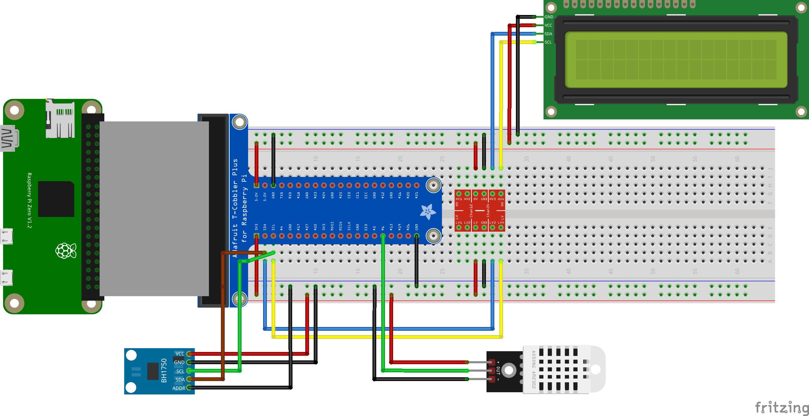

## 前言

在瀏覽別人的植物部落格 [^1] 時，看見他用樹莓派監測溫濕度，並遠端控制燈光與風扇。  
突然興起念頭，想用樹莓派做一個溫度警報器，監測到環境高於某個溫度時發送通知到手機。  
平時也會把監測的數據記錄起來，做成圖表方便觀察季節變化。  
因緣際會拿到樹莓派和一些零件，既然東西都有了那就來玩玩看吧。  

在此之前沒有使用過樹莓派，有許多不懂的地方，只好從頭慢慢研究。  
個人沒有相關背景，因此用字遣詞可能和學界、產業有落差，所以此系列不是好的參考資料。  
寫這系列也只是想紀錄過程中學到的知識。  

接下來分別介紹會用到的硬體與其介面。  

## Raspberry Pi Zero W

樹莓派本體。  
Zero 系列是樹莓派的輕便版本，許多接孔 (connector) 需要轉接器 (adapter) 轉成標準尺寸才能使用。  
W 內建了 wifi 和藍芽，因此使用 wifi 透過 SSH 控制的無頭樹莓派  (headless Raspberry Pi)  [^2] 是個好選擇。  

### MiniHDMI

為了節省空間使用了 miniHDMI。  
若需要接螢幕可能需要 miniHDMI 轉 HDMI 的轉接器。  



### Power

只能單純供電的接口。  
透過 microUSB 連接，電壓應在 5-5.25V 範圍內。  



### USB

只有這個孔能傳輸資料且供電。  
支援 OTG 功能 ([On-The-Go](https://en.wikipedia.org/wiki/USB_On-The-Go))，大致上是接口兩邊的裝置，都能作為主機（提供電力，能主動控制連結）或週邊裝置（消耗電力）。  



### Micro SD card slot

micro SD 卡就是插在這邊。  
SD 卡作為儲存設備，需要燒錄作業系統。  



### General-purpose input/output (GPIO)

樹莓派的重點，每個孔都有已經定義好的各種用途。  
透過這個介面可以實現讀取/提供資料、供電等與外接設備互動的功能。  

GPIO0 和 1 （Pin27 和 28）預留作別用，一般情況不要連接。  



#### 各接腳功能



可在樹莓派 cli 中輸入 `$ pinout` 查詢接腳。  
另外在 [pinout.xyz](https://pinout.xyz/) 也有大致說明各接腳的功能。  
sparkfun 也有比較 [I2C vs UART vs SPI](https://learn.sparkfun.com/tutorials/i2c/all)，對協定原理有興趣時也能看看。  

## GPIO Extension Board

將 GPIO pin 引出到麵包板，以避免頻繁插拔造成損壞。  




### 麵包板用法



## AM2302 (a.k.a. DHT22) humidity & temperature sensor/module

用來感測溫濕度。  



有分成四個 pin 的感測器 (sensor) 還有三個 pin 的模組 (module) 在販售。  
如下圖，四個 pin 由左到右是電源 (VDD, 3-5.5V)、數據 (DATA)、沒用 (NULL)、接地 (GND)。  
三個 pin 的話則是電源、數據、接地。  



### 其他規格

")

## BH1750 (a.k.a. GY30) light intensity sensor

I2C 介面的光度感測器。

### 感測器外觀



### Pin

- VCC：連接到電路的電壓，3.3-6V。
- ADDR：Address select。設備會有預設的位址，在同個 I2C bus 上若有一樣的設備，位址會衝突，於是需要 ADDR 來更改設備的位址。只有一個 GY30，使用預設位址就好，拉去接地。
- GND：Ground，接地。
- SDA：I2C 傳輸數據的介面。
- DVI：和 asynchronous reset 相關，手上的感測器沒有這個接腳，不用接。
- SCL：I2C 傳輸時脈的介面。

")

## LCD display 2004A 20x4 with I2C

I2C 介面的小顯示器，用來顯示溫濕度等數值。  
20x4 則是可以顯示 20 字 x 4 行的文字。  



背面有黑色的 I2C adapter (PCF8574)，上面有四個 pin。  

- GND: 接地
- VCC: 電源 (5V)
- SDA: I2C 數據
- SCL: I2C 時脈



### logic level converter

顯示器的工作電壓是 5V，而 GPIO 接腳的工作電壓是 3.3V。  
在接 SDA 和 SCL 的時候就必須透過這個邏輯電平轉換器，換成適合的電壓。  

如下圖，可依電壓分成 high-level (5V) 和 low-level (3.3V) 兩側。  



使用方式：

1. HV 接到 5V 的電源；LV 接到 3.3V 的電源。
2. 兩側的 GND 都接地。
3. HV1 對應 LV1，編號 1-4 共有四組通道。
4. 將顯示器的 SDA 接在 HV3；樹莓派的 SDA 接在 LV3。
5. 將顯示器的 SCL 接在 HV4；樹莓派的 SCL 接在 LV4。

## 設備連接圖

參考樹莓派的 [GPIO 說明](https://pinout.xyz/) 與各個感測器的說明，就可以開始連接對應的接腳。  

## 參考資料

- [Getting Started with the Raspberry Pi Zero Wireless](https://learn.sparkfun.com/tutorials/getting-started-with-the-raspberry-pi-zero-wireless/all)
- [Raspberry Pi 筆記(2)：GPIO接腳與 I2C 及 SPI 安裝](https://atceiling.blogspot.com/2014/01/raspberry-pigpio.html)
- [Raspberry Pi Pinout](https://pinout.xyz/)
- [sparkfun I2C TUTORIALS](https://learn.sparkfun.com/tutorials/i2c/all)
- [麵包板怎麼用? 超簡單教學!](https://www.davidhuanglab.com/post/breadboard)
- [Digital-output relative humidity & temperature sensor/module DHT22 (DHT22 also named as AM2302)](https://www.sparkfun.com/datasheets/Sensors/Temperature/DHT22.pdf)
- [GY-30 Digital Light Intensity Measuring Module](http://wiki.sunfounder.cc/index.php?title=GY-30_Digital_Light_Intensity_Measuring_Module)
- [Digital 16bit Serial Output Type Ambient Light Sensor IC](https://www.semiee.com/file/EOL2/ROHM-BH1750FVI.pdf)
- [Guide to Setup Raspberry Pi with LCD Display using I2C Backpack](https://phppot.com/web/guide-to-setup-raspberry-pi-with-lcd-display-using-i2c-backpack/)
- [Using a Logic-level Shifter with Raspberry Pi](https://littlebirdelectronics.com.au/guides/196/using-a-logic-level-shifter-with-raspberry-pi)

[^1]: [Tom's Carnivores](https://tomscarnivores.com/resources/raspberry-pi-terrarium-controller/)
[^2]: 無頭樹莓派：不用額外接螢幕、滑鼠、鍵盤的樹莓派
