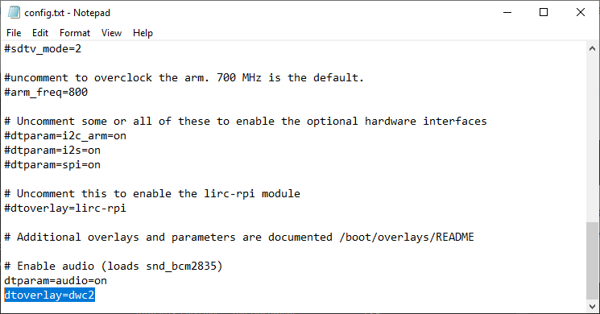

## 前言

本篇會使無頭樹莓派連上網路，並透過 SSH 在自己的電腦上控制。  

## 記憶卡燒錄 Raspberry Pi OS

1. 準備好 SD 卡及讀卡機，接上使用的電腦。  
2. 至[官網](https://www.raspberrypi.com/software/)下載 Raspberry Pi Imager。  
3. 選擇使用的樹莓派型號
    
4. 選擇使用的作業系統，直接使用他推薦的就好。若是 Lite 版會沒有桌面，想接螢幕的話要注意。  
5. 選擇儲存到記憶卡，會把儲存空間重新格式化，注意不要選錯設備。  
6. 從彈出視窗選擇編輯設定。  
    
7. 填寫此頁面所有設定。  
    
8. 在服務標籤下，啟用 SSH 並勾選使用密碼認證。  
    
9. 開始燒錄。  

## 自動連接多個 WiFi

1. 燒錄完後繼續編輯 SD 卡。  
2. 在根目錄下新增 `wpa_supplicant.conf`，複製下面檔案內容。

填入角括號中的值後，此 `wpa_supplicant.conf` 可自動連接手機熱點，當手機熱點找不到時才連接家中 Wifi。  
這個板子連接不到 5GHz 的訊號，需要先確認為 2.4GHz 才能連接成功。  
`wpa_supplicant.conf` 檔案內容如下：

```plain
country=<your_country_code>
ctrl_interface=DIR=/var/run/wpa_supplicant GROUP=netdev
update_config=1

network={
    ssid="<your_phone_hotspot_ssid>"
    psk="<your_phone_hotspot_password>"
    priority=1
    scan_ssid=1
}

network={
    ssid="<your_home_wifi_ssid>"
    psk="<your_home_wifi_password>"
    priority=2
    scan_ssid=1
}
```

參數說明可參考 [大軒軒的筆記本](http://bigpxuan.blogspot.com/2016/12/wpasupplicant.html)。  

在作業系統啟動時，樹莓派會偵測 SD 卡根目錄下的 `wpa_supplicant.conf` 檔案，把內容寫入作業系統中的 `/etc/wpa_supplicant/wpa_supplicant.conf` 檔案中。  
作業系統啟動後，便可以直接修改 `/etc/wpa_supplicant/wpa_supplicant.conf` 的內容並重啟 wpa_supplicant 服務，便可以更改設定。  

幾種重啟服務的指令：

  - `$ wpa_cli -i wlan0 reconfigure`
  - `$ sudo systemctl restart wpa_supplicant.service`
  - `$ systemctl restart network.service`

## 設定 USB 連結

若要透過 USB 孔連接樹莓派，需要在 SD 卡上額外設定這兩個檔案。  
若是 windows 注意不要使用內建筆記本，最好用 NotePad++ 之類的文字編輯器格式才不會跑掉。  

1. config.txt：將 `dtoverlay` 指定為 `dwc2`。
  
2. cmdline.txt：在 `rootwait` 後面加入文字 `modules-load=dwc2,g_ether`。此檔案沒有換行，用空白分格。
  

## 啟用 SSH

在燒錄時若沒有選擇啟用 SSH，可使用這個方法啟用。  

1. 在 SD 卡根目錄新增一個名稱為 `ssh` 的空白檔案。  
樹莓派預設不啟用 SSH。只有在啟動時讀到這個檔案，才會啟用 SSH 功能。  

## 連接樹莓派

1. 將 SD 卡插入樹莓派，並接電。  
2. 接電後第一次啟動需要等待一段時間。  
3. 確認使用的電腦與樹莓派在同個網路下。  
4. 進行 SSH 登入：mac 使用 `$ssh <username>@<hostname>`；window 可以使用 Putty。注意 hostname 會是 `xxx.local`。  

ssh 連接時找不到 hostname，可以使用 [LanScan](https://apps.apple.com/tw/app/lanscan/id472226235) 或 `$ arp-scan` 這類小工具，搜尋 ip 位址來替代 hostname。  
或者 windows 可以裝 [Bonjour](https://support.apple.com/kb/DL999)（mac 已經內建），就能找到燒錄時所設定的 `xxx.local` hostname。

若不想要每次登入時都輸入密碼，可以在自己電腦產生一組 SSH key，將公鑰放到樹莓派的 `~/.ssh/authorized_keys` 中。  

1. 產生 SSH key： `$ ssh-keygen`，公鑰會是 `.pub`
2. 將公鑰放到伺服器：`$ ssh-copy-id -i <your_key_path> <username>@<hostname>`

若是 ssh 時樹莓派的 fingerprint 不一樣，會跳警告說可能遇到中間人攻擊。  
確認裝置在內網，是因為重灌等原因導致 fingerprint 不一樣的話，可以執行 `$ ssh-keygen -R <hostname>`。  
此指令會將 `~/.ssh/known_hosts` 中特定 hostname 的公鑰刪除，並複製一份舊檔案命名成 `known_hosts.old`。  

## 參考資料

- [How to Set Up a Headless Raspberry Pi, Without Ever Attaching a Monitor](https://www.tomshardware.com/reviews/raspberry-pi-headless-setup-how-to,6028.html)
- [深究 ssh-keygen](https://datahunter.org/ssh-keygen)