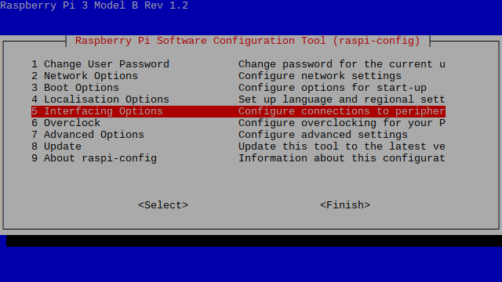
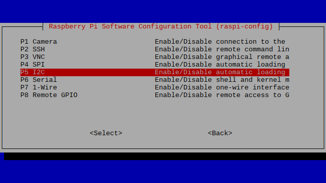
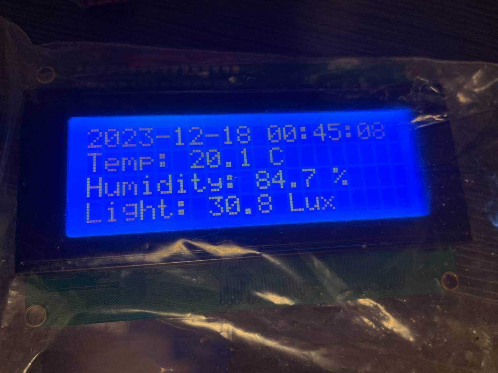
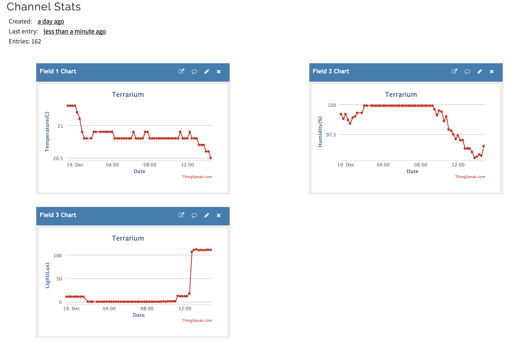

## 啟用 I2C 介面

樹莓派預設不啟用，但感光器和螢幕都會用到，需要先手動啟用。  

`$ sudo raspi-config` 打開樹莓派系統設定 GUI，並參照下圖打開 I2C。  


  
  


啟用後透過 `$ ls /dev/i2c*`，可發現 `/dev` 下多了兩個設備。  

`$ sudo i2cdetect -y 0` 或 `$ sudo i2cdetect -y 1`：檢查在 I2C bus 上設備的位址，Rev 1 的 I2C bus 是使用 i2c-0；Rev 2 則是 i2c-1。  

## Python 開發環境設定

考慮到一台電腦內可能需要執行許多專案，專案所需的套件、套件版本、python 本身的版本都不盡相同。  
若想要有便於管理的環境，最需要的工具有：

  1. 程式碼版本控制：使用 git，在安裝樹莓派作業系統時已經有內建
  2. 套件安裝的虛擬環境管理：Poetry
  3. 套件相依性管理：Poetry
  4. Python 本身的版本管理：pyenv

### 安裝 Poetry、pyenv

先跟著 [部落格文章](https://blog.kyomind.tw/linux-dev-setup/) 第三、四章節安裝 Poetry + pyenv


延伸閱讀。選用 Poetry 的原因、使用相關的文章可以參考：

- [Poetry + pyenv 指令](https://blog.kyomind.tw/poetry-pyenv-practical-tips/#Poetry-%E8%88%87-pyenv-%E7%9A%84%E9%83%A8%E5%88%86%E5%8A%9F%E8%83%BD%E9%87%8D%E7%96%8A)
- [選用 Poetry 的原因](https://blog.kyomind.tw/python-poetry/)


### 建立專案

跟著上述文章步驟安裝完後，執行 `$ pyenv --version`、`$ poetry --version` 確認是否安裝成功。  

安裝成功後，照順序執行以下指令建立專案：

1. `$ mkdir <project-name>`：建立專案資料夾
2. `$ cd ./<project-name>`：移動到資料夾內
3. `$ git init`：初始化 git
4. `$ pyenv install 3.10.10`：安裝特定版本 python 到此電腦內，若已經透過 pyenv 安裝過則可省略此指令
5. `$ pyenv local 3.10.10`：指定 pyenv 以後在此資料夾內自動使用 3.10.10 的 python
6. `$ poetry init`：初始化 poetry，建立 `pyproject.toml`
7. 修改 `pyproject.toml`：將 `[tool.poetry.dependencies]` 的 python 版本指定為 `^3.10.10`
8. `$ poetry env use 3.10.10`：使 poetry 建立 3.10.10 的虛擬環境，相關內容在 `.venv` 資料夾內

執行完以上指令後，就能以 3.10.10 版本的 python 進行開發。  
若是在自己電腦上開發，可以把程式碼 push 到 github 之後在樹莓派 pull 下來執行。  
或是透過 SFTP 將整個專案資料夾直接傳到樹莓派內。  
也可以透過 VS Code 的 Remote SSH 套件編輯樹莓派上的檔案。  

### git clone 已存在的專案

若是 `$ git clone` 已存在的專案，則只需要建立虛擬環境並安裝套件：  

1. `$ git clone <project-url>`：使用 git 複製專案到本地
2. `$ cd <project-name>`：進入專案資料夾
3. `$ pyenv install 3.10.10`：安裝特定版本 python 到此電腦內，若已經透過 pyenv 安裝過則可省略此指令
4. `$ pyenv local 3.10.10`：指定 pyenv 以後在此資料夾內自動使用 3.10.10 的 python
5. `$ poetry env use 3.10.10`：使 poetry 建立 3.10.10 的虛擬環境，相關內容在 `.venv` 資料夾內
6. `$ poetry shell`：進入虛擬環境
7. `$ poetry install`：使 poetry 安裝套件

### 其他指令

- `$ poetry shell`：進入虛擬環境，進入後才能使用 poetry 新增、移除套件，要離開則是輸入 `$ exit`
- `$ poetry add <module-name>`：新增套件
- `$ poetry remove <module-name>`：移除套件
- `$ poetry show --tree`：列出安裝的套件
- `$ pyenv versions`：列出已安裝的 python 版本
- `$ pyenv local`：顯示目前專案使用的 python 版本
- `$ pyenv global`：顯示目前全域使用的 python 版本

## 從 AM2302 取得溫濕度紀錄

使用 [adafruit-circuitpython-dht](https://pypi.org/project/adafruit-circuitpython-dht/) 套件。  

1. `$ sudo apt-get install libgpiod2`：安裝 `adafruit-circuitpython-dht` 套件的依賴  
2. 在專案資料夾內 `$ poetry shell`：進入虛擬環境  
3. `$ poetry add adafruit-circuitpython-dht`：安裝需要的套件  
4. 新增 `dht22_demo.py`，取得溫濕度：  
  完整程式碼可參考 [Github Repo](https://github.com/torai55/terrarium-sensor)

  使用的是 [BCM 腳位](https://pinout.xyz/)，而不是實體腳位。  
  例如我使用的 GPIO 6 對應的實體腳位是 31。  

```python
dhtDevice = adafruit_dht.DHT22(board.D6) # 使用 BCM 腳位
try:
    temperatureC = dhtDevice.temperature
    temperatureF = temperatureC * (9 / 5) + 32
    humidity = dhtDevice.humidity
    print(
        "Temp: {:.1f} F / {:.1f} C    Humidity: {}% ".format(
            temperatureF, temperatureC, humidity
        )
    )
except RuntimeError as error:
    # DHT22 很容易噴各種錯誤，發生錯誤時過一段時間再重試即可
    print(error.args[0])
finally:
    dhtDevice.exit()
```

5. 在虛擬環境下，執行 `$ python dht22_demo.py` 就會在終端顯示溫濕度

## 從 GY30 取得光度紀錄

1. 在專案資料夾內 `$ poetry shell`：進入虛擬環境  
2. `$ poetry add smbus2 RPi.GPIO`：安裝需要的套件  
3. 新增 `bh1750_demo.py`，取得溫濕度：  
  完整程式碼可參考 [Github Repo](https://github.com/torai55/terrarium-sensor)

```python
class BH1750:
    def __init__(self) -> None:
        # 參考下面註腳圖一
        # 預設 I2C 位址
        # ADDR 腳位在低電位時是 0x23
        # 高電位時是 0x5C
        self.DEVICE      = 0x23

        # 參考下面註腳圖二
        # 想要讀取的 bh1750 register 地址
        # 不同地址有不同解析度
        # 在讀取後會設定成 Power Down mode
        self.ONE_TIME_HIGH_RES_MODE_1 = 0x20

    # 參考下面註腳圖三
    # 感測器採取 Big-Endian，最高有效位數放在記憶體最低位 data[0]
    # 將高位數字乘以 256，可以當作位元運算，將高位數左移八位
    # 除以 1.2 是感測器設定的 Measurement Accuracy
    # 若使用解析度為 0.5 lx 的模式
    # 最低有效位數代表的是 2^-1，算法就會不一樣
    def convertToNumber(self,data):
        result=(data[1] + (256 * data[0])) / 1.2
        return(result)

    # 從 I2C bus 讀取 16 bit 的數據
    def readLight(self,addr=None):
        if addr is None:
            addr = self.DEVICE
        # read_i2c_block_data(i2c_addr, register, length)
        data = self.bus.read_i2c_block_data(addr, self.ONE_TIME_HIGH_RES_MODE_1, 16)
        return self.convertToNumber(data)

    def destroy():
        GPIO.cleanup()

bh1750 = BH1750()
lightLevel = bh1750.readLight()
print("BH1750 Light Level :" + format(lightLevel, '.2f') + "lx")
bh1750.destroy()
```

4. 在虛擬環境下，執行 `$ python bh1750_demo.py` 就會在終端顯示光度

圖一、BH1750 在 I2C bus 上的位址 [^1]  
圖二、BH1750 register 位址 [^2]  
圖三、BH1750 高解析度模式 [^3]  

## 控制 LCD display

1. 在專案資料夾內 `$ poetry shell`：進入虛擬環境  
2. `$ poetry add RPLCD`：安裝需要的套件  
3. 新增 `lcd_demo.py`，控制螢幕顯示：  
  完整程式碼可參考 [Github Repo](https://github.com/torai55/terrarium-sensor)

```python
lcd = i2c.CharLCD('PCF8574', 0x27, port=1, charmap='A00', cols=20, rows=4)

lcd.write_string('Hello world')
lcd.crlf()
lcd.write_string('IoT with Torai')
lcd.crlf()
lcd.write_string('Raspberry Pi')
sleep(5)
lcd.backlight_enabled = False 
lcd.close(clear=True)
```

4. 在虛擬環境下，執行 `$ python lcd_demo.py` 就會在螢幕顯示訊息

## 時間對溫濕度的紀錄圖

將資料上傳到 [ThingSpeak](https://thingspeak.com/)，可以在網頁上瀏覽他們的圖表。  
apiKey 是比較私密的資料，透過 dotfile 來存取。  
也要設定 `.gitignore` 避免被 git 記住。  

```python
import os
from datetime import datetime
import requests

apiKey = os.getenv('THING_SPEAK_API_KEY')
temp = "26 C"
humidity = "15 %"
lightLevel = "1500 lux"
requests.get(f"https://api.thingspeak.com/update?api_key={apiKey}&field1={temp}&field2={humidity}&field3={lightLevel}")
```

## 設定 crontab

設定每 15 分鐘執行一次

1. `$ crontab -e`：編輯自己的 crontab
2. 在檔案最後加入 `*/15 * * * * /path/to/virtual/env/.venv/bin/python /path/to/terrarium-sensor/main.py`

- `$ crontab -l`：查看自己的 crontab
- `$ grep -i cron /var/log/syslog`：可查看 crontab 執行紀錄


## 完成參考


  
  


## 參考資料

- [最佳 Python 套件管理器——Poetry 完全入門指南](https://blog.kyomind.tw/python-poetry/)
- [DHT Humidity Sensing on Raspberry Pi or Beaglebone Black with GDocs Logging](https://learn.adafruit.com/dht-humidity-sensing-on-raspberry-pi-with-gdocs-logging/python-setup)
- [讓你的 Raspberry Pi 透過 I²C 讀取 eeprom](https://coldnew.github.io/f0528f55/)
- [Digital 16bit Serial Output Type Ambient Light Sensor IC](https://www.mouser.com/datasheet/2/348/bh1750fvi-e-186247.pdf)
- [Create pi底板系列：数字光强度传感器模块.No7](https://zhuanlan.zhihu.com/p/649302435)
- [Big-Endian 與 Little-Endian 的差異與判斷程式碼](https://blog.gtwang.org/programming/difference-between-big-endian-and-little-endian-implementation-in-c/)
- [smbus2 readthedocs](https://smbus2.readthedocs.io/en/latest/)
- [Big-Endian 與 Little-Endian 的差異與判斷程式碼](https://blog.gtwang.org/programming/difference-between-big-endian-and-little-endian-implementation-in-c/)
- [Guide to Setup Raspberry Pi with LCD Display using I2C Backpack](https://phppot.com/web/guide-to-setup-raspberry-pi-with-lcd-display-using-i2c-backpack/)
- [Interfacing 20x4 LCD with Raspberry Pi 4 for Creating Custom Character and Scrolling Text](https://circuitdigest.com/microcontroller-projects/interfacing-lcd-with-raspberry-pi-4-to-create-custom-character-and-scrolling-text)
- [RPLCD readthedocs](https://rplcd.readthedocs.io/en/stable/api.html)
- [Linux 設定 crontab 例行性工作排程教學與範例](https://blog.gtwang.org/linux/linux-crontab-cron-job-tutorial-and-examples/)
- [How to set virtualenv for a crontab?](https://stackoverflow.com/questions/4150671/how-to-set-virtualenv-for-a-crontab)

[^1]: ")
[^2]: ")
[^3]: ")
