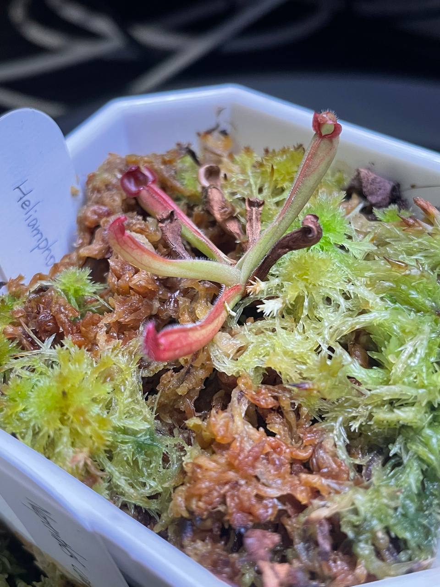

## 瘦長太陽瓶子草

中文名稱：瘦長太陽瓶子草  
學名：*Heliamphora elongata*  
購入管道：台灣食蟲社團  
購入價格： 650 NTD

夏季溫度：日/夜溫 26/22.5℃，使用製冷晶片小冰箱  
冬季溫度：台灣冬季不需保暖設備，但過冷的氣溫會使生長速度變慢  
濕度：70% 以上

## 栽培紀錄

### 2023/06/16 入手

四片葉子，其中一片頂端開始乾了。

### 2023/08/08

乾掉兩片長一片葉子。

### 2023/09/01

再長一片葉子。

