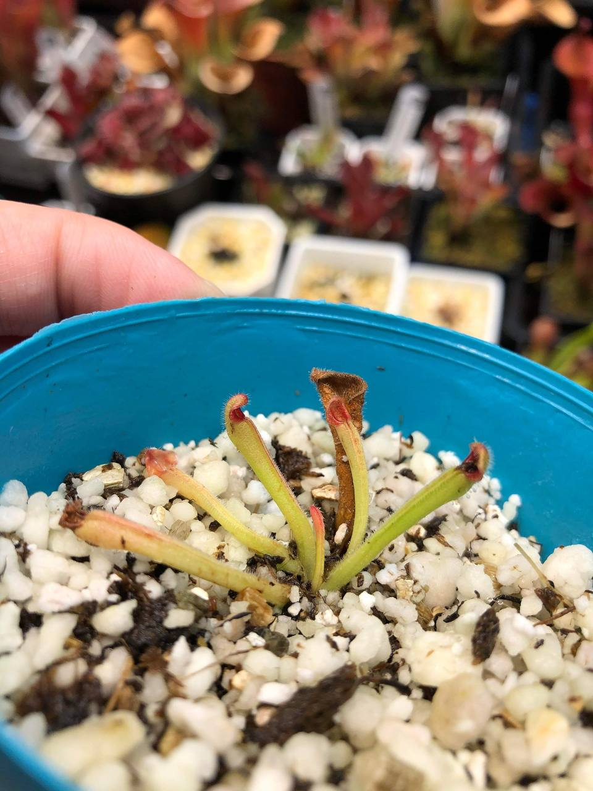
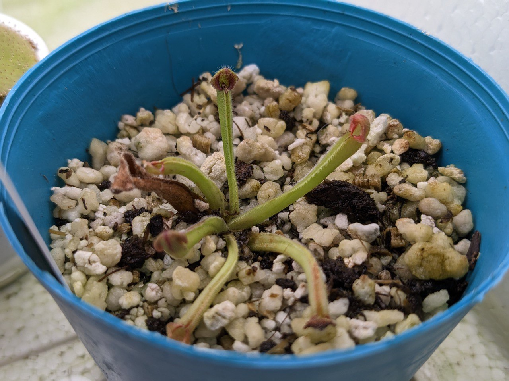
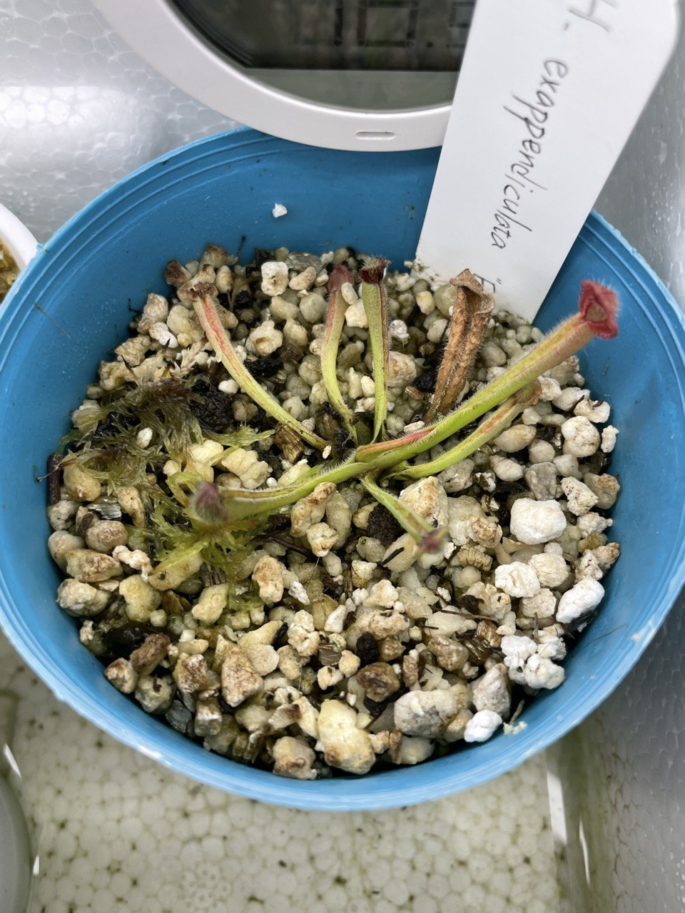
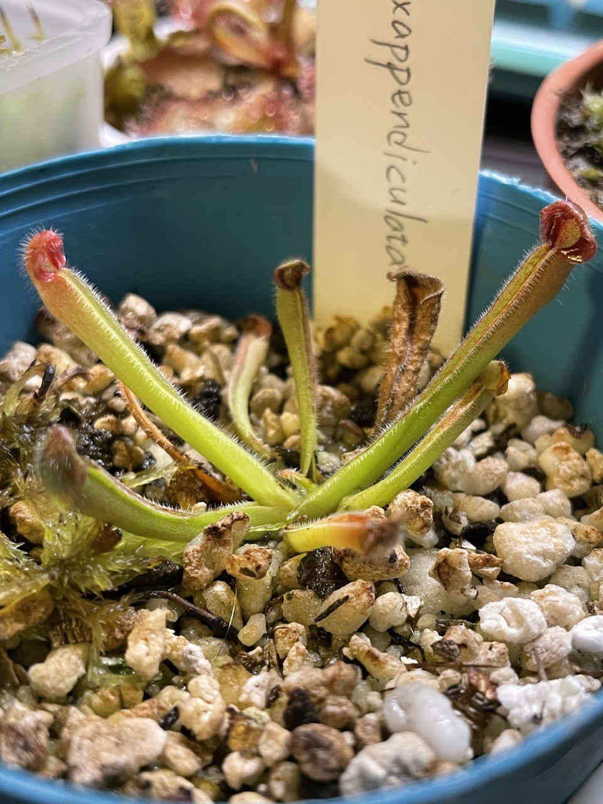
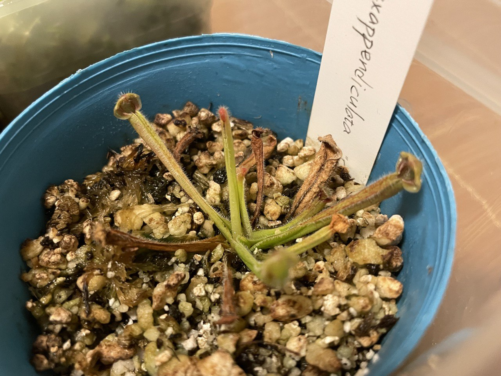
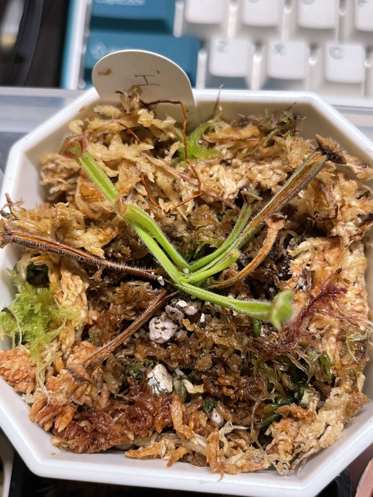

## 無附太陽瓶子草

中文名稱：艾俄那西太陽瓶子草  
學名：*Heliamphora exappendiculata* "Ewok"  
購入管道：FB 食蟲社團  
購入價格：1800 NTD

## 栽培紀錄

### 2023/04/02 入手

已經能看到葉芽。  

### 2023/04/21 新葉伸展

新葉伸展完成。  

### 2023/05/27

葉子再 +1，且看到新葉芽。  

### 2023/06/13 第二芽點

新葉伸展完成。  
一般葉芽應該會從最新的葉片中間長出來，但這時觀察到的葉芽是從基部直接冒出，可能是第二芽點。

### 2023/08/07

兩個芽點分別冒出葉芽。  
但老葉大量枯萎，感覺不太妙。  

### 2023/08/26

入手後長的葉子也開始枯萎，該換盆了。  
清除老葉，將介質換成水苔混珍珠石。  
賣家有提過這品種怕濕度驟降，加上塑膠罩悶養中。

