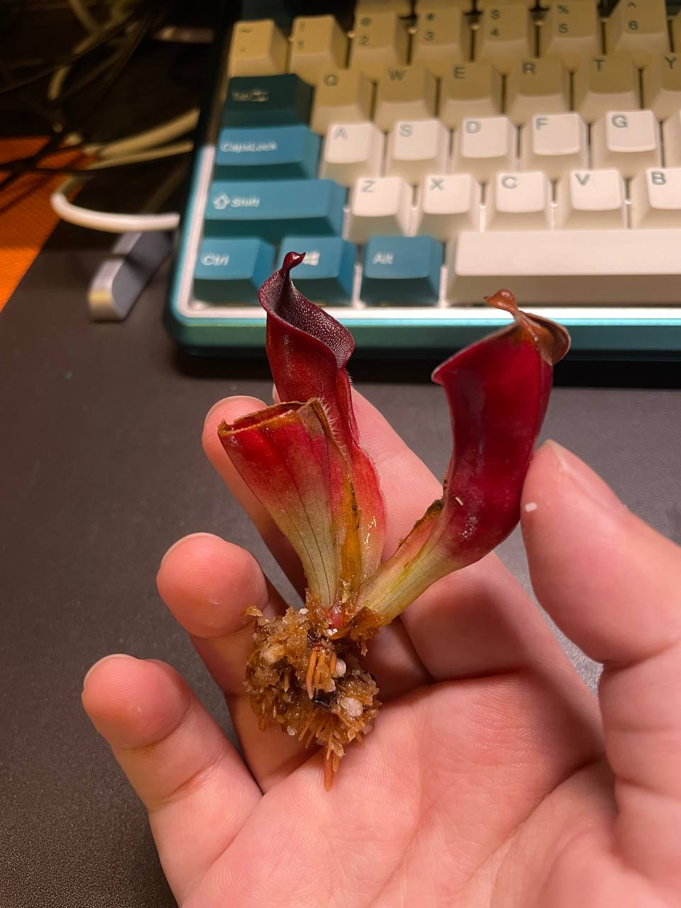
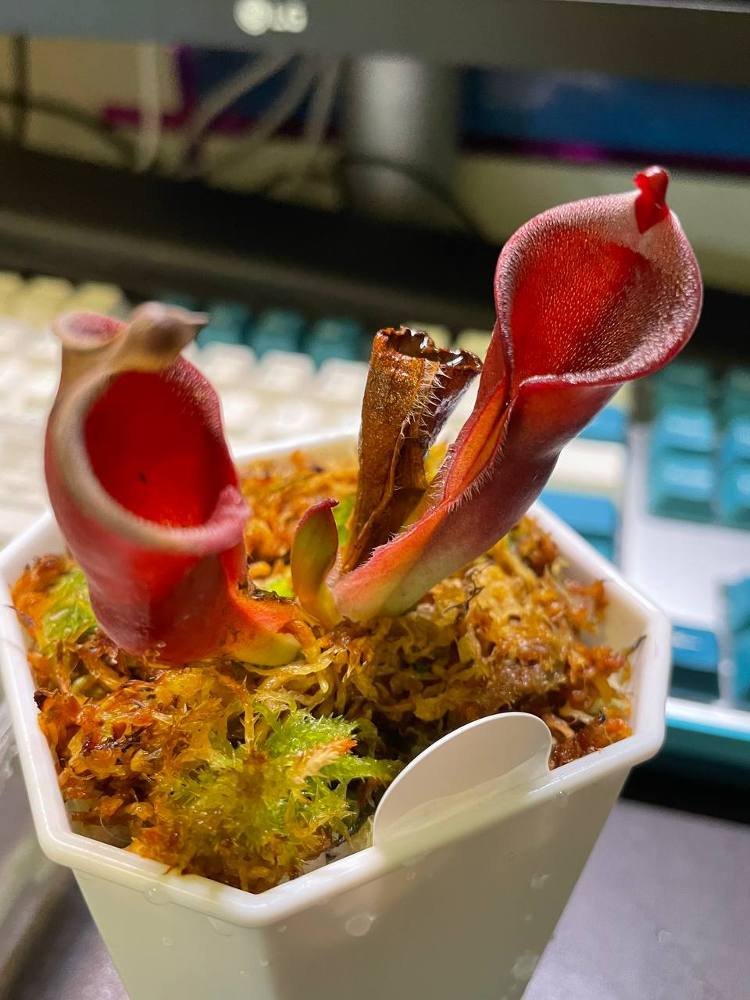

## (另解 x 艾俄那西) x 披毛小太陽瓶子草 AW clone 02

中文名稱：(另解太陽瓶子草 x 艾俄那西太陽瓶子草) x 披毛小太陽瓶子草  
學名及種源：*Heliamphora* (*heterdoxa* x *ionasi*) x *minor* var. *pilosa* AW clone 02  
購入管道：台灣食蟲社團  
購入價格：1800 NTD

夏季溫度：日/夜溫 26/22.5，使用制冷晶片小冰箱  
冬季溫度：台灣冬季不需保暖設備，但生長速度會變慢  
濕度：70% 以上

## 栽培紀錄

### 2023/06/29 入手

### 2023/07/24 長新葉

