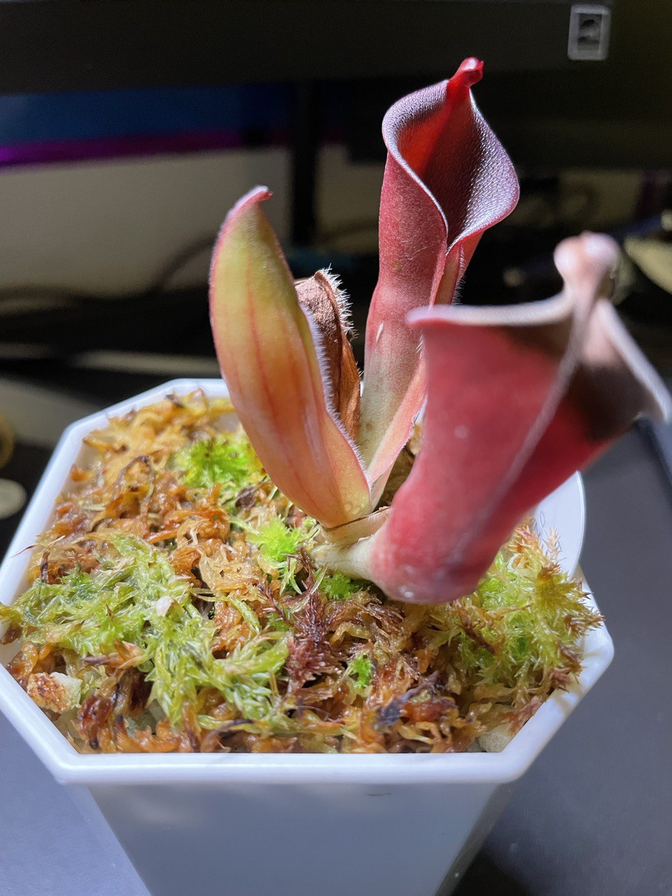
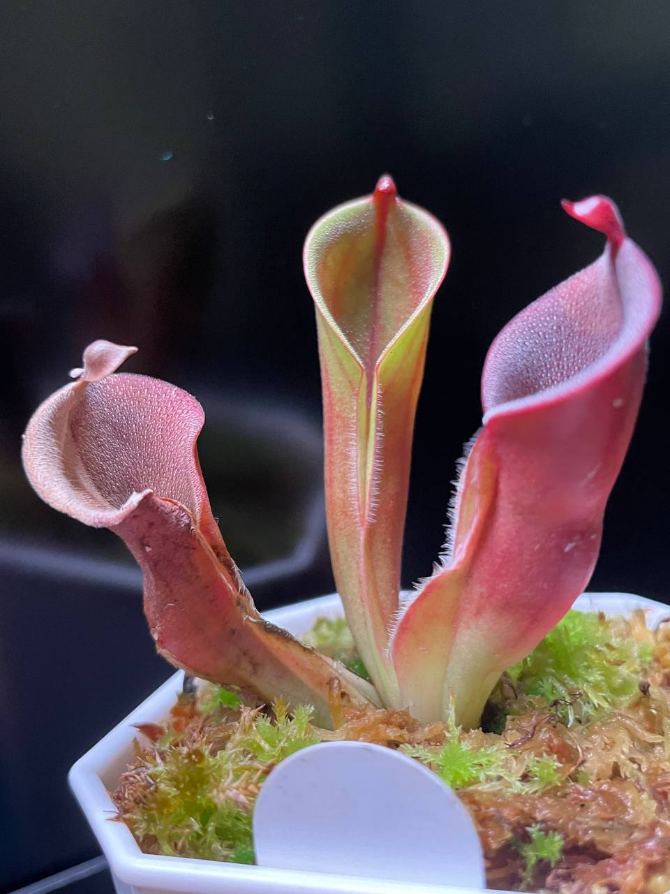

## (另解 x 艾俄那西) x 披毛小太陽瓶子草 AW clone 02

中文名稱：(另解太陽瓶子草 x 艾俄那西太陽瓶子草) x 披毛小太陽瓶子草  
學名及種源：*Heliamphora* (*heterodoxa* x *ionasi*) x *minor* var. *pilosa* AW clone 02  
購入管道：台灣食蟲社團  
購入價格：1800 NTD

夏季溫度：日/夜溫 26/22.5℃ ，使用製冷晶片小冰箱  
冬季溫度：台灣冬季不需保暖設備，但過冷的氣溫會使生長速度變慢  
濕度：70% 以上

## 栽培紀錄

### 2023/06/29 入手

### 2023/07/24 葉芽竄出

### 2023/08/07 新葉子由片狀開始膨大

### 2023/09/01 第一片新葉

葉片完成發育。  
可能是光照不夠，新瓶子顏色偏橘黃色，形狀較瘦長。  
暫時不調整光強度，看看下個月會不會轉紅。  

### 2023/11/01

幾乎沒動靜，只有兩片老葉子乾掉或正在乾掉的路上。  
最新的葉子基部可以觀察到葉芽，就看他要多久才長出來。  

