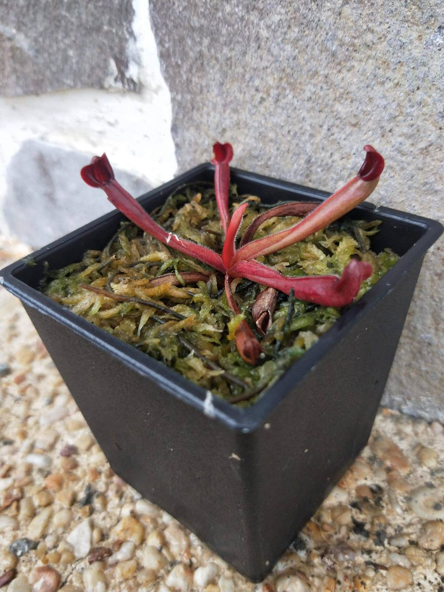
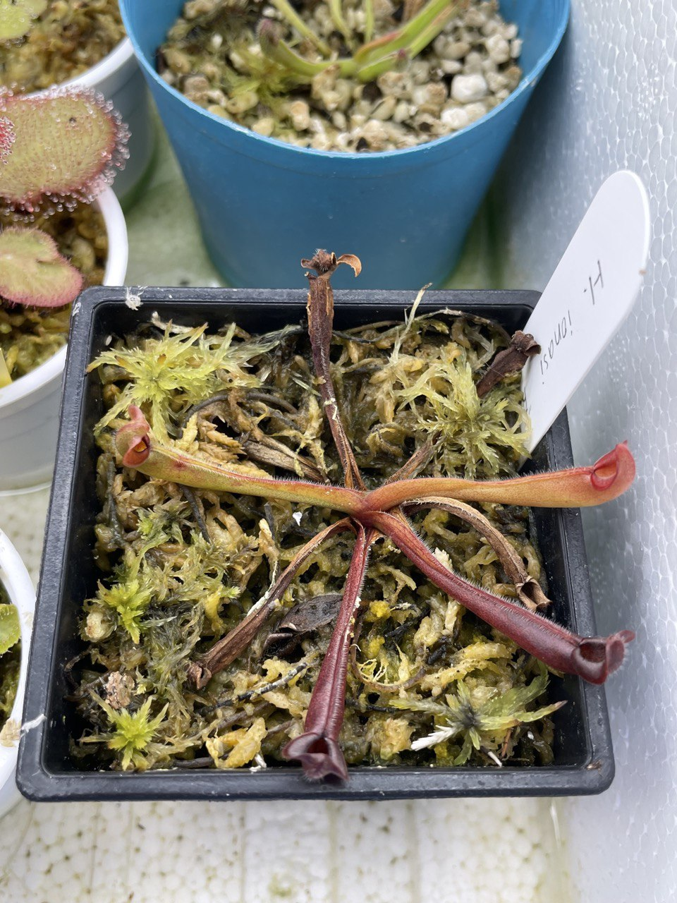
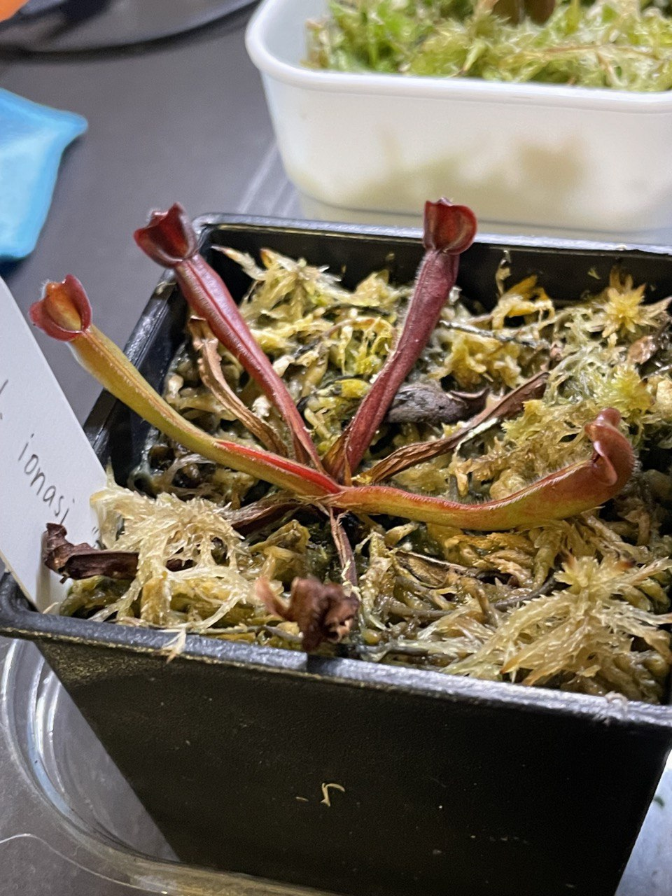
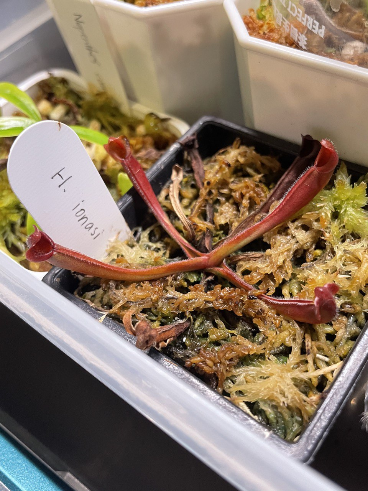

## 艾俄那西太陽瓶子草

中文名稱：艾俄那西太陽瓶子草  
學名：*Heliamphora ionasi* "Red Striped"  
購入管道：FB 食蟲社團  
購入價格：1500 NTD

## 栽培紀錄

### 2023/04/02 入手

正在長第五片葉子。

### 2023/04/21 乾掉一片葉子

新葉伸展完成，為橘黃色，可能光照不足。

### 2023/05/27 +1-1

長一片葉子且枯一片葉子。  
加強光照後新葉子顏色沒那麼黃，偏橘色。  
上一片新葉還是一樣維持橘黃色。

### 2023/06/13 緩慢生長中

新葉子冒出。

### 2023/09/01 再度 +1-1

還是維持在四片葉子。  
加強光照後葉色終於和入手時一樣紅。  
感覺枯葉的速度有點快，怕是水苔腐敗或莖部有問題。  
目前乾枯的葉子都是入手前長的，如果觀察到新葉子有乾枯情況就要換盆。  

## test
## test
## test
## test
## test
## test
## test
## test
## test
## test0
## test9
## test8
## test7
## test6
## test5
## test4
## test3
## test2
## test1
## test;
## test,
## testm
## testn
## testb
## testv
## testc
## testx
## testz
## testll
## testk
## testj
## testh
## testg
## testf
## testd
## tests
## testa
## testp
## testo
## testi
## testu
## testy
## testt
## testr
## teste
## testw
## testq
