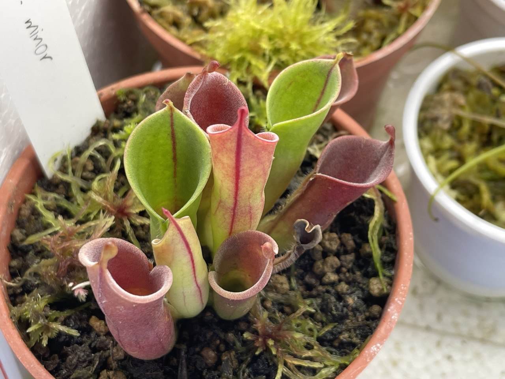
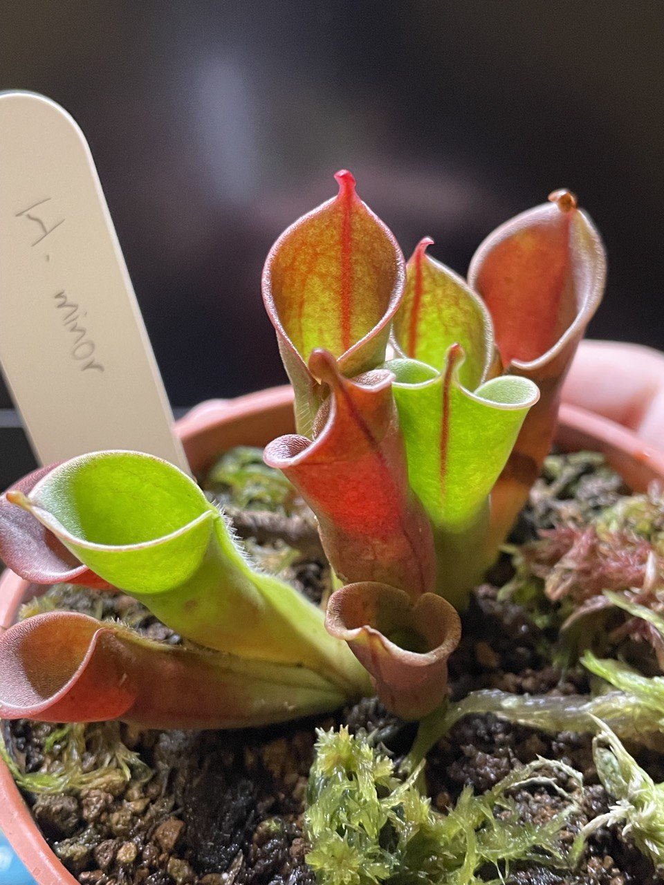

## 小太陽瓶子草

中文名稱：小太陽瓶子草  
學名：*Heliamphora minor*  
購入管道：建國花市愛蘭  
購入價格：650 NTD

夏季溫度：日/夜溫 26/22.5℃，使用制冷晶片小冰箱  
冬季溫度：台灣冬季不需保暖設備，但生長速度會變慢  
濕度：70% 以上

## 栽培紀錄

### 2023/03/16 入手

剛入手幾天冒出兩片新葉子，觀察到有兩個芽點。

### 2023/05/08 加強光照

試著加強光照，由三支增加至四支 LED 支架燈。  
除了三月冒出的葉子外，老葉及伸展中的新葉都轉紅。

### 2023/05/31 新葉顯色

綠色的基底配上橘紅色的紋路，個人認為蠻好看的。  
不過全紅的老葉已經開始枯萎。





### 2023/08/07 全紅老葉大量枯萎

六月後移進冰箱，期間改用投射燈提供光源。

可以看到中間葉片的蓋子比起之前照片變得更大，可見太陽瓶子草葉片發育的進程非常久。  
約花費一個月從芽點長出完整瓶型，再一個月且環境、植物狀態適合蓋子才會變大。

且光照太強會使得葉片壽命提早結束。  
可能是光照太強使得葉肉組織被破壞得太嚴重，顏色全紅代表葉綠素都被分解而植物色素堆積。

