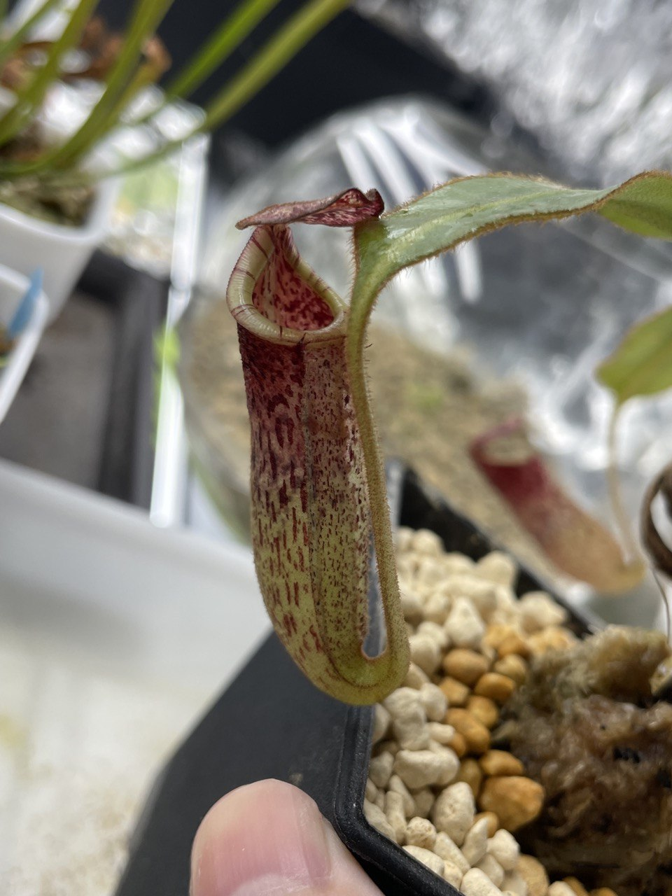

## 植物資料

中文名稱：豹班豬籠草  
學名：*Nepenthes burbidgeae*  
購入管道：FB 食蟲社團  
購入價格：1200 NTD  

## 栽培紀錄

### 2023/10/20 入手

分佈海拔約 1200-1800 m，算是高地入門款，感覺夏天有機會不用放在冰箱。  
入手時三片葉子。  

### 2023/11/07

放置於冰箱內無悶養，濕度變化真的太大，兩個瓶子都乾掉。  

