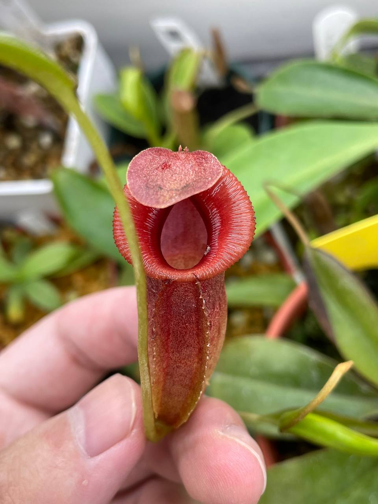
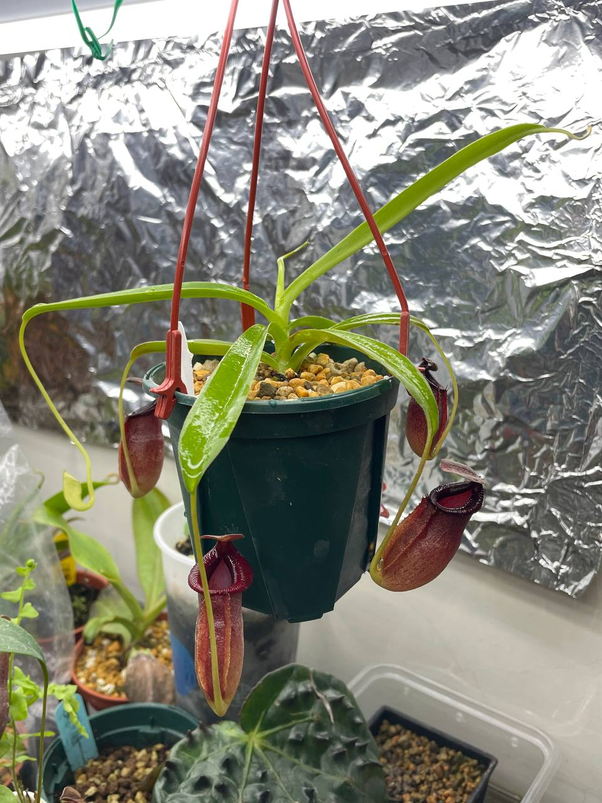
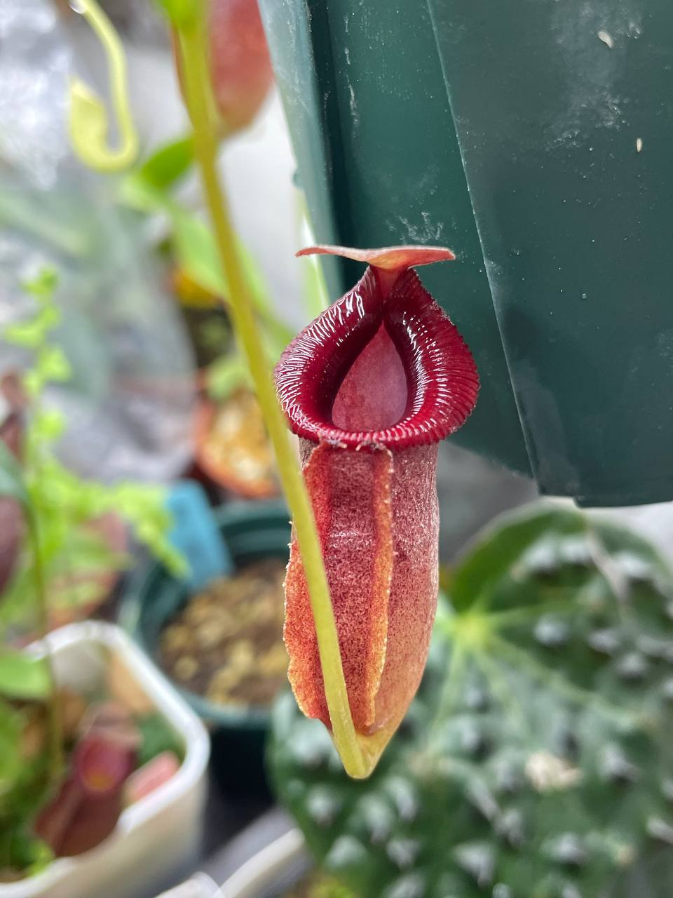

## 匙葉交賈桂琳豬籠草

中文名稱：匙葉交賈桂琳豬籠草  
學名：*Nepenthes spathulata* x *jacquelineae*  
購入管道：蝦皮 PING 樂園  
購入價格：1800 NTD  

外觀為匙葉的斜口，加上賈桂琳寬大的唇。  
交種後耐候性似乎蠻不錯的，個人是當作好種版的賈桂琳來對待。  

### 2023/11/04 入手

寬大橢圓的唇，有種整齊規律的美感。  


  
  
  

