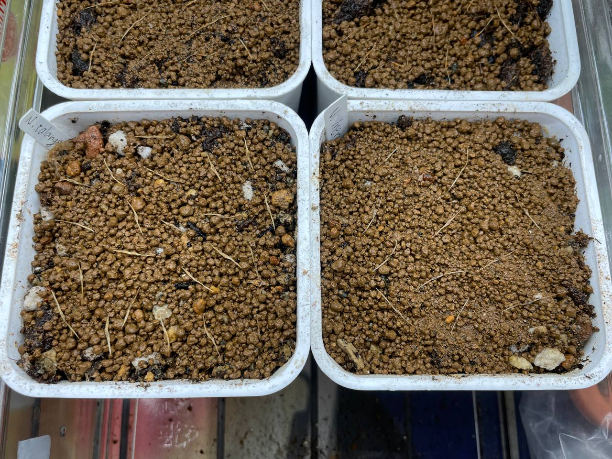

## 植物資料

中文名稱：塔蘭山豬籠草  
學名及產地：*Nepenthes talangensis* Mt. Talan  
購入管道：FB 食蟲社團  
購入價格：500 NTD/20 顆種子  

塔蘭山豬籠草具有卵型至漏斗型的下位瓶，搭配紅色或紫色的斑點很好看。  
分佈海拔 1800-2500m，屬高地豬籠草，夏天得放冰箱降溫才行。  

## 栽培紀錄

### 2023/12/01 播種

播種後淺腰水（約 1 cm），至於塑膠箱中悶養。  

