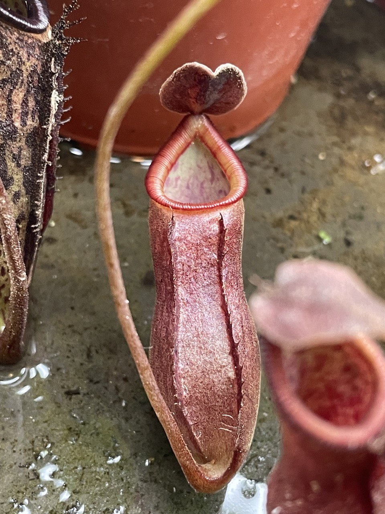
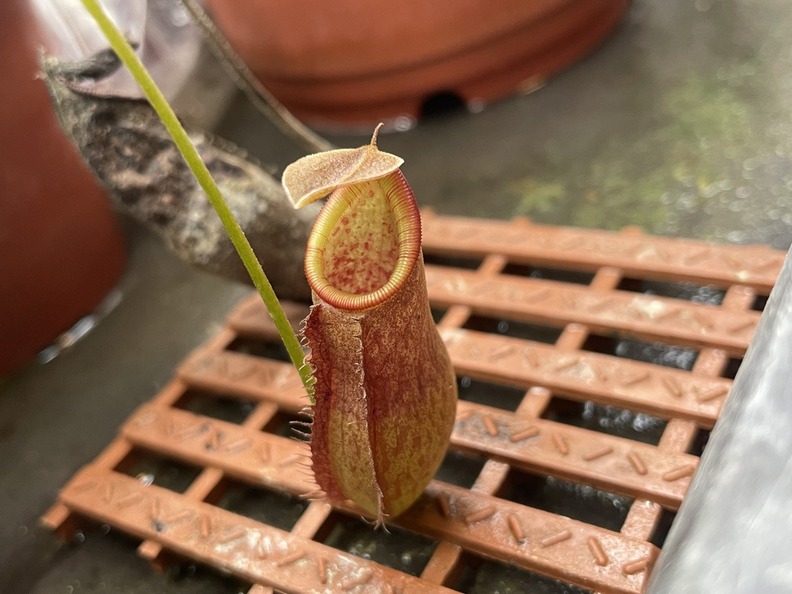
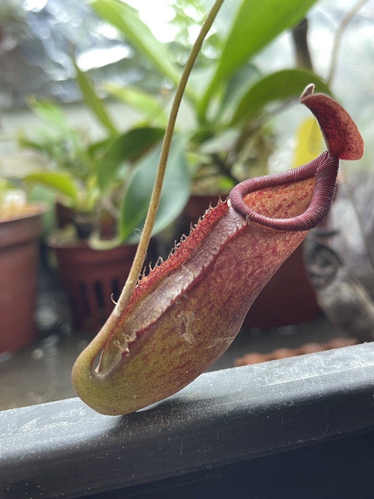
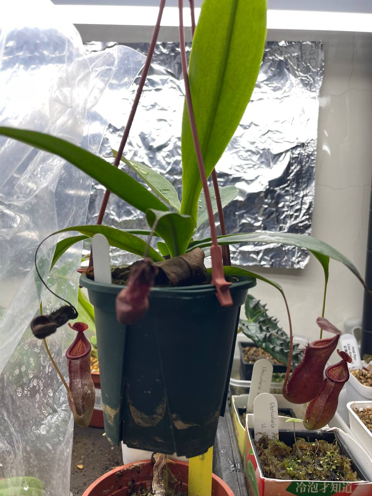

## 高棉勞氏風鈴豬籠草

中文名稱：高棉勞氏風鈴豬籠草，也稱老虎LC  
學名：*Nepenthes thorelii* 'tiger' x (*lowii* x *campanulata*)  
入手管道：蝕友贈送  

### 2023/09/08

### 2023/10/18

新生的瓶子為橘黃色，之後會逐漸變紅。  





### 2023/11/01

非常強健，生長速度也很快，展葉越來越大。  

