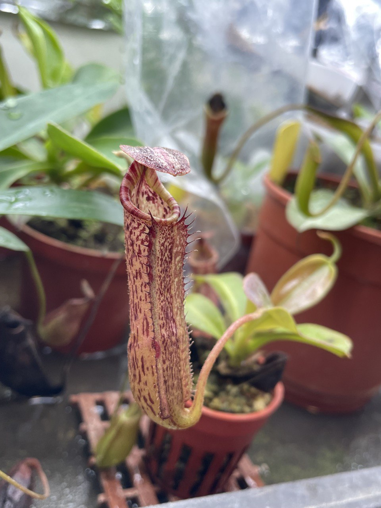
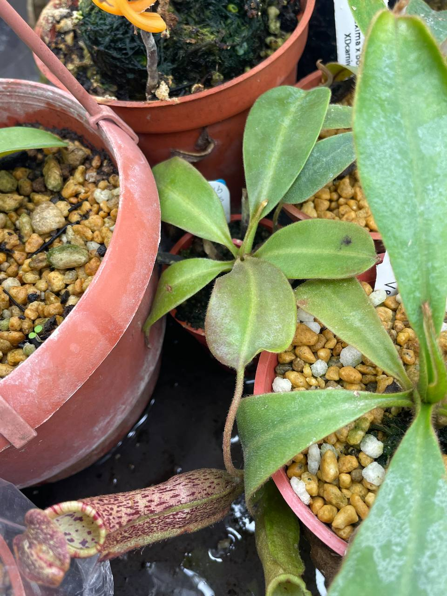

## (維奇包希) x {大豬 x [(窄葉勞氏) x (六甲維奇)]}

中文名稱：(維奇包希) x {大豬 x [(窄葉勞氏) x (六甲維奇)]}  
學名交配式：*Nepenthes* (*veitchii* x *boschiana*) x {*maxima* x [(*stenophylla* x *lowii*) x ('Rokko' x *veitchii*)]}  
購入管道：FB 食蟲社團  
購入價格：600 NTD  

### 2023/10/12 入手

親本非常複雜的交種，還有四分之一包希血，耐候性應該挺不錯的。  
目前粉色具斑點的瓶身加上花唇，觀賞性非常好。  

### 2023/11/07

生長狀況沒有太大變化。  
剛入手的時候葉子偏紅色，目前則是慢慢回到綠色。  

