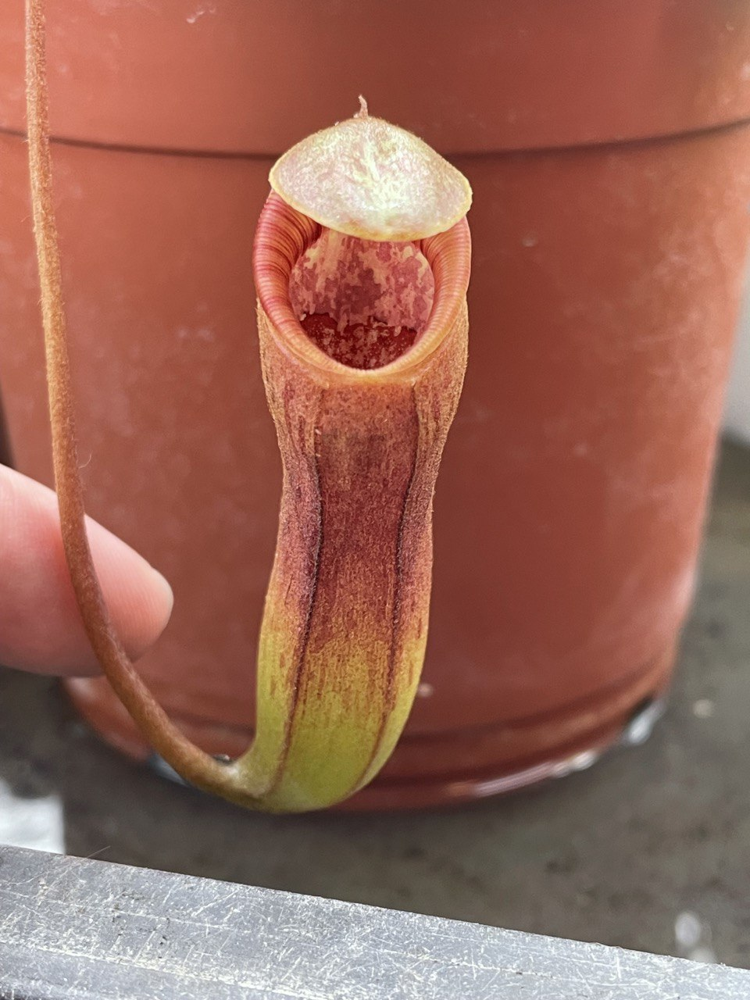
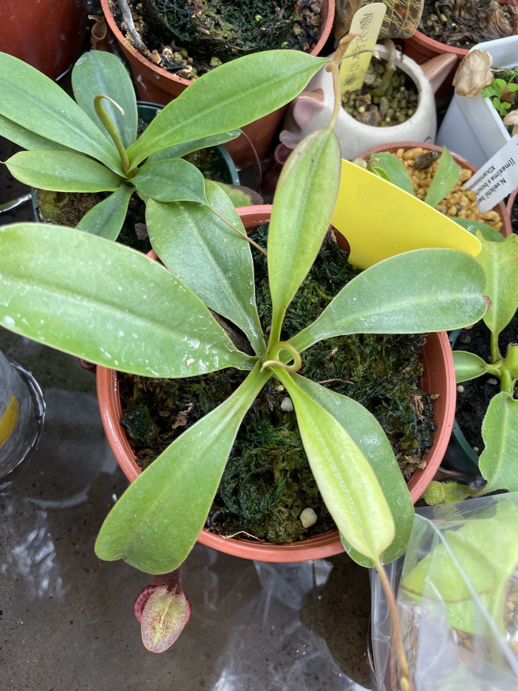
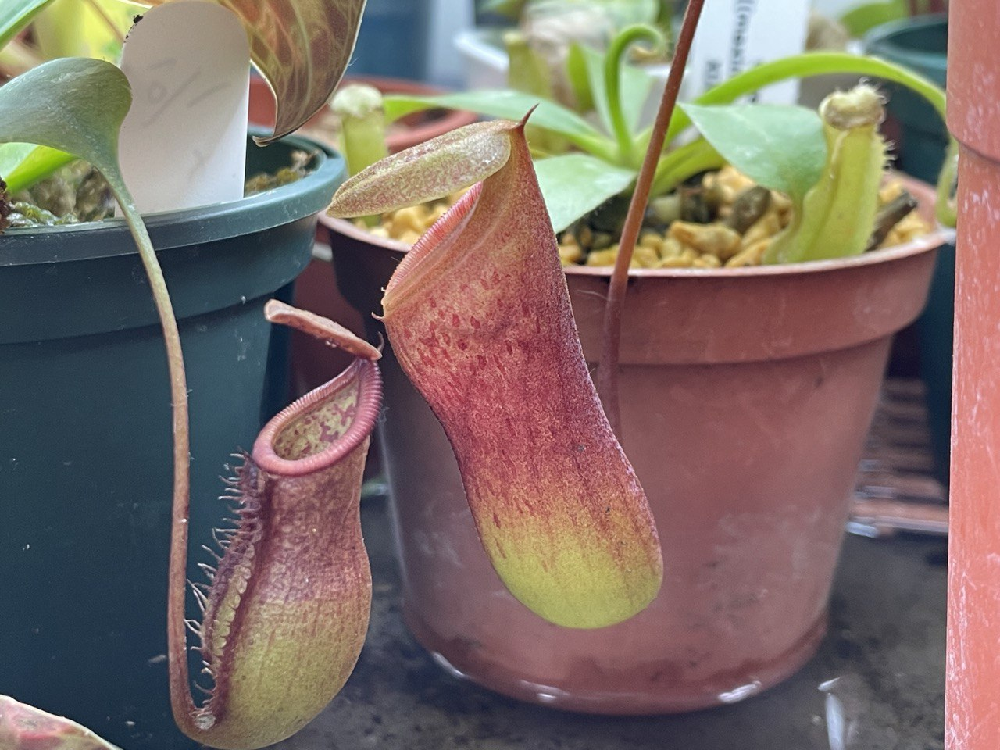
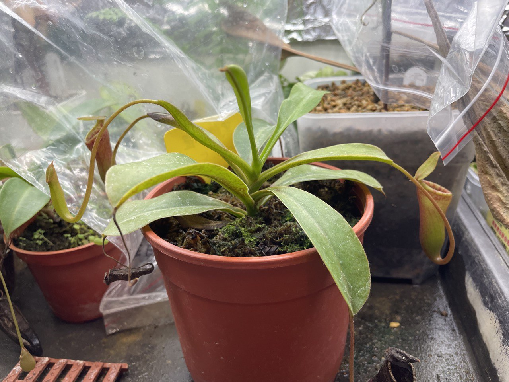
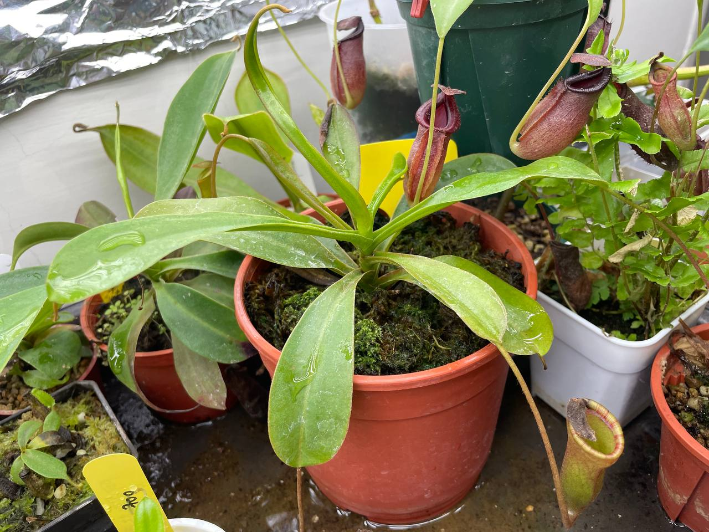

## 黑精靈豬籠草

中文名稱：黑精靈豬籠草  
學名：*Nepenthes ventricosa* x *lowii* ?  
入手管道：蝕友贈送  

中國那邊組培出來的一批 LV。  
因為血統不確定，後來被玩家自行命名d為黑精靈，或稱假 LV。  
表現上容易比 EP 的 VL 瓶子顏色來得深紅，且更加耐熱。  

### 2023/07/03 入手





### 2023/09/30

有陣子夜溫蠻高的，新長出來的葉子嚴重葉縮。  

### 2023/11/05

葉子畸形呈現杯狀。  
最新未展開的葉片變得很大，應該回到正常狀態了。  

