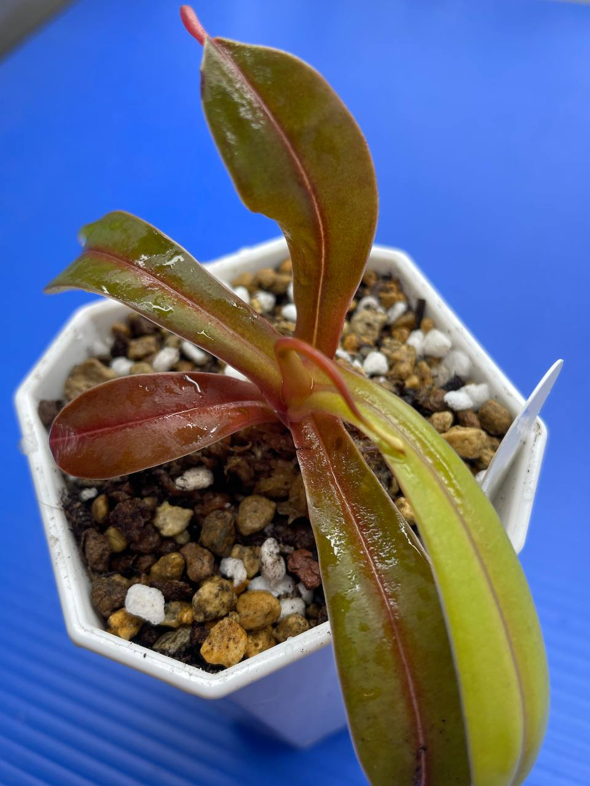

## 植物資料



中文名稱：葫蘆交細豬籠草  
學名及來源：*Nepenthes ventricosa* (a) x *tenuis* Y's  
購入管道：FB 食蟲社團  
購入價格：1000 NTD  

細豬籠草生長在蘇門答臘高地雲霧林的山脊處，溫度變化大。  
海拔約 1000~1200m，不是非常高，可推測此種較其他中高地豬籠草好種。  
且母本是的對環境適應極強的葫蘆豬籠草，交種後應該可嘗試在台灣平地不用冰箱度夏。  
瓶子外觀保留許多細豬籠草的特色，矮胖水桶狀的瓶型很有特色。  

Y's 為來自山田 (Y's Exotics) 的交種。  
母本的 (a)，應該只是商家自己標注的個體編號。  

## 栽培紀錄

### 2023/12/02 入手

購買的是現切側芽，在莖基部包覆水苔，並以無肥泥炭土、赤玉土、珍珠石之混合介質填充盆內空間。  
套袋悶養中，希望能順利發根。  

