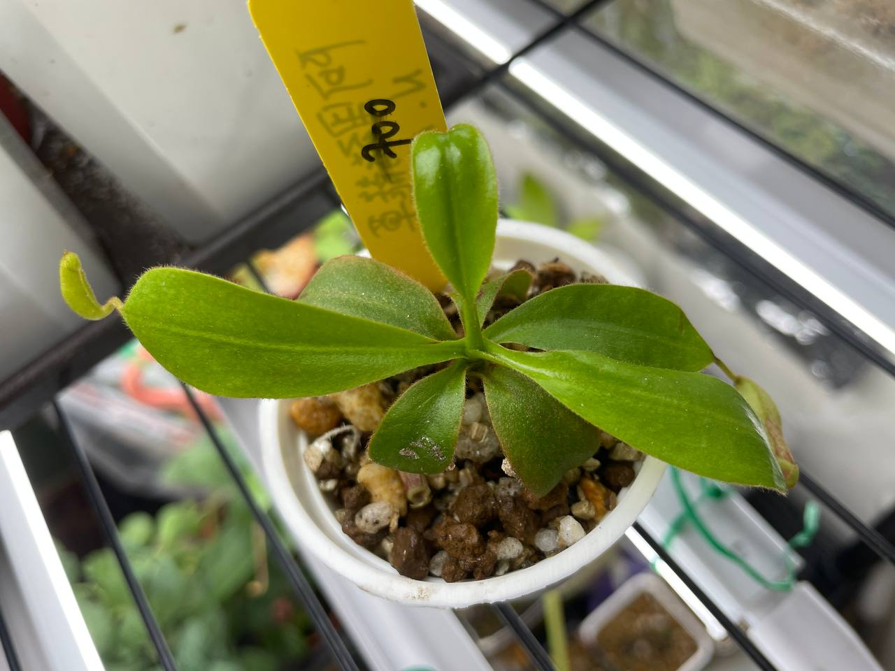

## 阿里豬籠草

中文名稱：阿里豬籠草  
學名：*Nepenthes* x 'Alisaputrana'  
購入管道：2023 台北食蟲植物交流會  
購入價格：700 NTD  

豹班與馬來王的自然雜交種，約生長在海拔 2000 m。  
外觀上保留了馬來王寬唇巨瓶的特色。  

這棵有趣的是原本攤位上賣得不貴，卻沒有人要買。  
結果拿去競標，結標價格比我入手的還高。  
旁邊馬來王倒是賣得很快，我看到的下一秒就被人拿在手中再也不放下了。  

### 2023/11/04 入手

