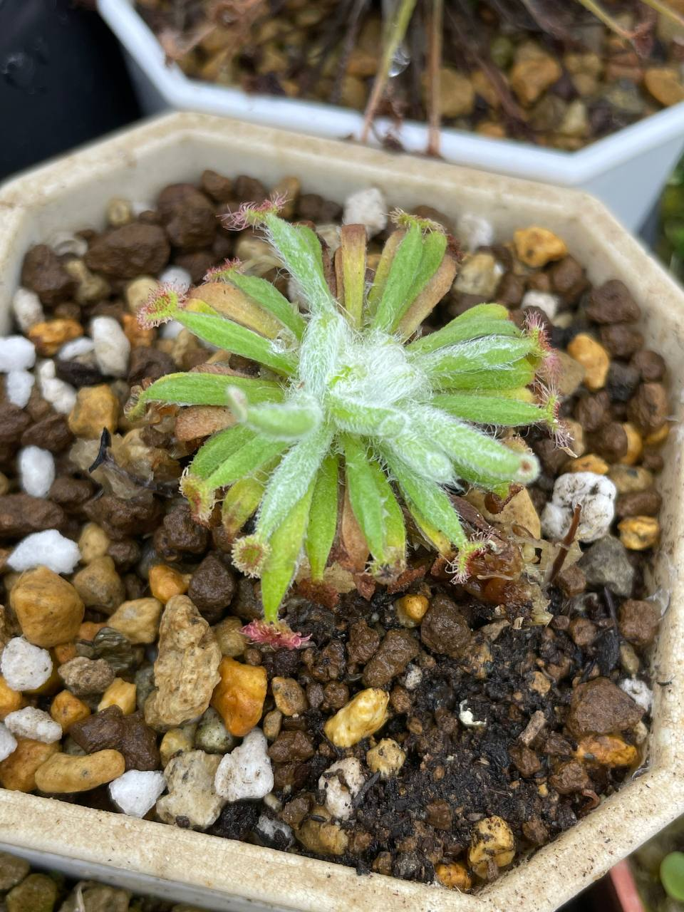

## 植物資料

中文名稱：寬銀毛毛氈苔  
學名：_Drosera ordensis_  
購入管道：shopee  
購入價格：550 NTD

北領地毛氈苔的一員，夏天不怕熱，只要注意不要讓土乾掉。  
反而是冬天要注意保溫，可以的話能稍微斷水使其休眠。

## 栽培紀錄

這陣子市面上出現蠻多寬銀毛，可能是有人大量進口或者哪個繁殖商有釋出吧。

### 2024/04/09 入手

幾乎無根，要多注意植株保濕，目前加蓋悶養中。

### 2024/05/06 死亡

夏天腰水種植，結果從底部慢慢往上黑心。
