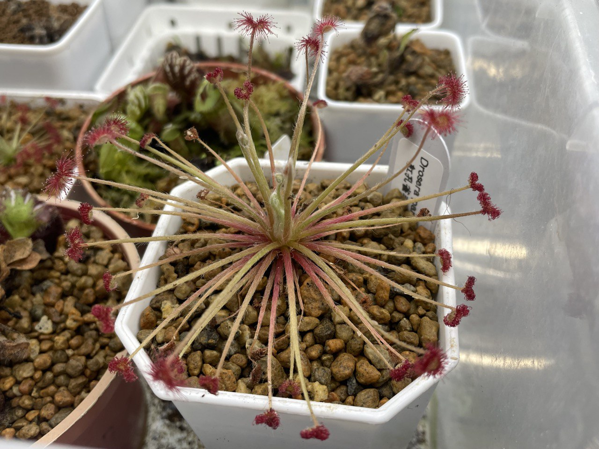
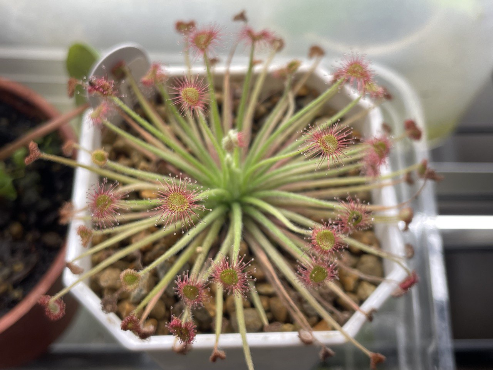
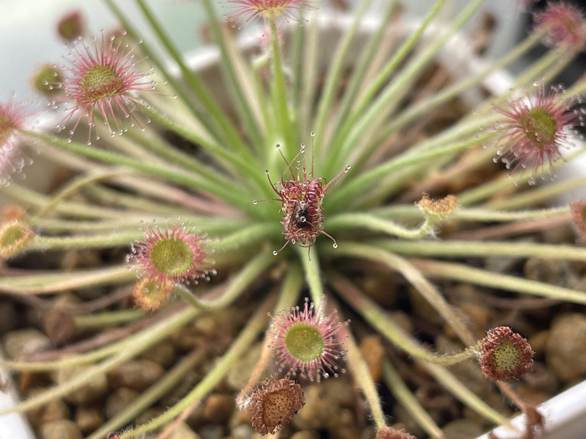
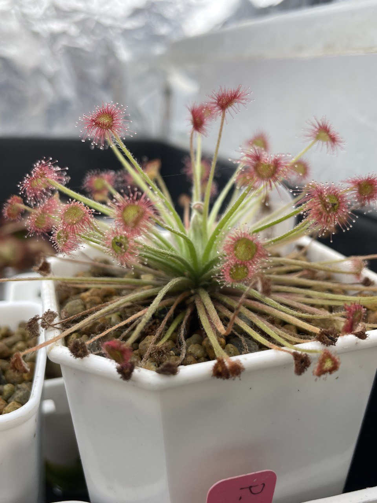
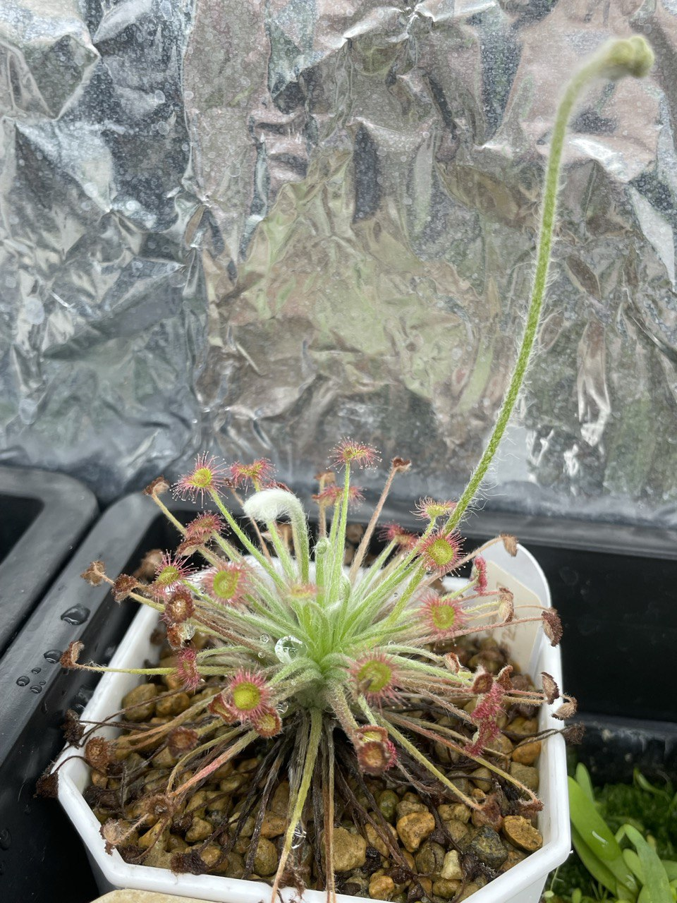
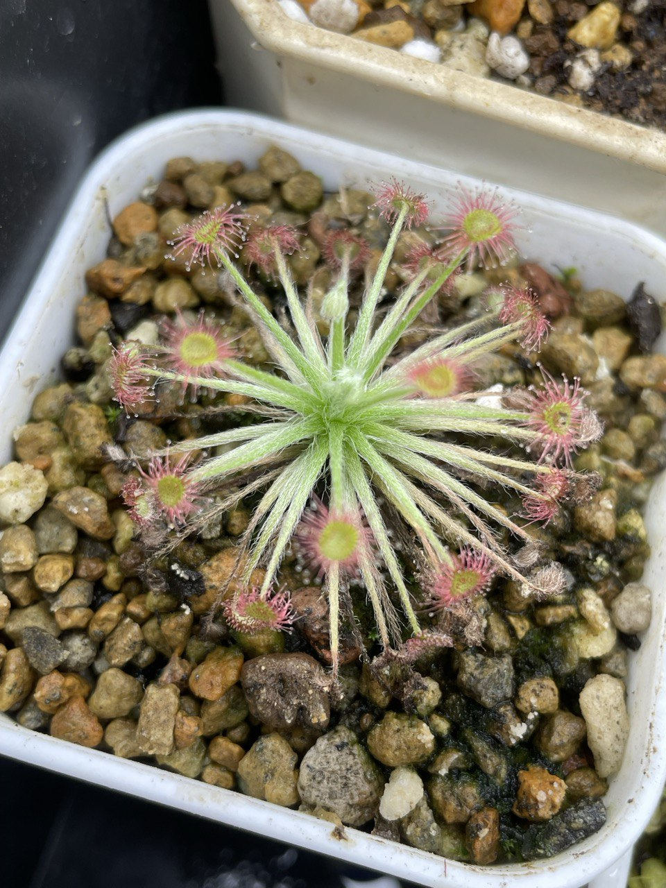

## 植物資料



中文名稱：紅孔雀毛氈苔  
學名：*Drosera paradoxa*  
購入管道：shopee  
購入價格：100 NTD / 3 棵  

北領地毛氈苔中最容易種植的種類，即使冬天休眠也不太會完全從土表消失。  
取得容易，可以拿來練習北領地毛的葉插。  

## 栽培紀錄

## 2023/11/01 入手

實際收到兩大一小，一棵送人剩一大一小。  
腺毛好紅，但很多都乾掉。  

### 2023/12

腺毛沒有剛來時那麼紅，可能光強度要再高一點才能曬出來。  
這個光強度太陽瓶都能曬出不錯的顏色了，可見北領地非常耐曬。  
抓蟲丟上去一陣子後，可見捕蟲葉將昆蟲包覆起來，十分舒爽。  


  
  
  


### 2024/04/09

之前都只拍大棵的，這次第一次小棵的入鏡。  
在冬天氣溫低時有輕微斷水，使得植株小休眠尺寸縮水。  
大棵的可能休眠較多，恢復生長勢後抽了花梗。  


  
  

