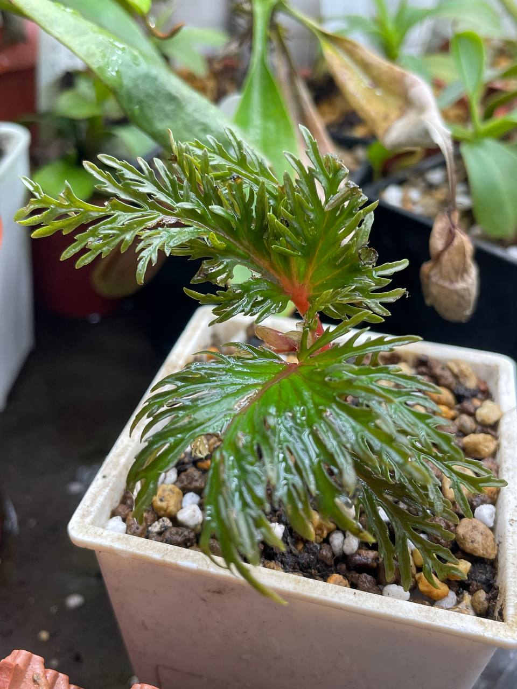
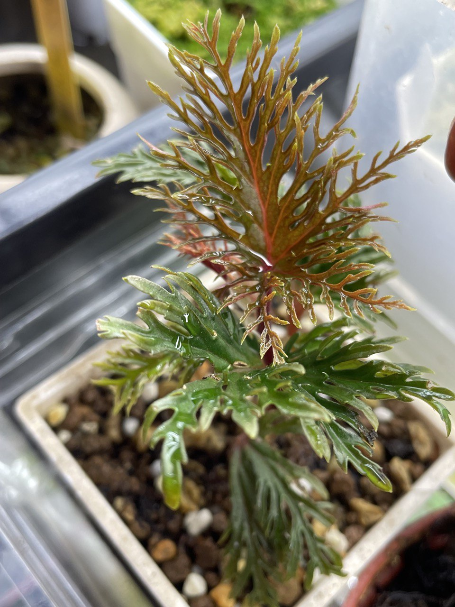
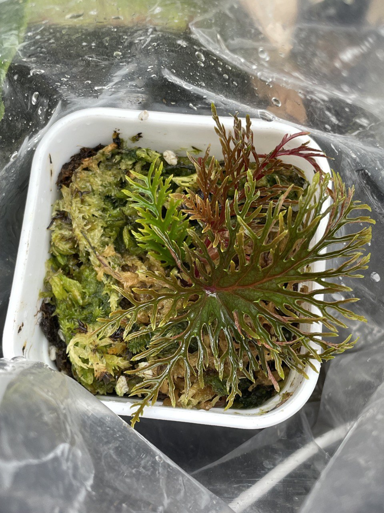

## 植物資料

中文名稱：二回羽裂秋海棠  
學名：*Begonia bipinnatifida*  
購入管道：蝦皮  
購入價格：350 NTD  

光線不用太強，但需要極高的空氣濕度，在濕度高的台灣平地還是建議悶養比較保險。  
為了兼顧透氣性，使用泥炭土與顆粒介質約 1:1，低於 1 cm 腰水栽培。  

## 栽培紀錄

### 2023/12/12 入手

原本栽培的光度可能稍弱，葉片的分支性沒這麼好。  

### 2023/12/30

光度足夠時生長的葉片分支較緻密。  

### 2024/01/05

砍頂芽扦插。  

