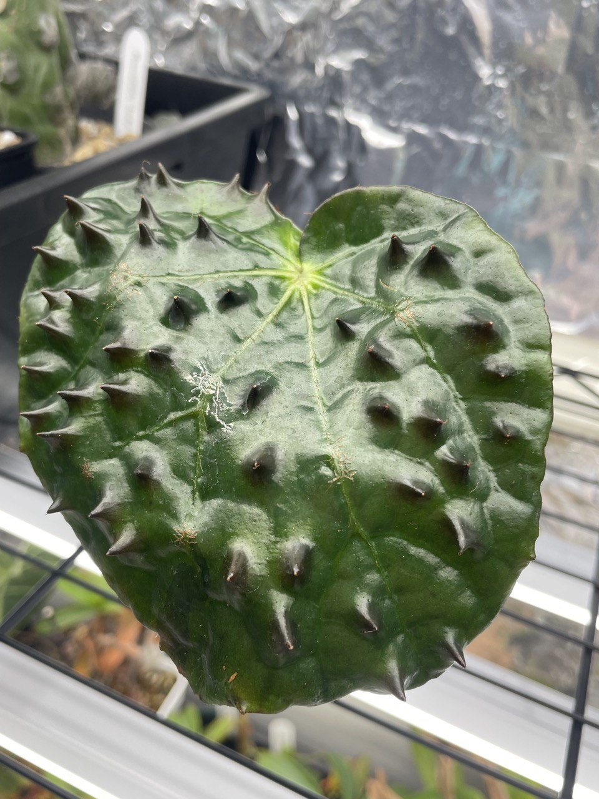
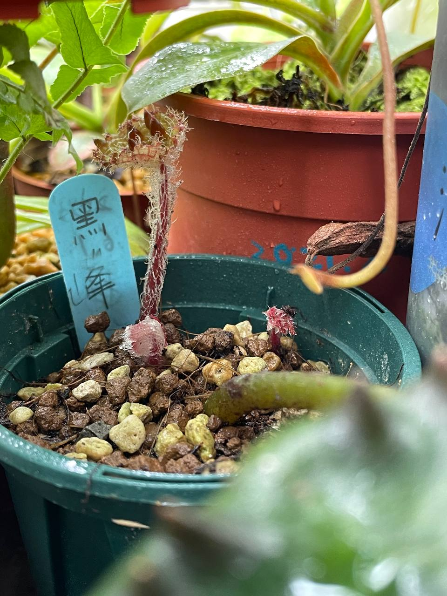
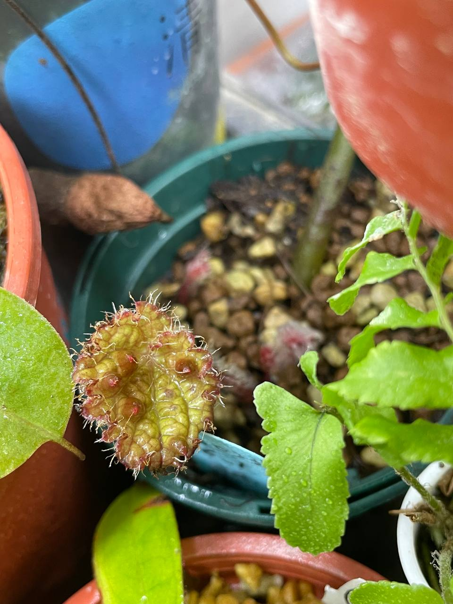
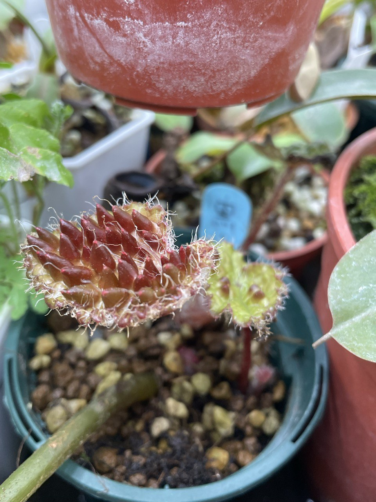
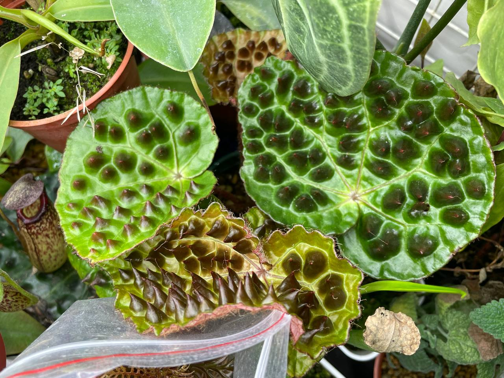
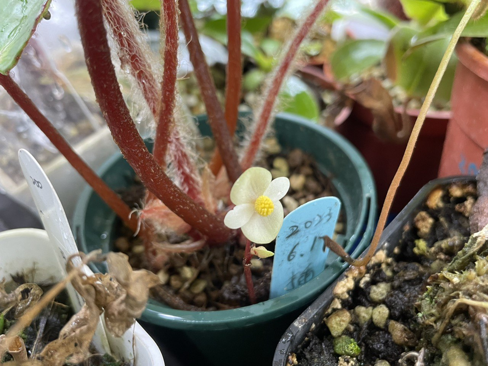

## 植物資料

中文名稱：黑峰秋海棠、中國黑峰秋海棠  
學名：*Begonia ferox*  
入手管道：朋友贈送  

外觀非常像黑泡秋海棠（越南黑峰秋海棠, *Begonia melanobullata*）。  
差別在黑峰葉緣與釘上的毛在成熟後會脫落。  

光線不用太強，明亮即可。  
對於空氣濕度變化也不像太陽瓶子草那麼敏感，在台灣不要放在風太大的地方即可，平時不用特別加濕。  
耐熱性似乎沒那麼好，夏天可能要再觀察一下是否會熱衰。  

## 栽培紀錄

### 2023/10/23 入手

約 2023/06/01 扦插。  
放置於室內層架水盤內，水盤常態有低於一公分的淺腰水，顆粒介質。  

### 2024/01/02

老葉無變化，不過總共有三片新葉子自土壤中竄出。  


 
 


### 2024/01/21

自從新葉子從土中冒出後，成長速度快了許多。  

### 2024/04

葉子持續生長，也開了朵小花。  


  
  

