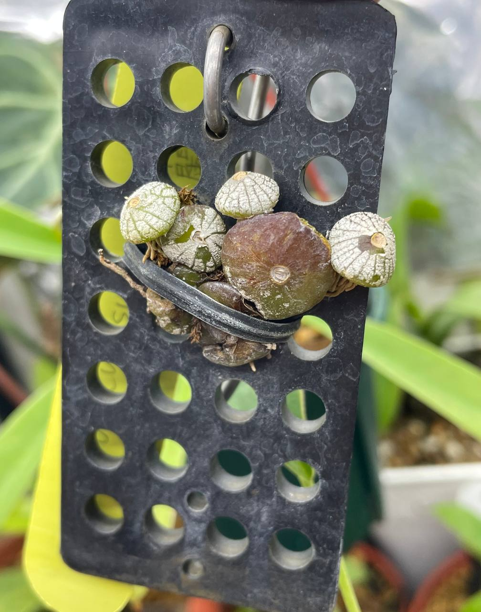

## 植物資料

中文名稱：藏銀豆蘭  
學名：*Bulbophyllum polliculosum*  
購入管道：FB 蘭花交流社  
購入價格：300 NTD  

豆蘭附生在熱帶樹林的樹冠層高處，可以推測其喜歡空氣濕度較高、半陰至明亮的環境。  
藏銀豆蘭生長週期類似於春石斛，春季來花、夏季生長、秋季落葉、冬季休眠。  
冬季休眠時需要節水，假球莖表面會轉為銀白色。  

## 栽培紀錄

### 2024/01/07 入手

為了較高的空氣濕度，與豬籠草種在一起。  
裸根版植的關係，應該不太需要注意根部積水的問題。  
銀白色的鞘膜非常好看。  


  
  


### 2024/04/28 抽芽

沒開花，直接從假球莖側邊抽芽。  


  
  

