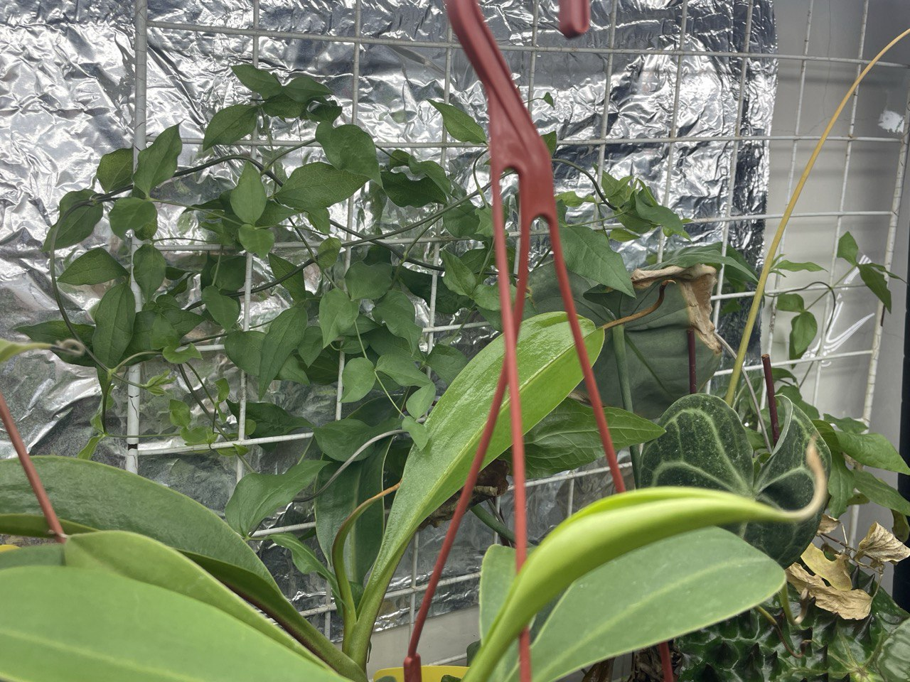
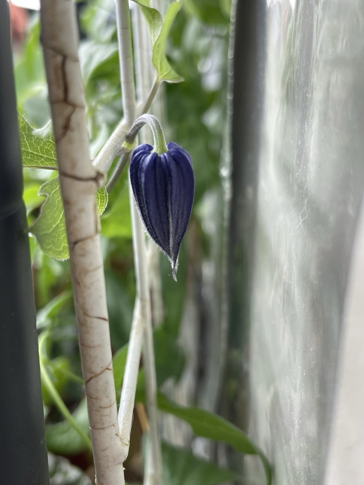
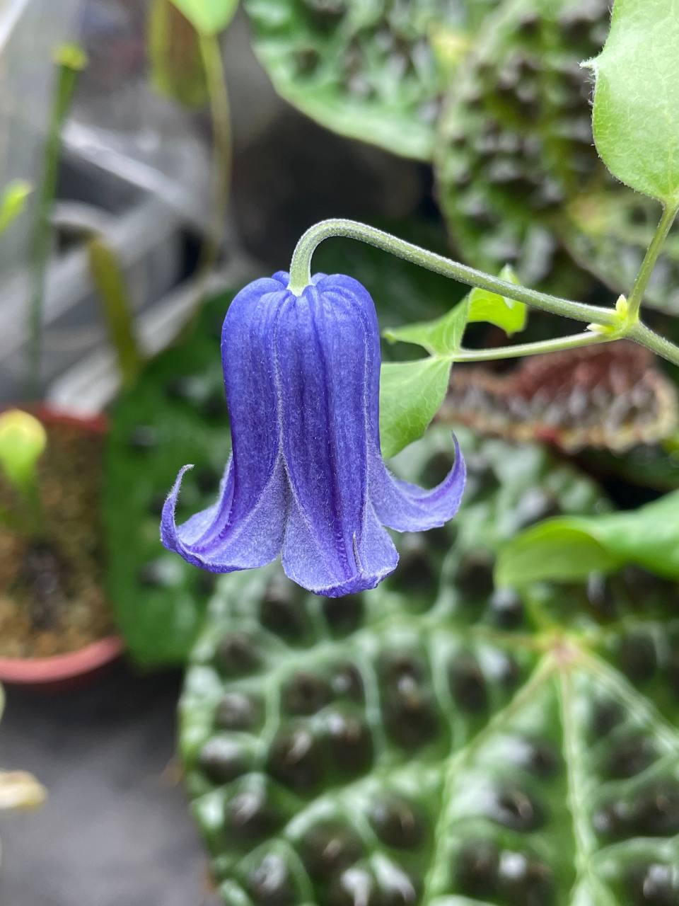

## 植物資料



中文名稱：龍口鐵線蓮  
園藝名：*Clematis* 'Rooguchi'  
花期：夏  

此品種冬天會枯葉，春季生長夏季開花。  
藍紫色鈴鐺狀單瓣花，冬天休眠時可重剪。  
葉子喜歡光照，但根部怕熱，夏季時需要準備方法避免陽光直曬盆土。  
長期積水容易導致病害，能以培養土為主體適當添加一些顆粒介質增加透氣度。  
土壤完全乾燥後未出現缺水徵狀，可等土乾後再澆水，製造乾濕循環降低病害風險。  

## 栽培紀錄

### 2024/04/27 抽芽

冬天休眠後，隨著氣溫升高醒來，由較粗的莖基部抽出新芽，並爬慢塑膠網。  

### 2024/06/20 開花

今年首花。  
注意到的時候已經掛著藍紫色的花苞，三天後盛開。  


  
  

