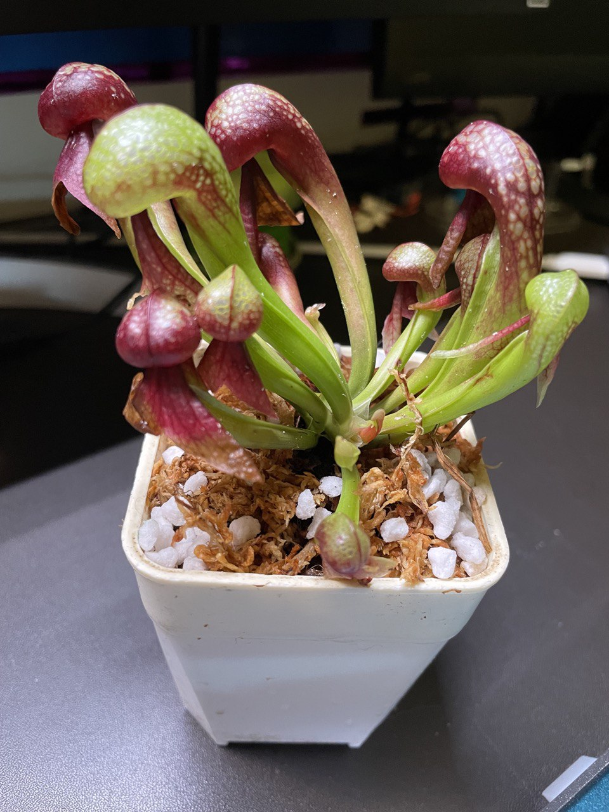
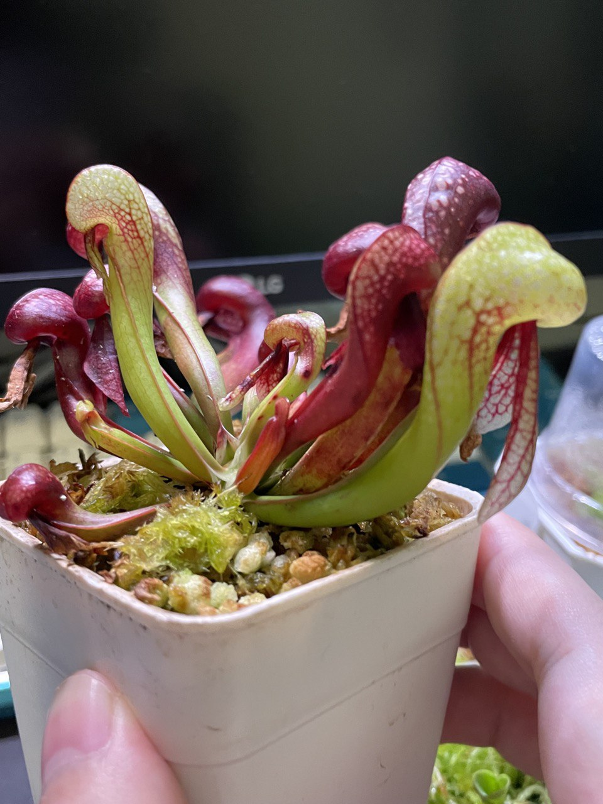
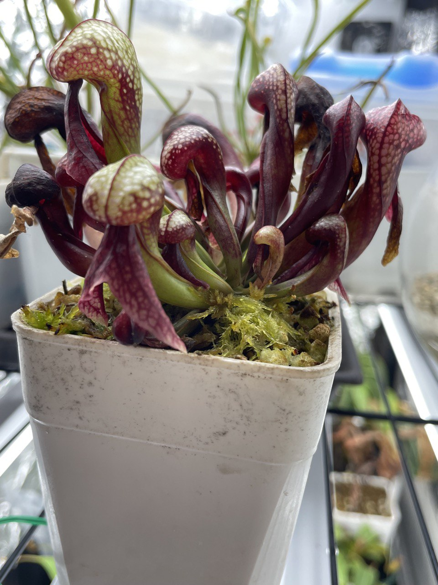

## 眼鏡蛇瓶子草

中文名稱：眼鏡蛇瓶子草  
學名：*Darlingtonia californica*  
購入管道：FB 食蟲社團  
購入價格：950 NTD  

夏季溫度：日/夜溫 26/22.5℃，使用製冷晶片小冰箱  
冬季溫度：能以休眠的型態度過原生地會降雪的冬季，在台灣冬季不需保暖設備  
濕度：70% 以上  

## 栽培紀錄

### 2023/06/08 入手

以水苔混珍珠石作為介質。  
比太陽瓶子草還怕熱，毫無懸念直接放冰箱。  
原生地的眼鏡蛇瓶子草根部會浸在水裡，於是使用水盤淺腰水。  

### 2023/07/24

眼鏡蛇瓶子草的瓶子在生長後期頭部會向外扭轉，非常有趣。  
可觀察瓶子上的脈紋，或者比較前後幾張照片發現。  

### 2023/11/01

眼鏡蛇瓶子草的莖平行於地表生長。  
即使植株種在盆子正中間，生長點也會逐漸向盆壁移動。  
碰到盆壁若不換盆，生長點受到擠壓產生的瓶子可能就會不那麼美觀。  

