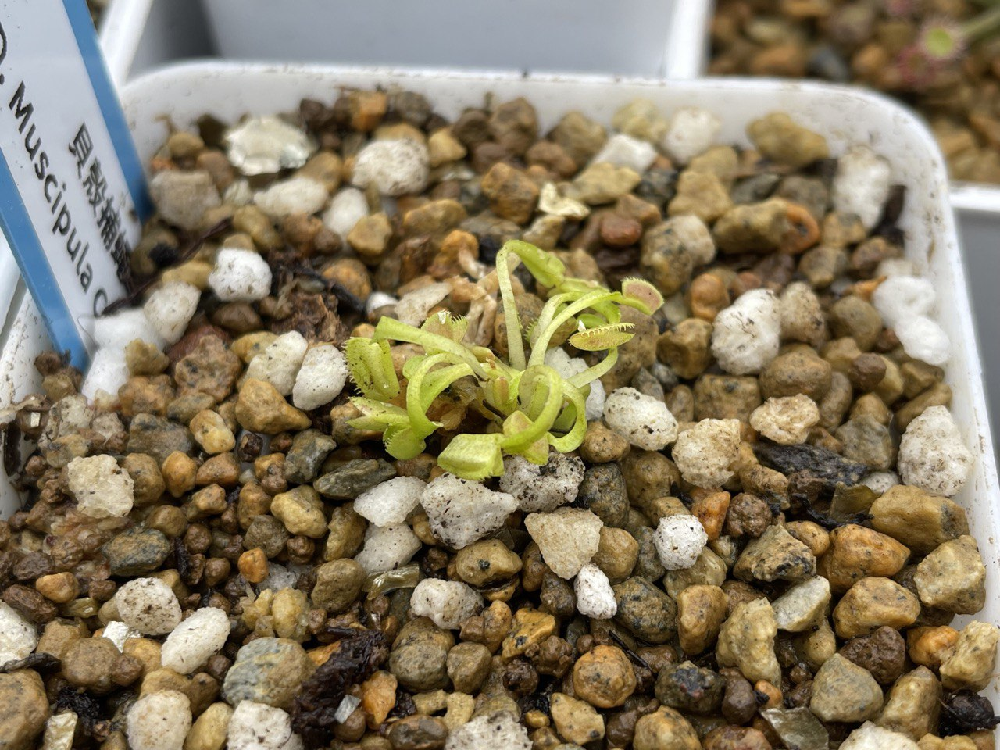

## 植物資料

中文名稱：貝殼捕蠅草  
學名：*Dionaea muscipula* "Coquillage"  
購入管道：蝦皮  
購入價格：350 NTD  

捕蠅草喜歡強光，根喜濕，但鱗莖過於潮濕容易染菌。  

貝殼是牙齒小而短，夾子圓而具厚實感的種類。  
使用水苔包覆植株基部，種植於顆粒與泥炭混合介質中。  
1 cm 以內淺腰水，置於層架光度偏強的位置。  

## 栽培紀錄

### 2023/12/27 入手

植株比想像中小很多，不確定成株尺寸能多大。  

