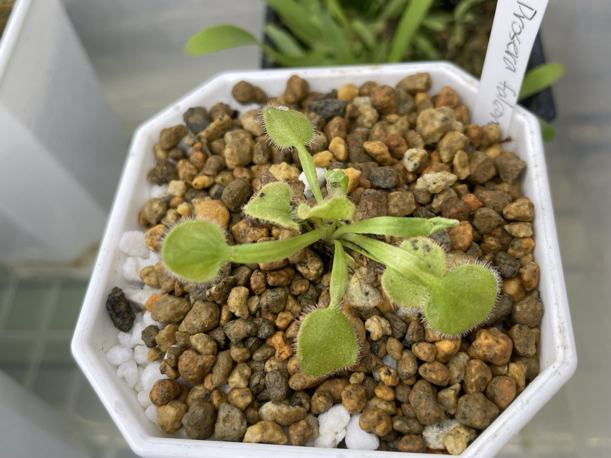

## 植物資料



中文名稱：大肉餅毛氈苔  
學名：*Drosera falconeri*  
購入管道：蝦皮  
購入價格：580 NTD  

屬於北領地毛氈苔的一種。  
北領地毛通常喜歡高溫強光，較為適應台灣夏天的氣候。  
一般來說，栽培難點比較落在冬季休眠的管理。  
夏天時，以淺腰水種植，等水盤完全乾燥再補水即可。  
北部冬天對於北領地毛來說過於陰暗且濕冷，容易使球莖腐敗。  
若能移至室內以燈養的方式栽培會簡單很多。  
隨著氣溫降低，需要降低給水使其休眠。  
如何給水讓球莖不至於乾死，也不會因過於潮濕而腐敗，是栽培者的挑戰。  
大肉餅休眠是會完全從土表消失，等到隔年約 3-5 月回暖才從土表冒出葉子並抽梗開花。  

## 栽培紀錄

### 2024/05/11 入手

可看出原本環境較為低光高濕，長出來的葉柄偏長，且在開放空間下沒什麼黏液。  
入手後先加蓋悶養，防止脫水太嚴重。  
一週後再移除蓋子，讓他自己去適應普通環境。  
氣溫乍暖還寒，還是會怕球莖腐敗。  
用顆粒介質為主，並且用水盤給水，水量控制在約當天就能被盆栽吸乾，一兩天土表會轉白的程度。  

