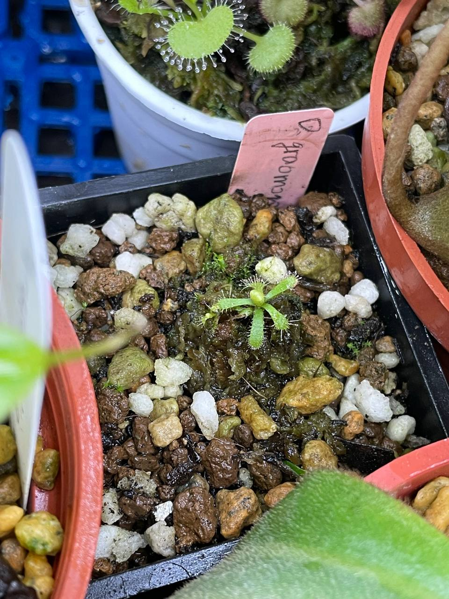
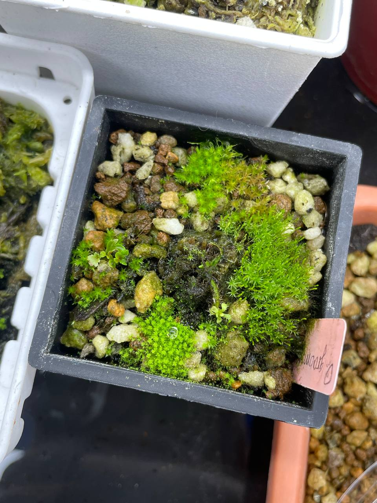

## 植物資料

中文名稱：格拉莫哥毛氈苔  
學名：*Drosera graomogolensis*  
購入管道：蝦皮  
購入價格：390 NTD  

南美毛氈苔中適應性較好的種類。  
喜歡強光，且可以適應較低的濕度，在台灣應該可以不悶養。  
可以忍受到 30℃ 的日溫，不過似乎需要降低夜溫。  

## 栽培紀錄

### 2023/12/12 入手

植株狀態感覺沒有很好，先用低光淺腰水悶養。  

### 2024/02/02

原本的葉片枯萎到剩下兩片，現在看到的葉片大多是入手後重新長的。  
看植株沒有再枯葉，情況穩定後移除悶養蓋子，不過還是放置在低光高濕度的地方。  
左側葉片尖端有小芽產生。  

### 2024/04/10 枯萎後新生

原本以為狀況還行，沒有悶養後一陣子突然主芽點枯萎，剩下他自行從葉尖生長出來的小苗。  
發現狀況後繼續加蓋悶養。  
今天發現枯萎的芽點又有新的葉子冒出來。  

## 參考資料

[SPECIES PROFILE: DROSERA GRAOMOGOLENSIS](https://www.carnivorousjourney.com/p/species-profile-drosera-graomogolensis)
