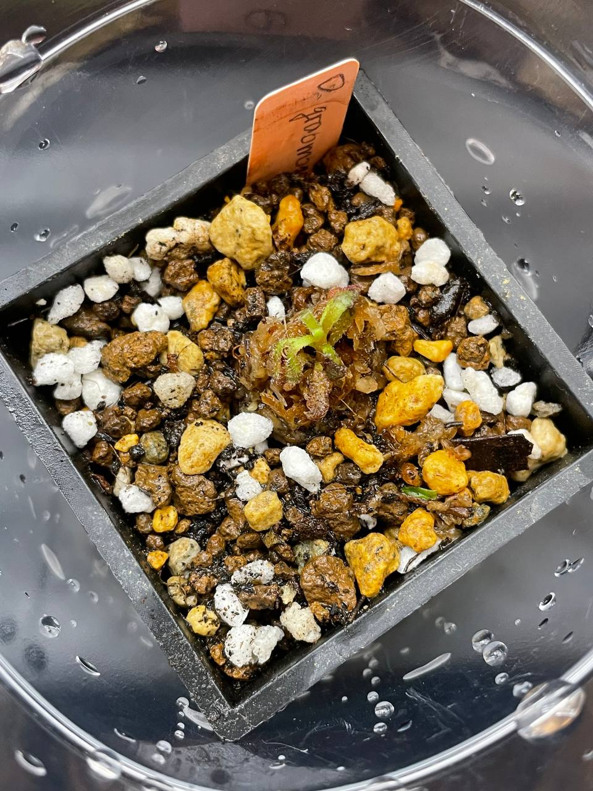

## 植物資料

中文名稱：格拉莫哥毛氈苔  
學名：*Drosera graomogolensis*  
購入管道：蝦皮  
購入價格：390 NTD  

南美毛氈苔中適應性較好的種類。  
喜歡強光，且可以適應較低的濕度，在台灣應該可以不悶養。  
可以忍受到 30℃ 的日溫，不過似乎需要降低夜溫。  

## 栽培紀錄

### 2023/12/12 入手

植株狀態感覺沒有很好，先用低光淺腰水悶養。  

## 參考資料

[SPECIES PROFILE: DROSERA GRAOMOGOLENSIS](https://www.carnivorousjourney.com/p/species-profile-drosera-graomogolensis)
