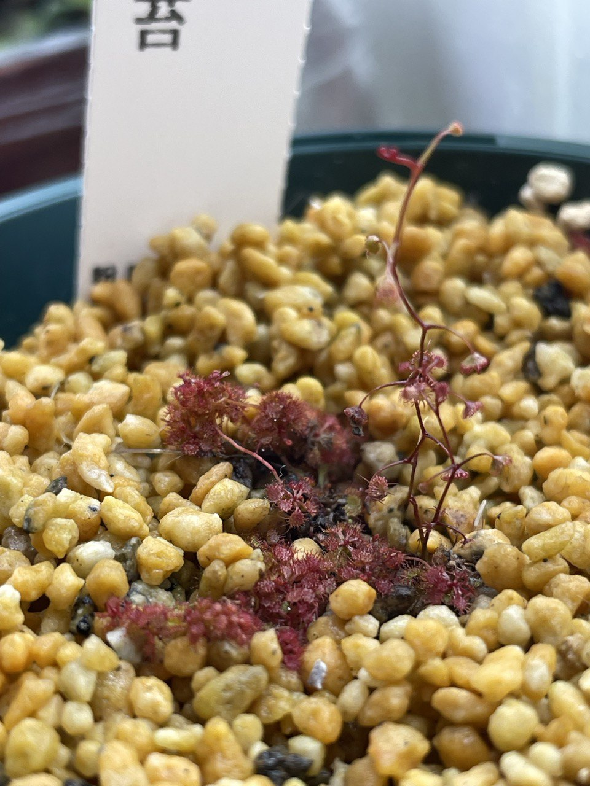
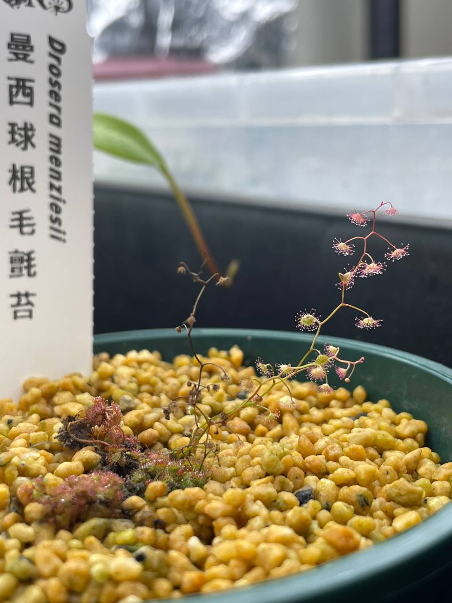

## 植物資料

中文名稱：曼西毛氈苔  
學名：*Drosera menziesii*  
購入價格：250 NTD  

## 栽培紀錄

### 2024/02/17 入手

直立型的球根毛氈苔，葉片非常小。  
照顧方式可參照 D. squamosa。  


### 2024/06/05

冰箱日夜溫約 24/21℃，投射燈光直射處。  
舊的直立葉枯萎，同時也抽了兩根新的直立葉。  
看來光照需求較高，都直射了顏色還是偏綠。  

