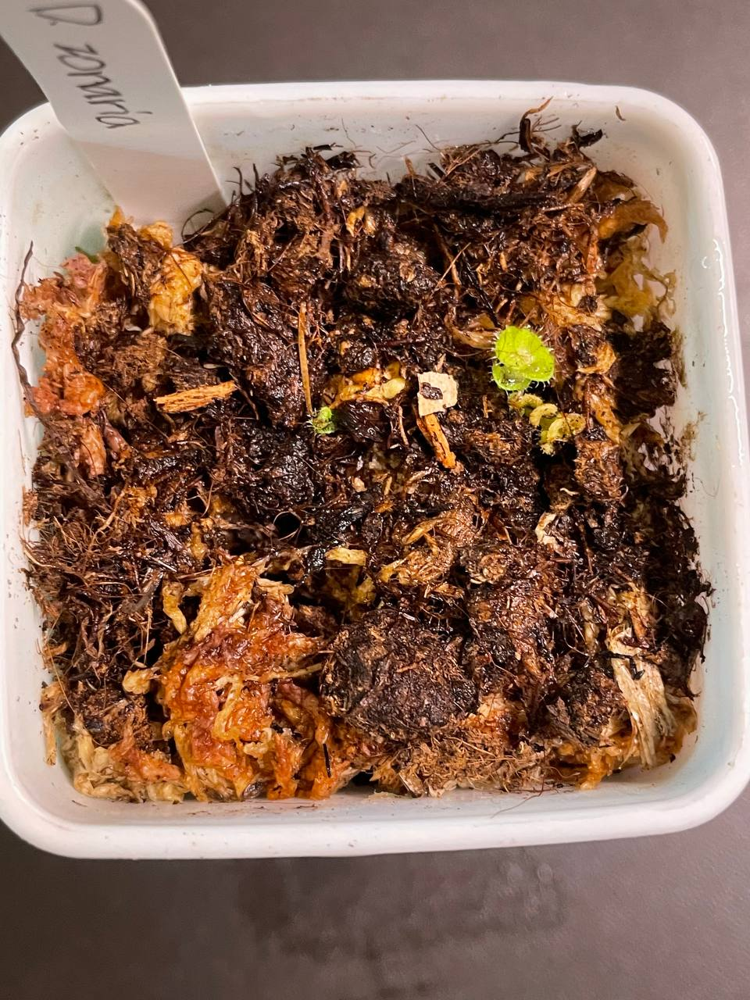

## 植物資料

中文名稱：環狀毛氈苔  
學名：*Drosera zonaria*  
購入價格：540 NTD / 2 顆塊莖  

## 栽培紀錄

### 2024/04/29 入手

組培球根毛，雖然有多個芽，但總共只看到兩顆球。  
一般來說應該是把容易爛掉的葉子拔掉，洗乾淨後種下去。  
照片左邊那棵沒有球，而右邊那棵有。  
不過植株看起來狀況沒很好，就直接種下去試試看。  
目前放在小冰箱，溫度約 20-23℃。  

