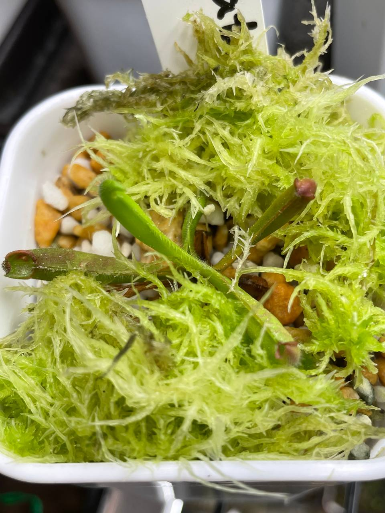
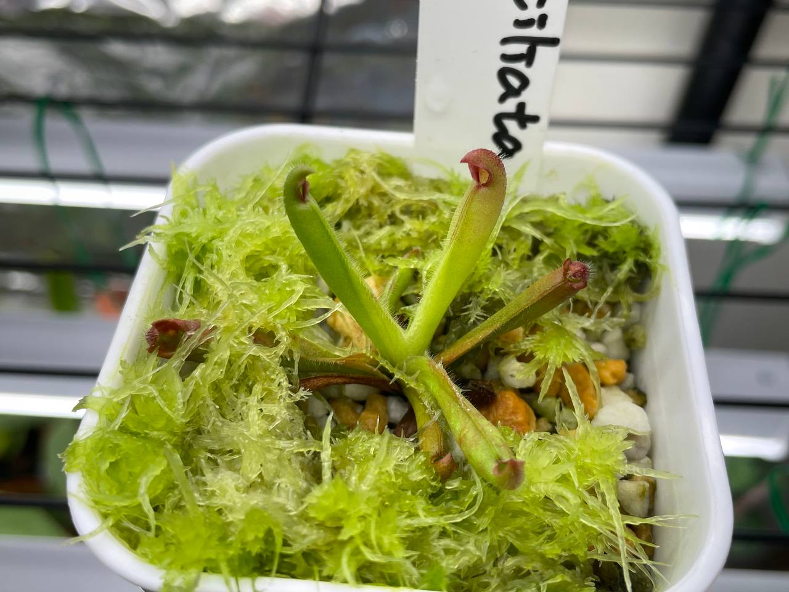

## 絨毛太陽瓶子草

中文名稱：絨毛太陽瓶子草  
學名：*Heliamphora ciliata*  
購入管道：2023 台北食蟲植物交流會  
購入價格：700 NTD  

夏季溫度：日/夜溫 26/22.5℃，使用製冷晶片小冰箱  
冬季溫度：台灣冬季不需保暖設備，但過冷的氣溫會使生長速度變慢  
濕度：70% 以上  

原生地海拔約 900 m，在太陽瓶子草中特別低，可以推估耐熱性較其他太陽瓶子草還要好。  
成熟瓶的蓋子上會有明顯的絨毛。  

### 2023/11/04 入手

### 2023/12/25

室內燈養中，日/夜溫約 22/16-17℃。  

