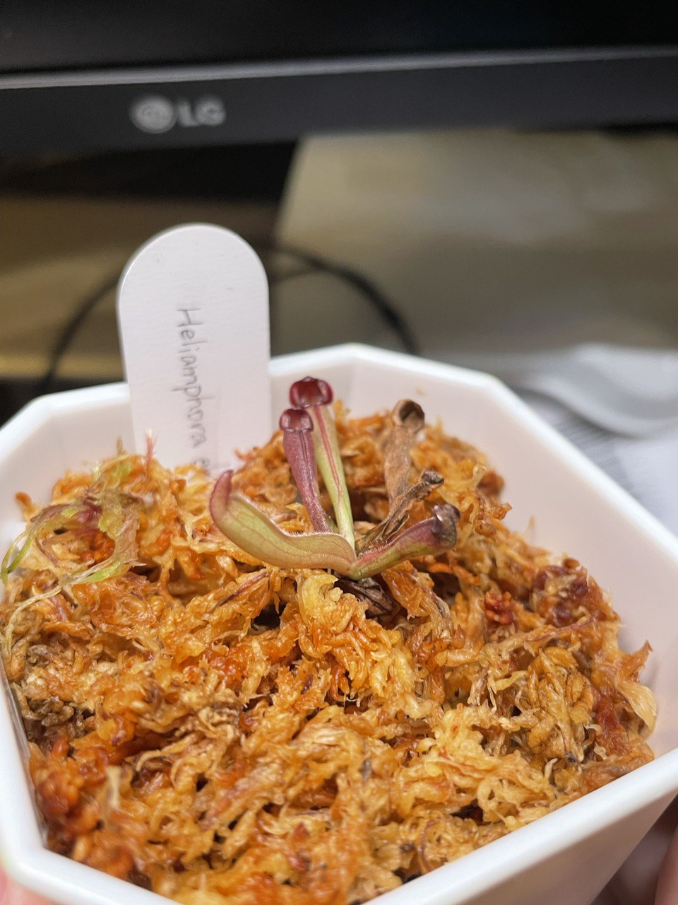
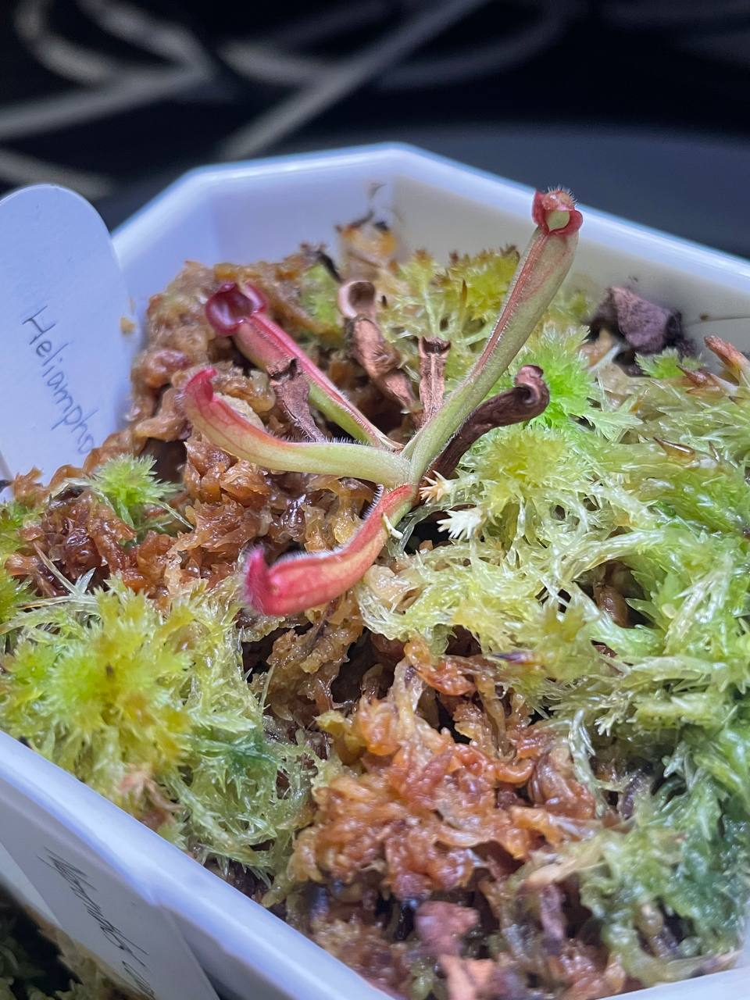
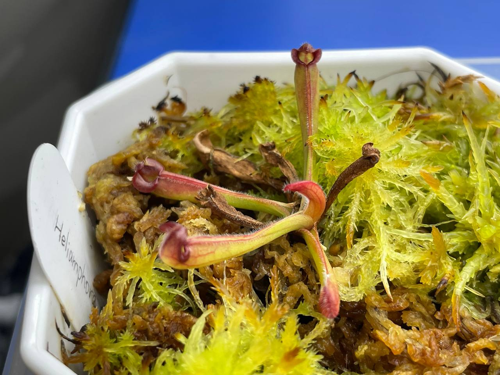
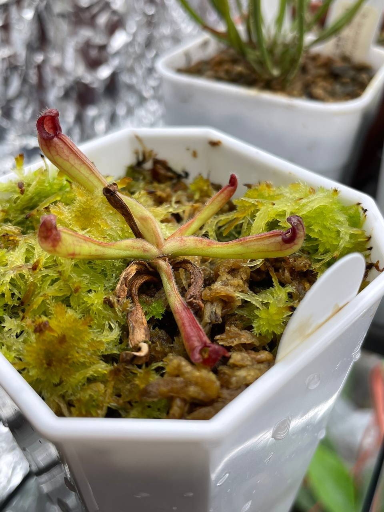
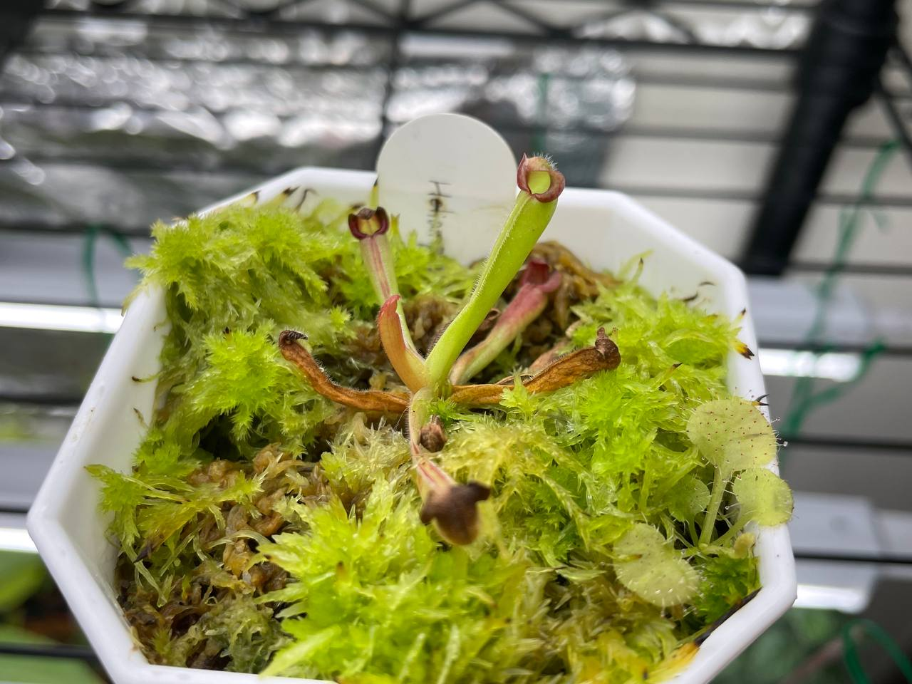
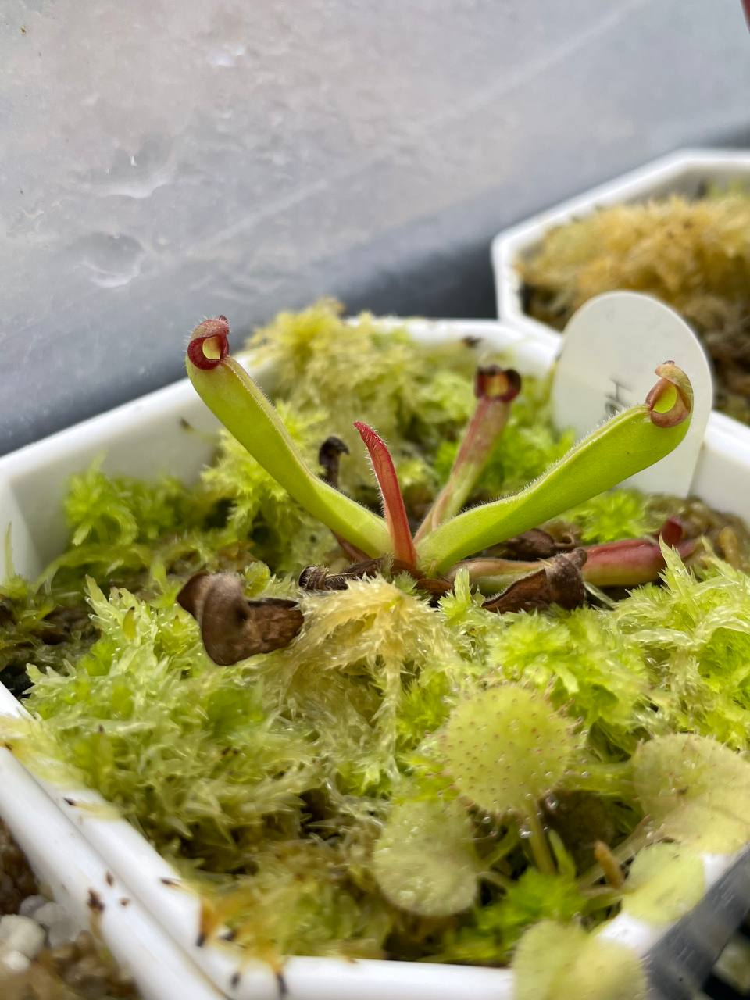

## 植物資料

中文名稱：瘦長太陽瓶子草  
學名：*Heliamphora elongata*  
購入管道：台灣食蟲社團  
購入價格： 650 NTD

夏季溫度：日/夜溫 26/22.5℃，使用製冷晶片小冰箱  
冬季溫度：台灣冬季不需保暖設備，但過冷的氣溫會使生長速度變慢  
濕度：70% 以上

## 栽培紀錄

### 2023/06/16 入手

四片葉子，其中一片頂端開始乾了。

### 2023/08/08

乾掉兩片長一片葉子。

### 2023/09/01

再長一片葉子。

### 2023/10/01 五片葉子

葉子再 +1。  

### 2023/11/01

葉片數沒增加。不過上面的脈紋蠻好看的。  

### 2023/12/25

室內燈養中，日/夜溫約 22/16-17℃。  
濕度波動太大，許多瓶子尖端都開始枯萎。  
不過有持續長大中。  
盆子右下角莫名冒出負子毛氈苔。  
雖然我有種植負子毛，但沒有混用過它的介質，真神奇。  

### 2024/02/02

