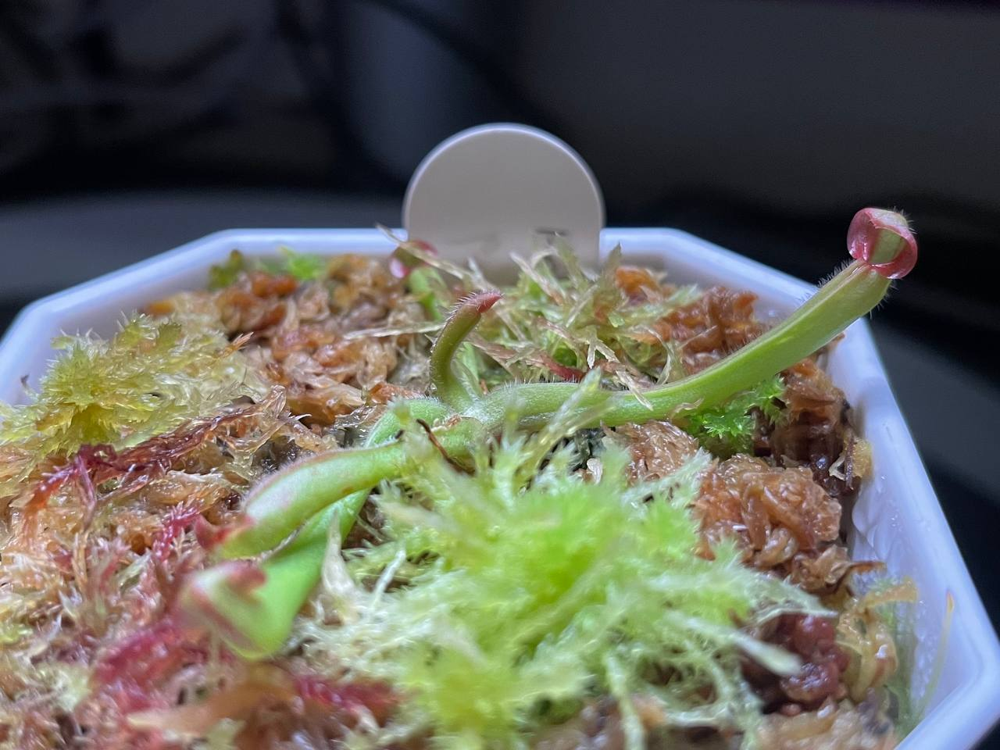
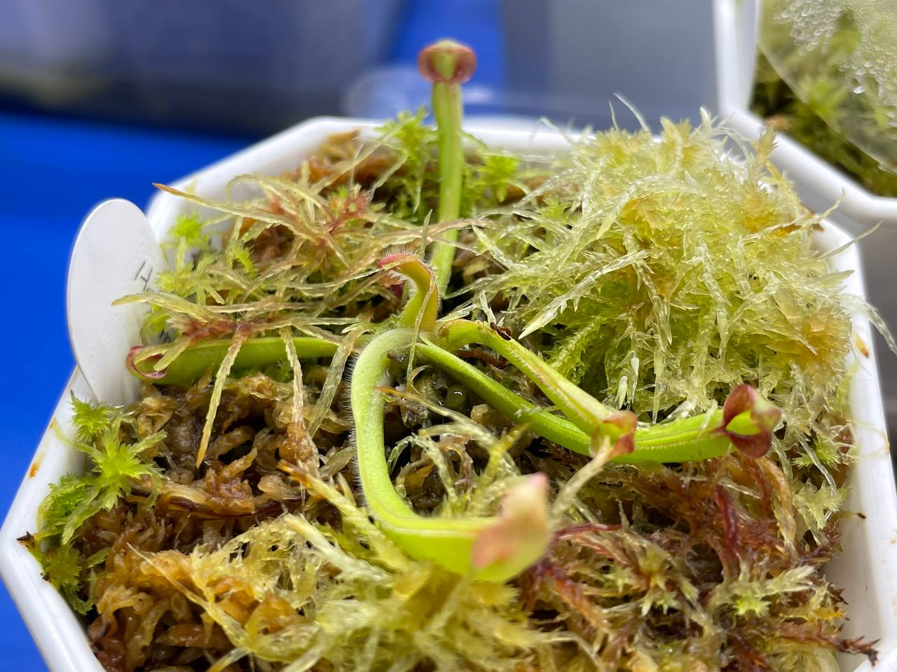
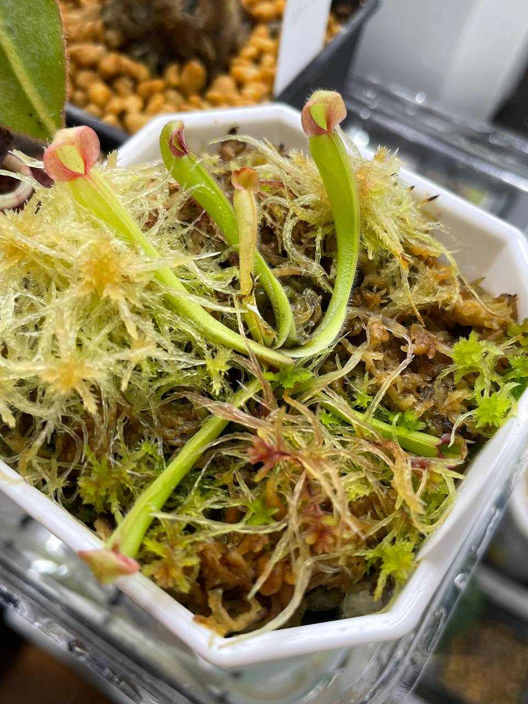
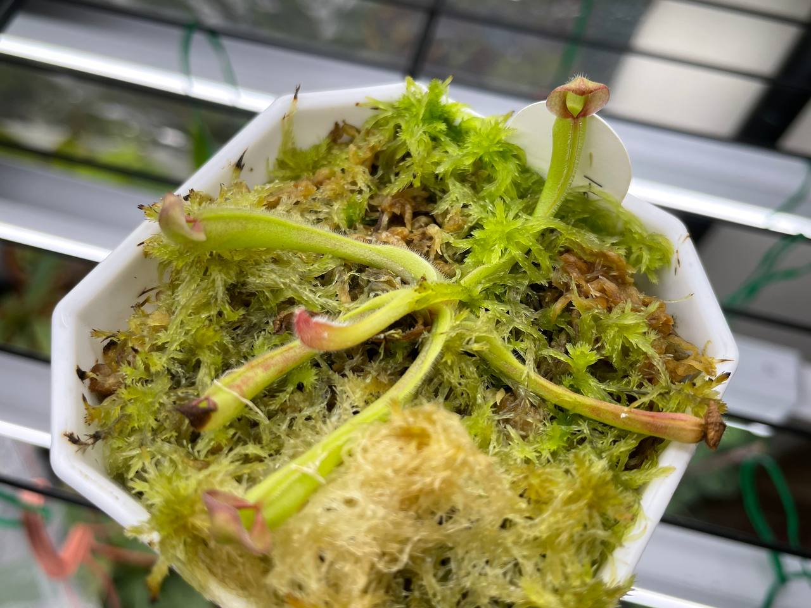

## 小囊太陽瓶子草 BCP

中文名稱：小囊太陽瓶子草  
學名及種源：*Heliamphora folliculata* BCP  
購入管道：台灣食蟲社團  
購入價格： 400 NTD

夏季溫度：日/夜溫 26/22.5℃ ，使用製冷晶片小冰箱  
冬季溫度：台灣冬季不需保暖設備，但過冷的氣溫會使生長速度變慢  
濕度：70% 以上

## 栽培紀錄

### 2023/06/29 入手

### 2023/07/24 三片葉子

### 2023/08/08 四片葉子

### 2023/09/01 五片葉子

持續以一個月一片葉子的速度成長著。  

### 2023/10/01 六片葉子

成長中，隔壁的水苔越來越猖狂。  

### 2023/11/01

低光悶養環境，長得有夠快。  

### 2023/12/25

室內燈養中，日/夜溫約 22/16-17℃。  
因為最近濕度波動大，有些葉片開始枯萎。  

