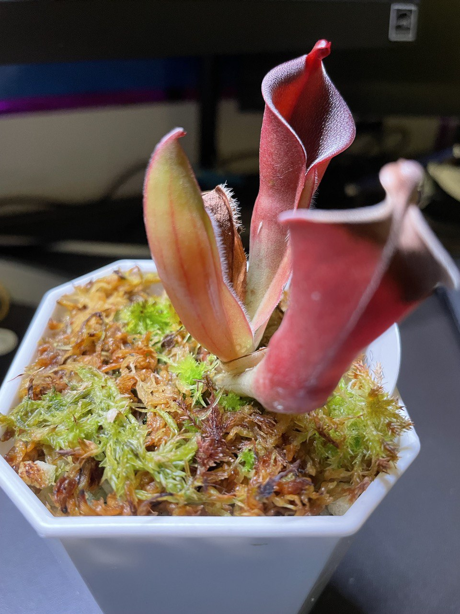
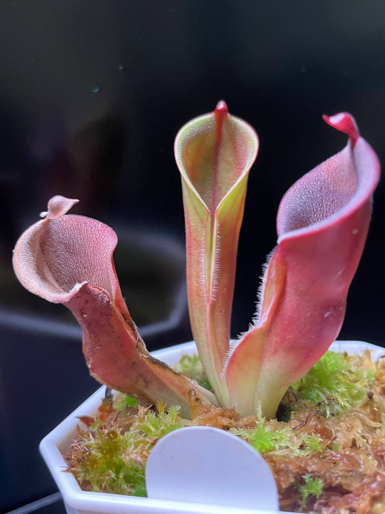
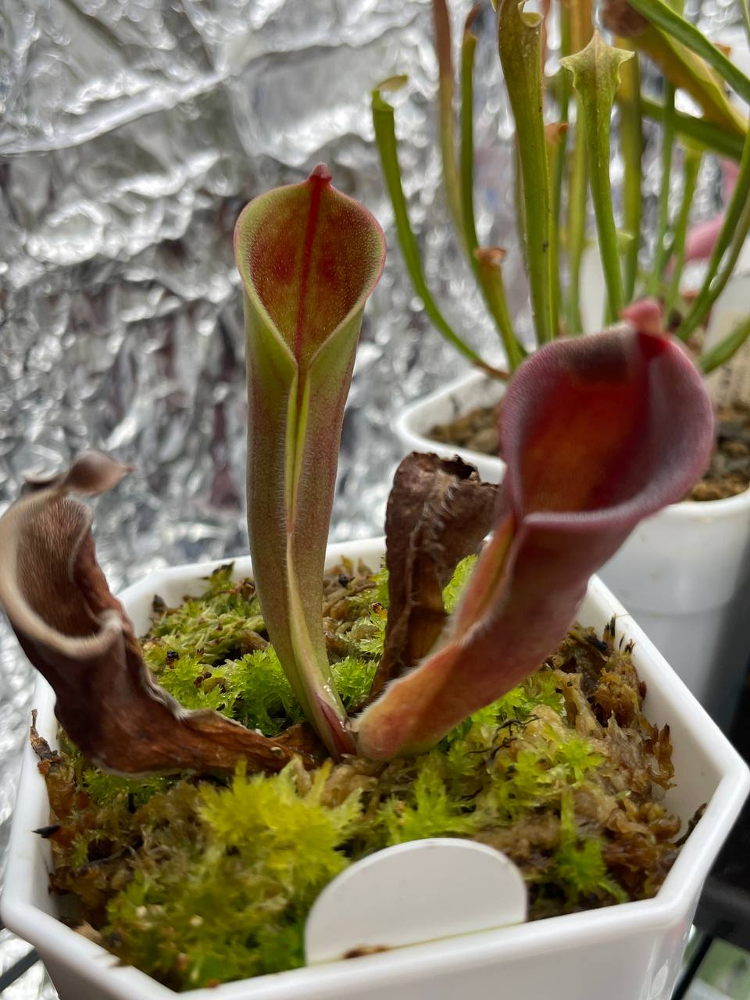
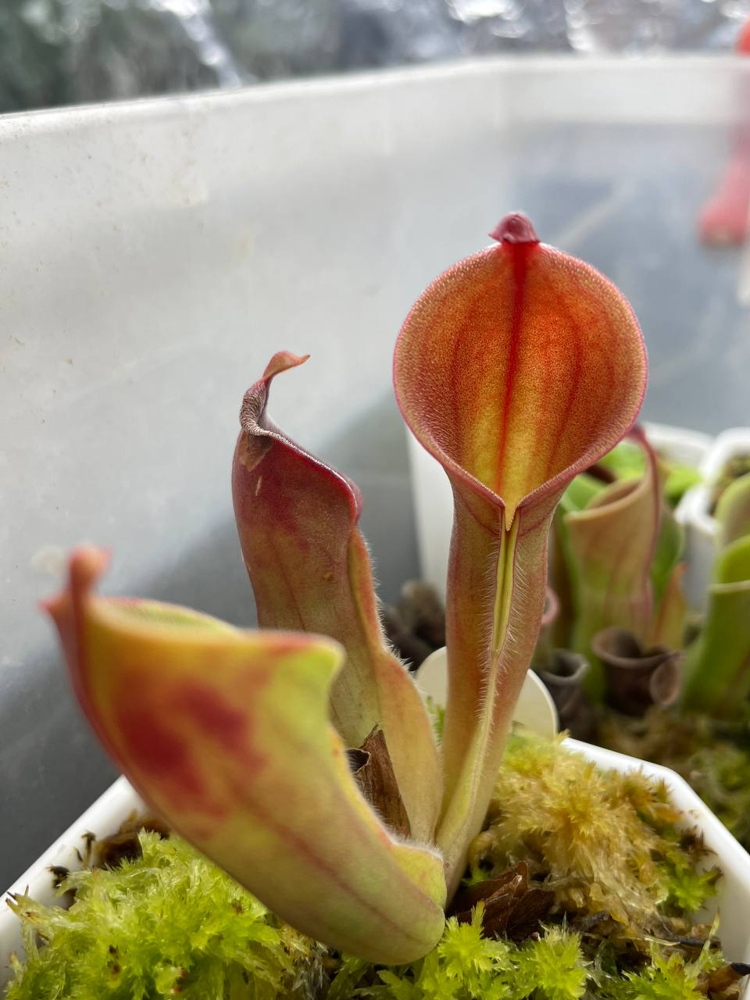
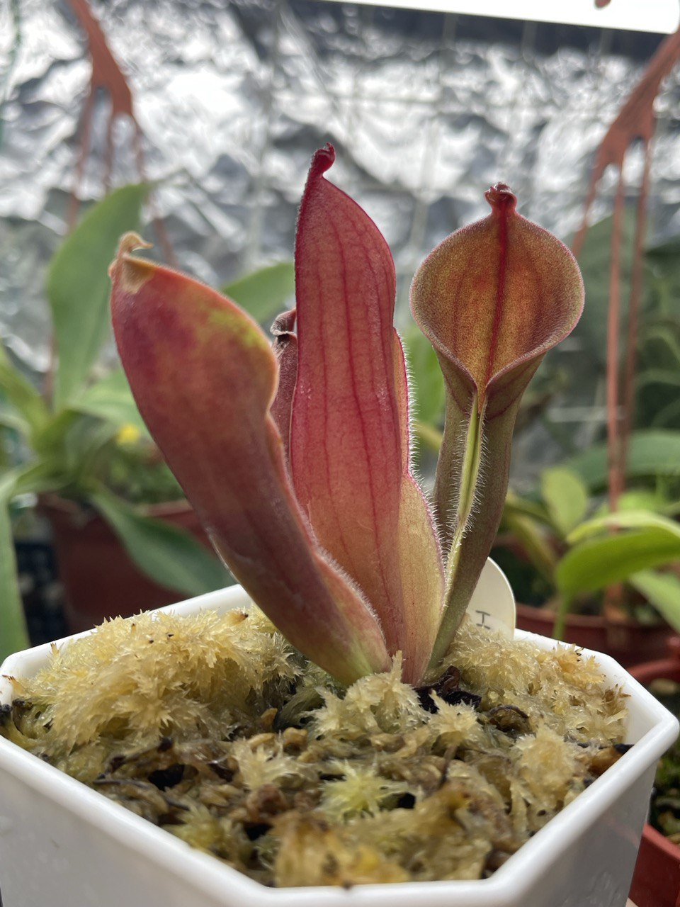
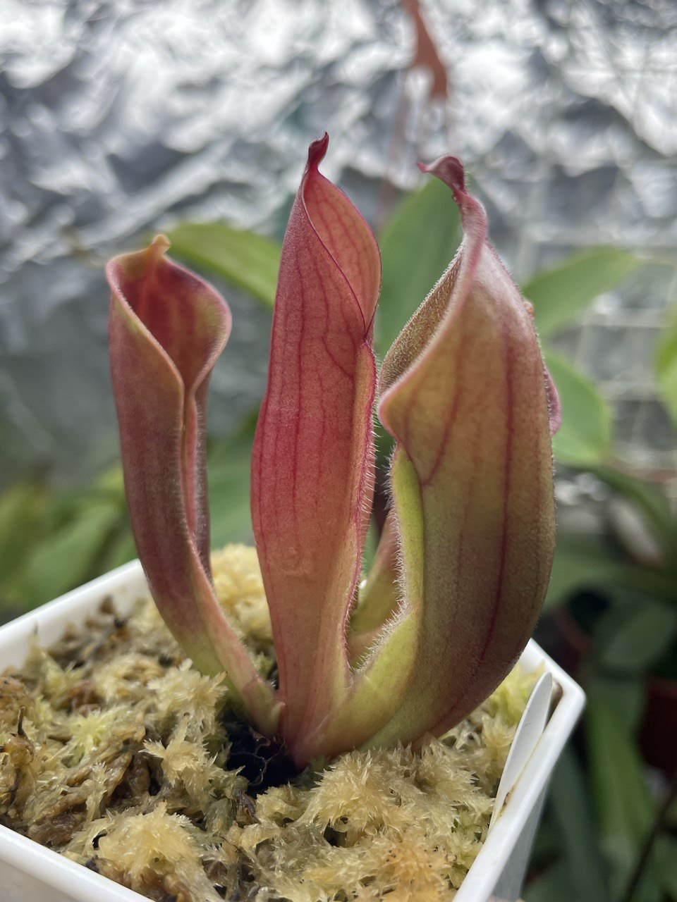
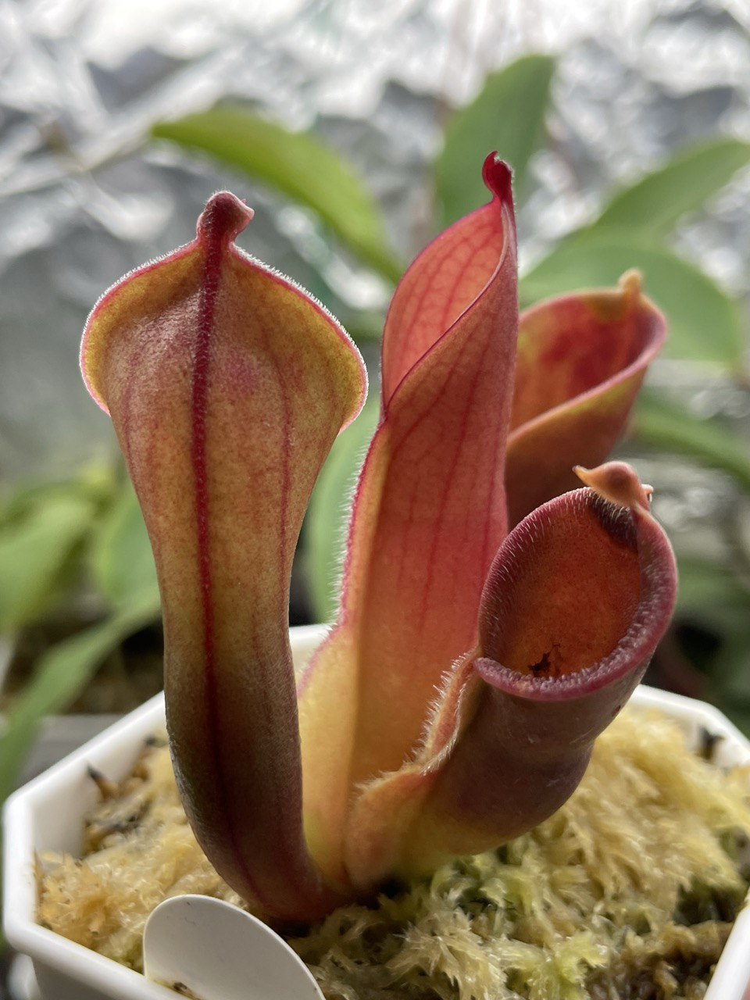

## 植物資料

中文名稱：(另解太陽瓶子草 x 艾俄那西太陽瓶子草) x 披毛小太陽瓶子草  
學名及種源：*Heliamphora* (*heterodoxa* x *ionasi*) x *minor* var. *pilosa* AW clone 02  
購入管道：台灣食蟲社團  
購入價格：1800 NTD

夏季溫度：日/夜溫 26/22.5℃ ，使用製冷晶片小冰箱  
冬季溫度：台灣冬季不需保暖設備，但過冷的氣溫會使生長速度變慢  
濕度：70% 以上

## 栽培紀錄

### 2023/06/29 入手

### 2023/07/24 葉芽竄出

### 2023/08/07 新葉子由片狀開始膨大

### 2023/09/01 第一片新葉

葉片完成發育。  
可能是光照不夠，新瓶子顏色偏橘黃色，形狀較瘦長。  
暫時不調整光強度，看看下個月會不會轉紅。  

### 2023/11/01

幾乎沒動靜，只有兩片老葉子乾掉或正在乾掉的路上。  
最新的葉子基部可以觀察到葉芽，就看他要多久才長出來。  

### 2023/12/14

在夜溫開始低於二十度後，移出小冰箱至室內層架。  
雖然今年是暖冬，十二月白天加上燈的發熱有時能達到 27℃，不過還是長得不錯。  

新長的第一片葉子蓋子較小、瓶口瘦長，看來是光度不足。  
新長的第二片葉子在層架下生長，蓋子正常發育且瓶口較寬圓，看來光度是足夠了。  
新長的第一、二片葉子都不像剛入手時的瓶子那麼紅，可能是低溫不足或是要再增加光度。  
怕光度再增加下去，瓶子壽命會降低太多。  
目前這樣也挺好看，環境就先不動了。  

> 葉色變化可參考這篇
> 

### 2024/02/28


  
  
  

