## 植物資料

中文名稱：艾俄那西太陽瓶子草  
學名：*Heliamphora ionasi* "Red Striped"  
購入管道：FB 食蟲社團  
購入價格：1500 NTD

## 栽培紀錄

### 2023/04/02 入手

正在長第五片葉子。

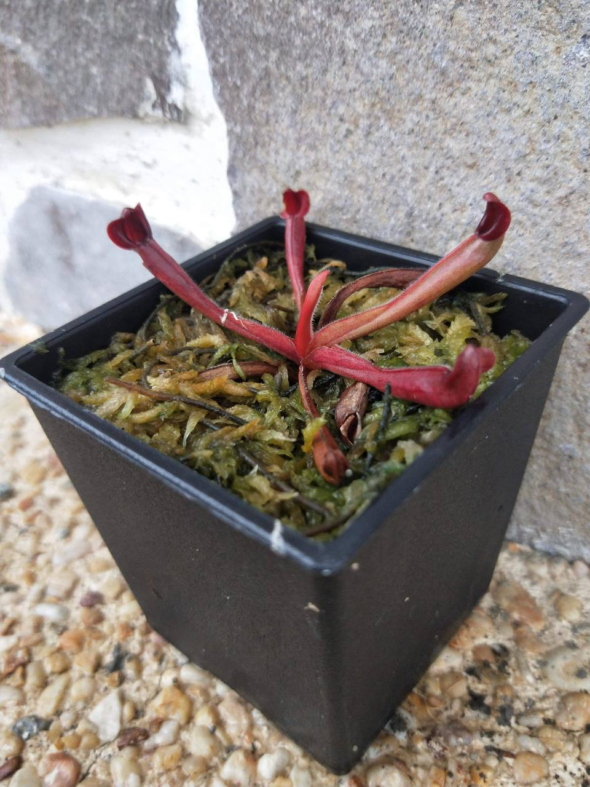

### 2023/04/21 乾掉一片葉子

新葉伸展完成，為橘黃色，可能光照不足。

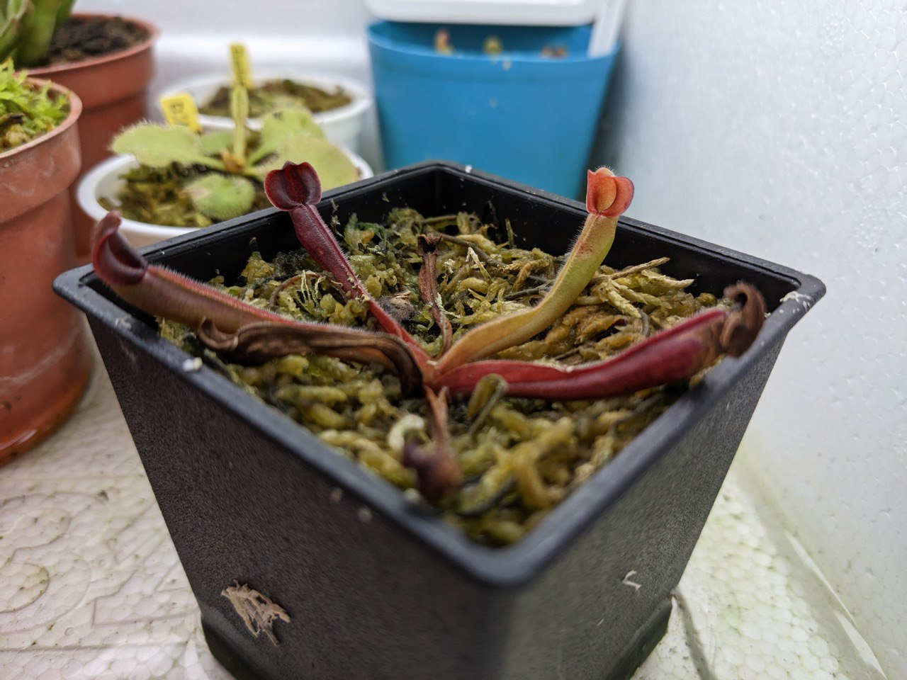

### 2023/05/27 +1-1

長一片葉子且枯一片葉子。  
加強光照後新葉子顏色沒那麼黃，偏橘色。  
上一片新葉還是一樣維持橘黃色。

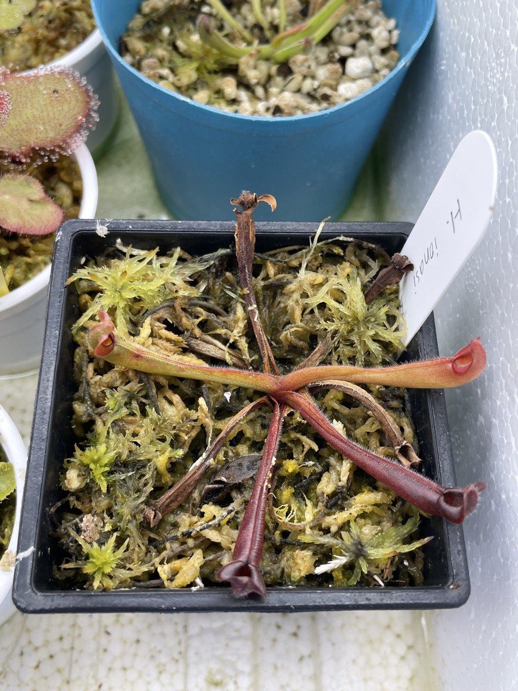

### 2023/06/13 緩慢生長中

新葉子冒出。

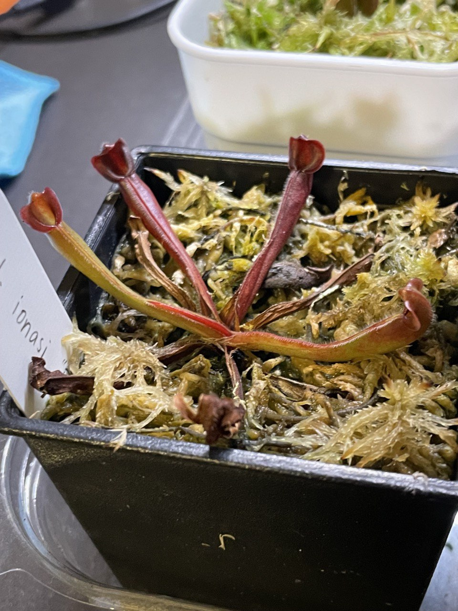

### 2023/09/01 再度 +1-1

還是維持在四片葉子。  
加強光照後葉色終於和入手時一樣紅。  
感覺枯葉的速度有點快，怕是水苔腐敗或莖部有問題。  
目前乾枯的葉子都是入手前長的，如果觀察到新葉子有乾枯情況就要換盆。  

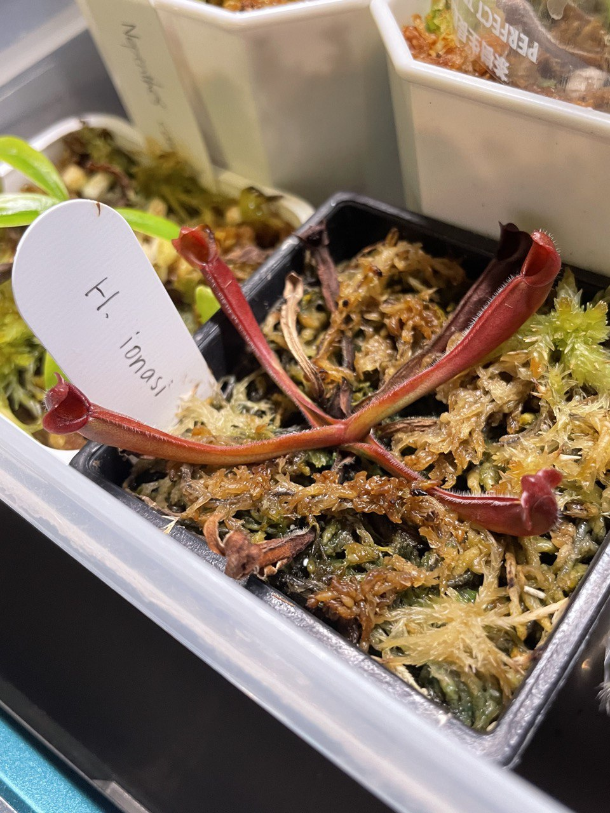

### 2023/10/01 +1

生長狀態差不多，還是一個月一片葉子。  
希望是在儲存地下根莖 (rhizome) 的養分。  

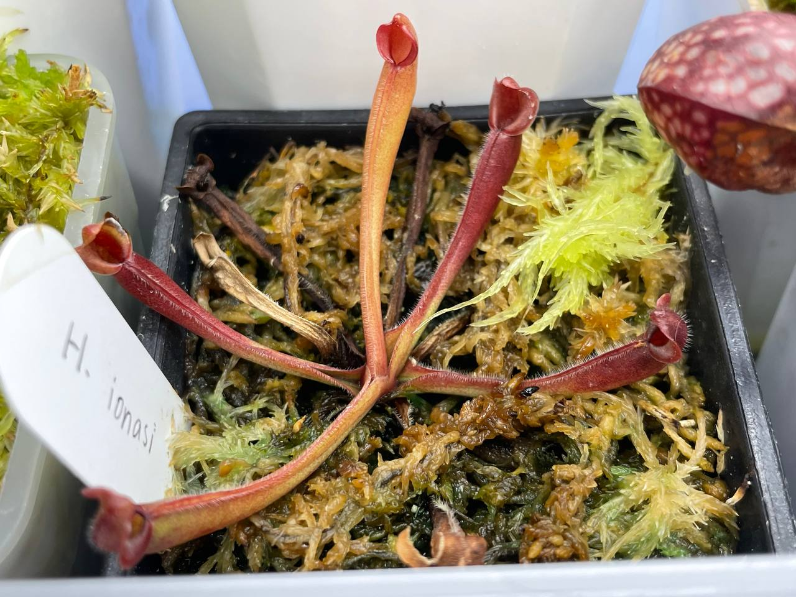

### 2023/11/01 換盆

跟剛入手時一樣是五片葉子。  
嘗試把活水苔丟到上面，但連活水苔都長不好，換介質的時候到了。  


  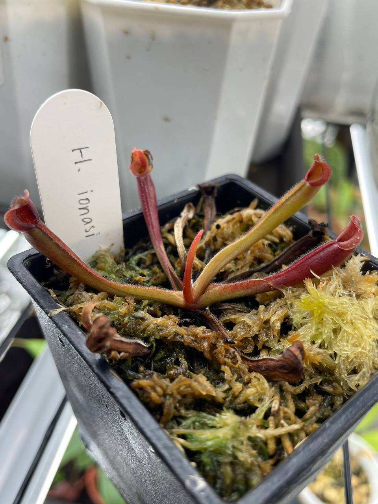
  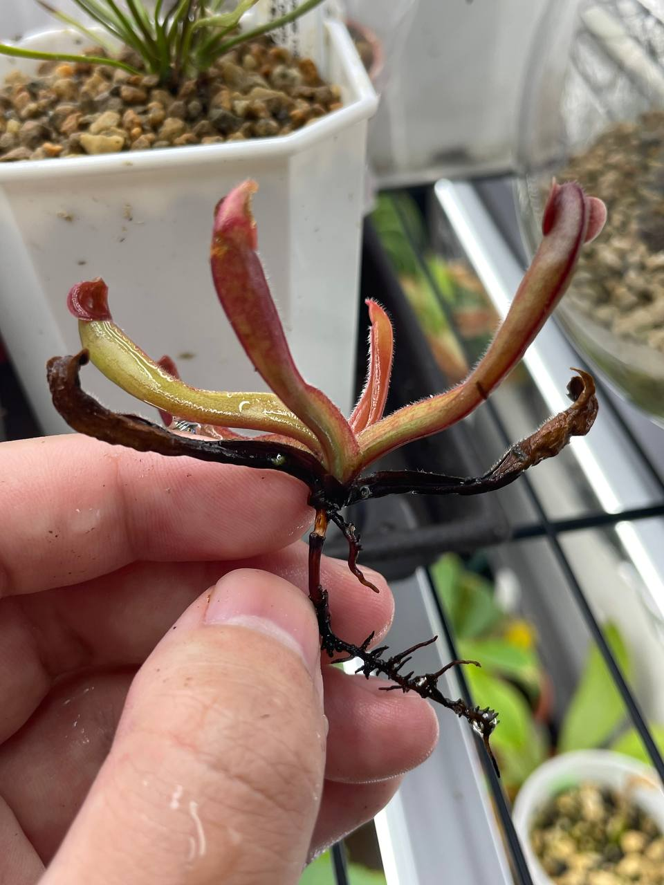
  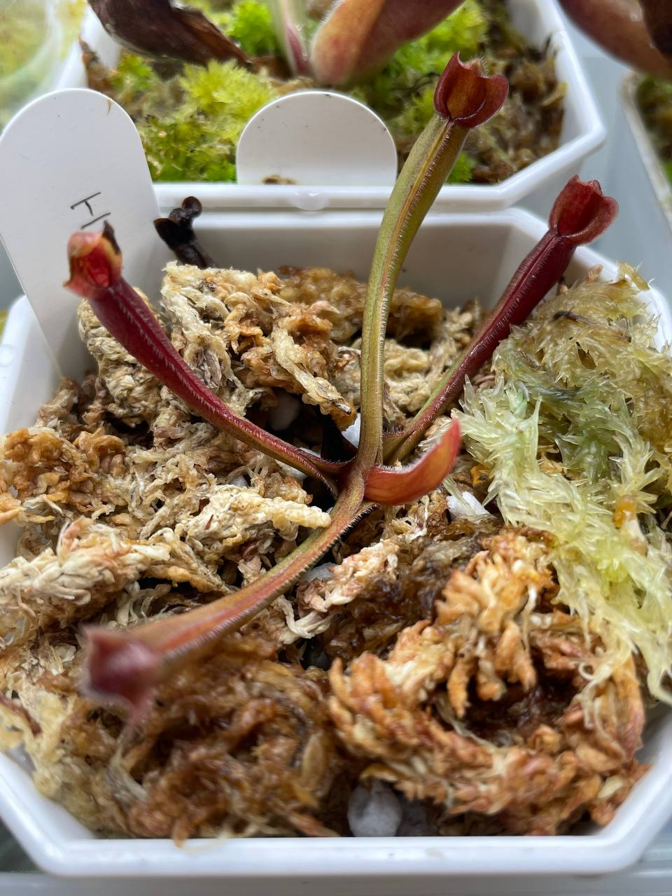


### 2024/02/02

葉子顏色有點怪，不過有在持續生長。  
冬天濕度低的時候會噴水，老葉乾枯的情況有減緩了。  

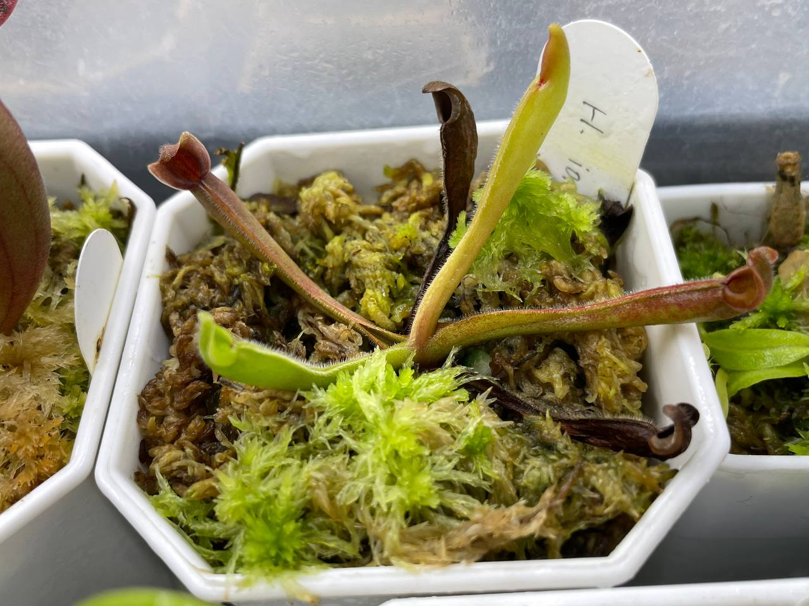

### 2024/06/05

冰箱內日夜溫約 24/21℃，光沒有直射但也蠻強的地方。  
顏色反而較淺，應該是這種類比較喜歡光強一點。  
蓋子的特徵更明顯了。  

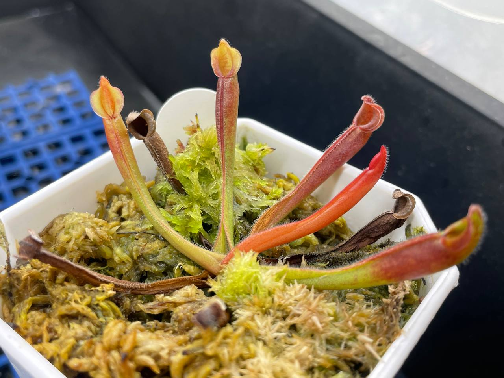
