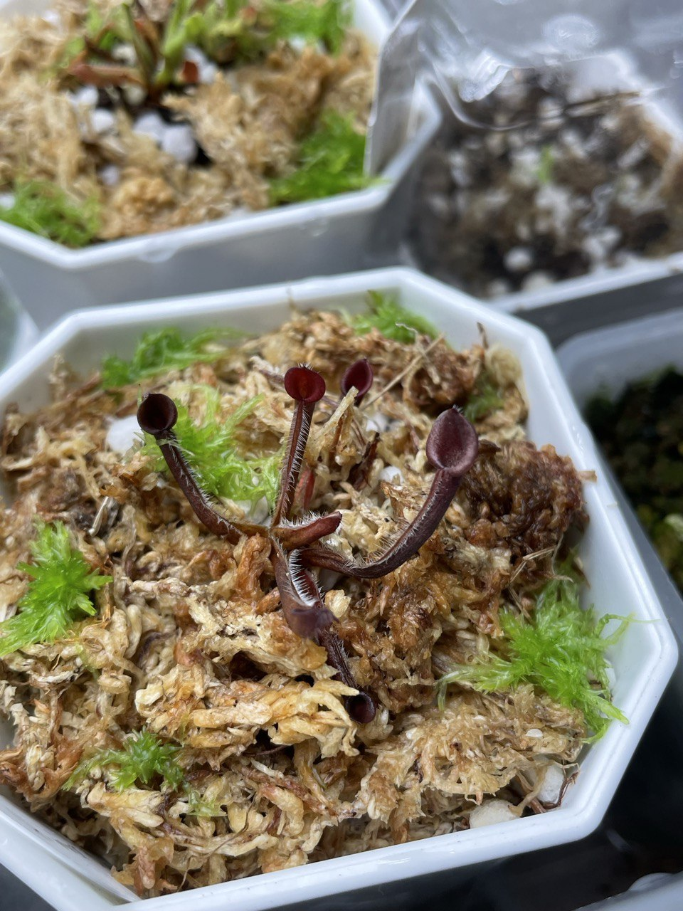
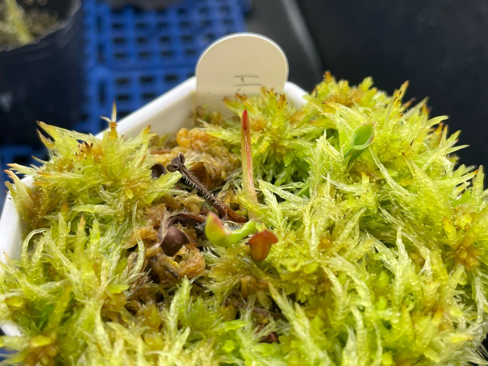

## 植物資料

中文名稱：勃肯地黑小太陽瓶子草  
學名及來源：*Heliamphora minor* 'Burgundy Black' AW  
購入價格：1200 NTD  

## 栽培紀錄

### 2024/02/18 入手

多數葉片由基部開始乾枯，看起來有點像染菌。  
不過在運輸過後怕缺水，還是養在濕度較高的地方觀察。  

### 2024/06/05

置於冰箱光照較低處，日夜溫約 24/21℃。  
原有的葉子基本上都已經乾枯，目前看到綠色的都是入手後長的葉子。  

