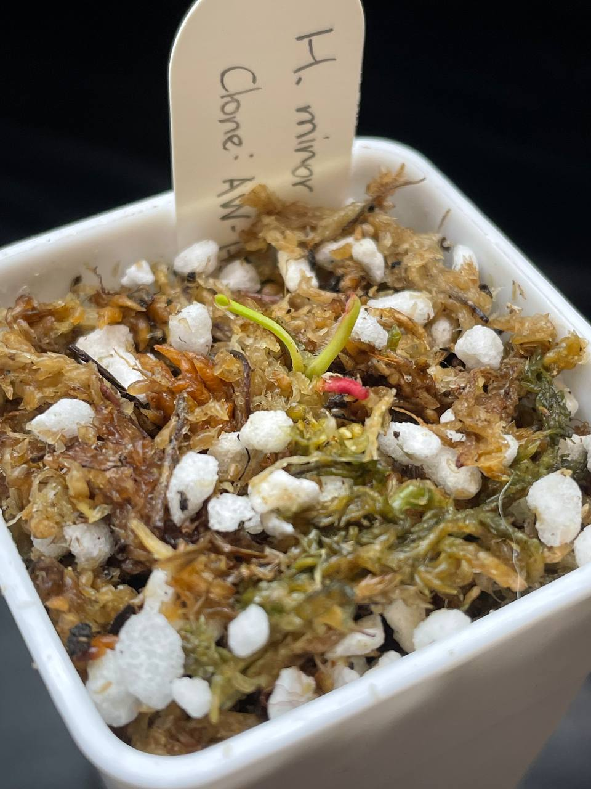

## 植物資料



中文名稱：長毛小太陽瓶子草  
學名及來源：*Heliamphora minor* var. *pilosa* (Auyan) AW
Clone：AW-H_min_pil_02 'Reddish-huge'  
購入管道：FB 食蟲社團  
購入價格：600 NTD  

成株瓶子內側能看到明顯絨毛的小太陽變種。  

## 栽培紀錄

### 2023/12/09 入手

非常小棵，瓶子長度約一公分。  
三片葉子，紅色那片在我種植時折斷了。  
悶養中。  

