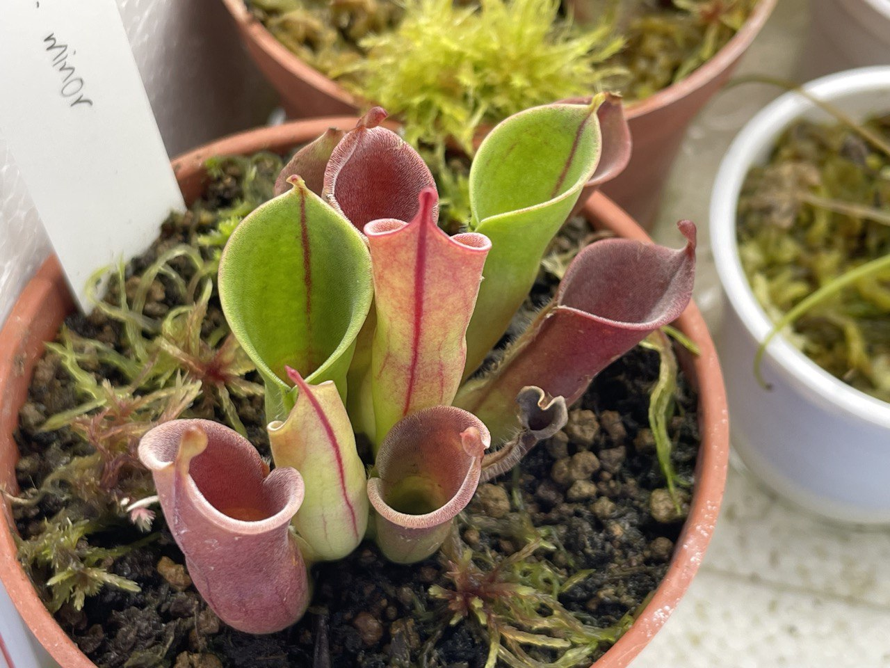
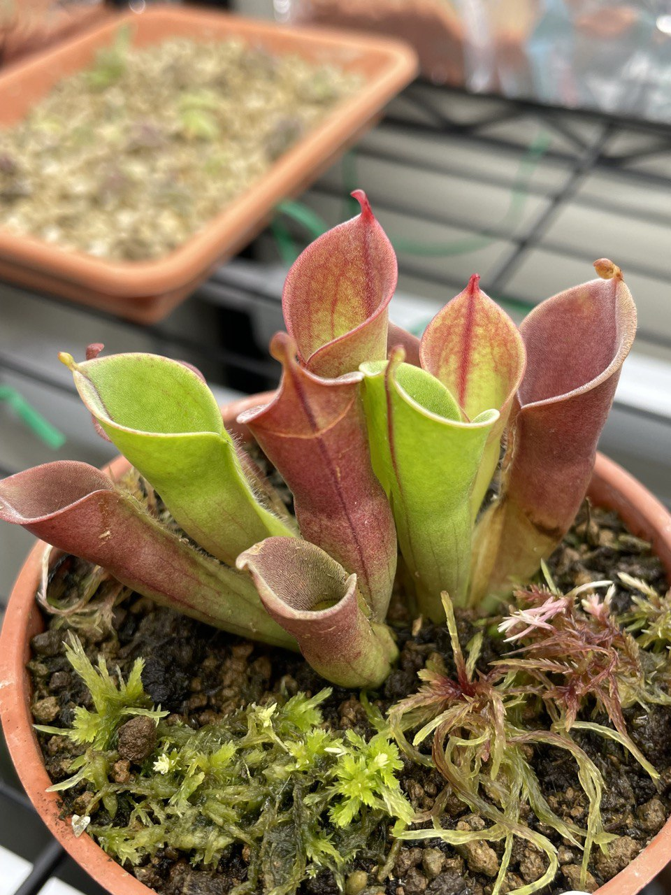
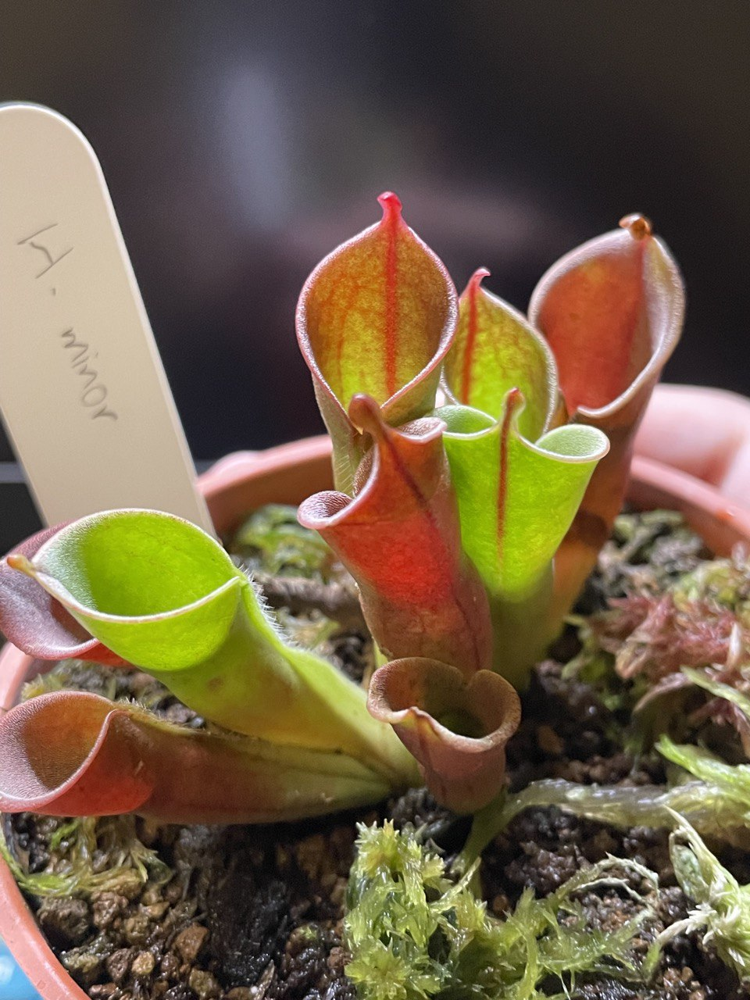
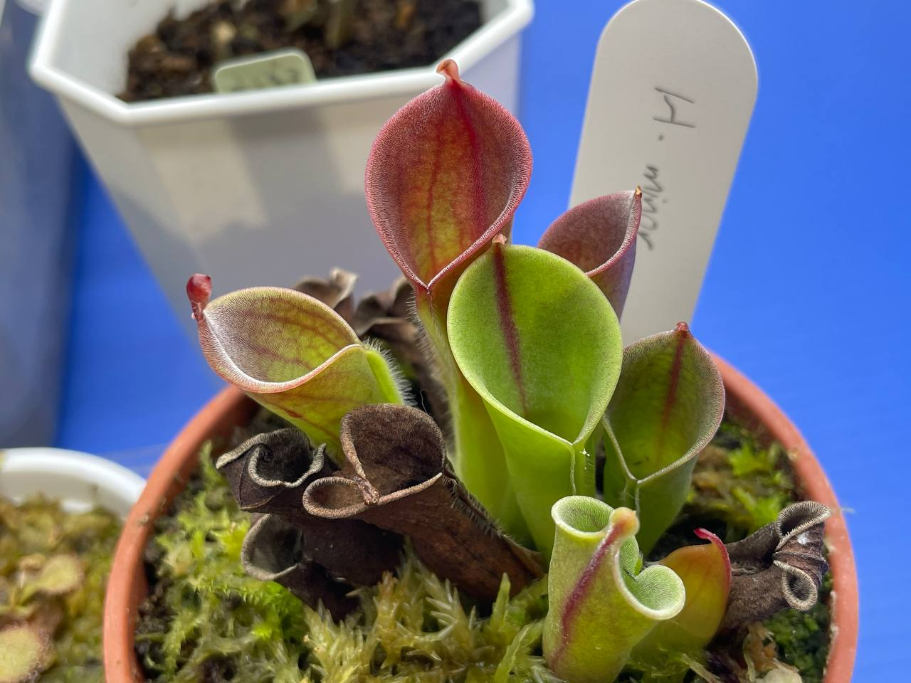
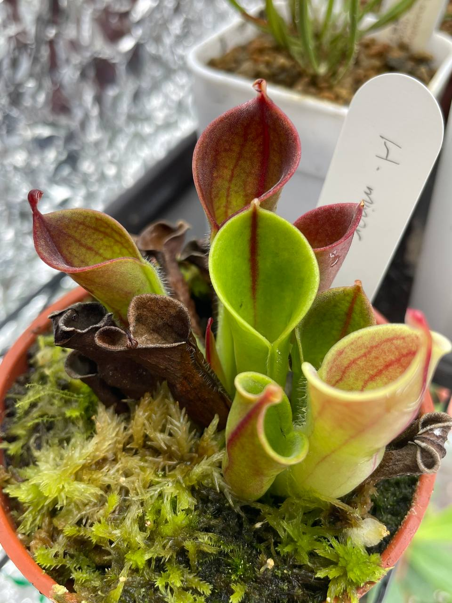
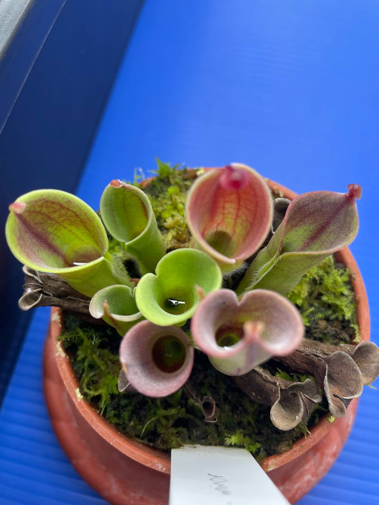
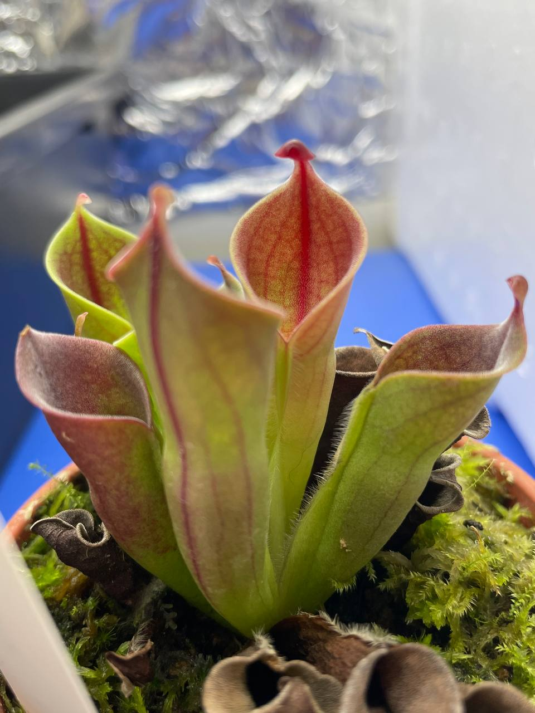
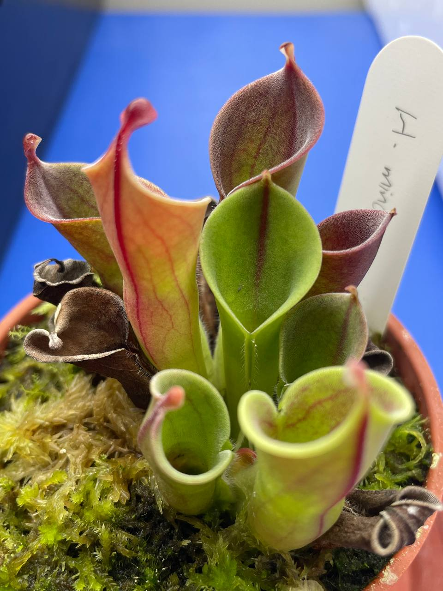
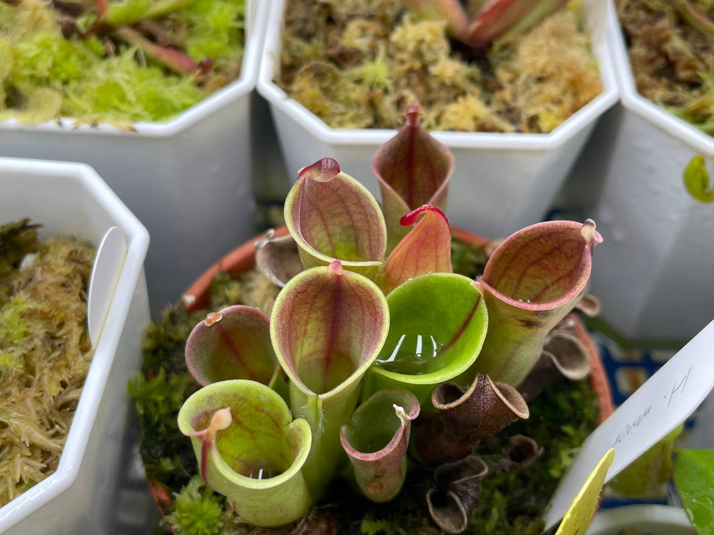

## 植物資料



中文名稱：小太陽瓶子草  
學名：*Heliamphora minor*  
購入管道：建國花市愛蘭  
購入價格：650 NTD

夏季溫度：日/夜溫 26/22.5℃，使用製冷晶片小冰箱  
冬季溫度：室溫種植。台灣冬季不需保暖設備，但過冷的氣溫會使生長速度變慢  
濕度：75% 以上，晚上能增加濕度至 80% 以上會更好  
給水：新竹自來水，淺腰水種植  

## 栽培紀錄

### 2023/03/16 入手

剛入手幾天冒出兩片新葉子，觀察到有兩個芽點。

### 2023/05/08 加強光照

試著加強光照，由三支增加至四支 LED 支架燈。  
除了三月冒出的葉子外，老葉及伸展中的新葉都轉紅。

### 2023/05/31 新葉顯色

綠色的基底配上橘紅色的紋路，個人認為蠻好看的。  
不過全紅的老葉已經開始枯萎。


  
  
  
  


### 2023/08/07 全紅老葉大量枯萎

六月後移進冰箱，期間改用投射燈提供光源。

可以看到中間葉片的蓋子比起之前照片變得更大，可見太陽瓶子草葉片發育的進程非常久。  
約花費一個月從芽點長出完整瓶型，再一個月且環境、植物狀態適合蓋子才會變大。  

光照太強會使得葉片壽命提早結束。  
可能是光照太強使得葉肉組織氧化得太嚴重，顏色全紅代表葉綠素濃度降低而花青素堆積。  

### 2023/10/01

持續有新葉子生長、老葉枯萎。  
目前移動到其他環境，待觀察下個月的狀態。  

### 2023/11/01

這環境下長出的新葉偏黃，但這一個月內沒有葉片枯萎。  

### 2023/12/05 瓶子外觀與環境的觀察

目前觀察栽培過程認為，瓶子還在生長時，最容易受環境影響而改變外觀。  
瓶子發育完全後，環境變動對於外觀的影響較低，推測是葉綠素合成速度較老葉和芽快導致。  

葉子的顏色受葉綠素等植物色素（如花青素、胡蘿蔔素）濃度所影響。  

光照普通時，葉綠素濃度較高，葉子的綠色較深。  
光照越高，葉綠素的分解速度越快濃度就越低，較穩定的胡蘿蔔素就會顯現而使得顏色偏黃。  
植物會將葡萄糖與葉黃素合成為花青素，能保護其他色素不被光氧化而破壞。  
為了保護自身，光照越強合成花青素的速率也會越快。  

溫度低時葉綠素合成較慢，於是濃度會在較低的水準。  
在有日夜溫差的情況下，  
白天溫度較高，光合作用速度快，醣類生產得多；  
夜晚溫度低，呼吸作用速度降低，有助於醣類累積。  
醣類則是合成花青素的原料之一，於是可以說日夜溫差越大，醣類累積速度越快，也紅得越快。  

綜上所述與觀察結果，  
光度普通時，葉綠素濃度較高，瓶子顏色會是深綠，瓶子上部漏斗型開口大、下部少了腰身變成管狀、蓋子尖細（如下圖三中間的瓶子）；  
光度稍強時葉綠素濃度較低、綠色較淺，此時瓶子上部漏斗形彎曲程度較大、下部的腰身略呈葫蘆狀、蓋子發育良好而呈現帽狀（如下圖二中間的瓶子）。  
此時若足夠低溫，則會呈現橘紅色。  

2023 三月剛入手時，所有瓶子與芽呈現翠綠色，應該是環境光度不夠。  
2023 五月加強光照後，所有老葉葉綠素被分解，花青素大量堆積，呈現紅色。  
植物體內葡萄糖濃度較高，在強光加速花青素合成、葉綠素分解下葉芽呈現紅色。  
而剛展開的新葉，可能葉綠素合成速率比老葉與芽還快，所以維持綠色。  
2023 八月，全紅老葉大量枯萎則可能是強光照導致葉片壽命縮短。  
並可觀察到五月後新生的葉片，生長過程會是黃色底 + 紅色脈紋 → 黃色部分逐漸轉成綠色 → 紅色部分變深。  
最後應該會葉綠素合成速率減緩而呈現全紅，然後枯萎。  


  
  
  


### 2024/02/02

