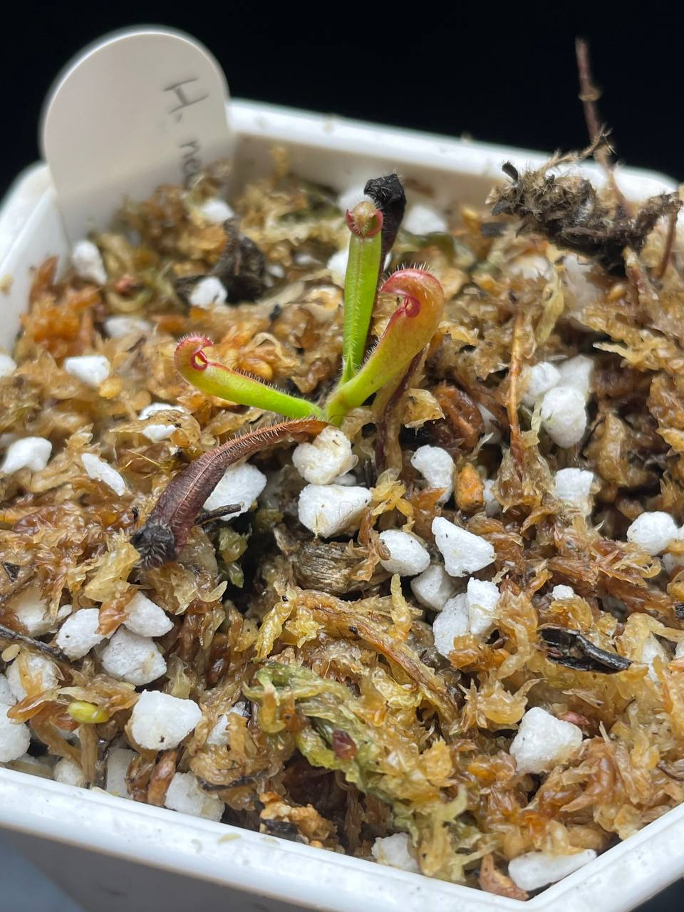
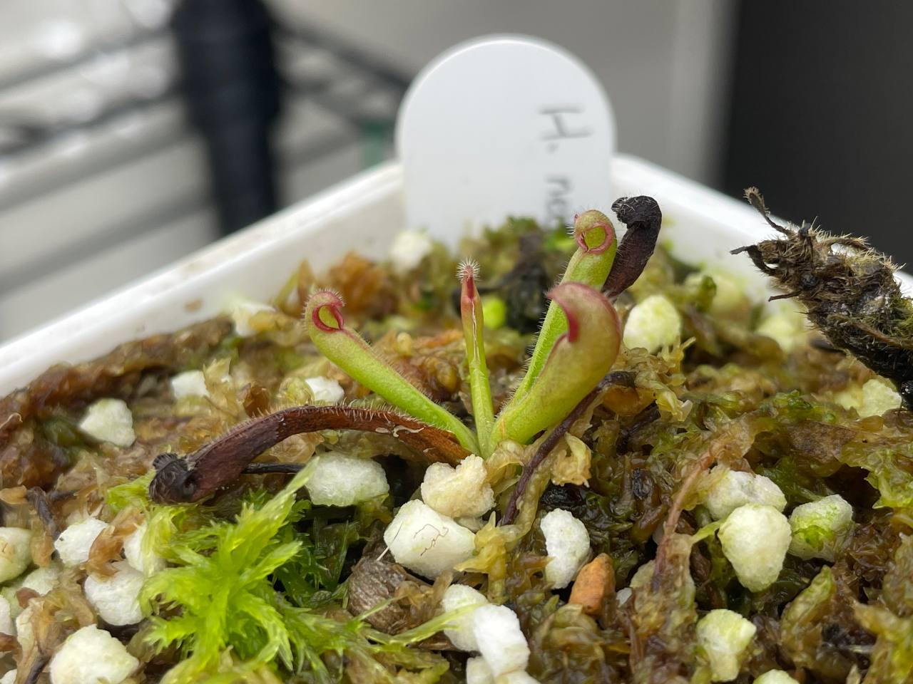

## 植物資料



中文名稱：內布利納山太陽瓶子草  
學名及來源：*Heliamphora neblinae* Cerro Neblina, Braz. Ven. BCP  
購入管道：FB 食蟲社團  
購入價格：1000 NTD  

## 栽培紀錄

### 2023/12/09 入手

三片葉子，旁邊還有兩個扦插中的土瓶草莖段。  
悶養中。  

### 2023/12/25

室內燈養中，日/夜溫約 22/16-17℃。  

