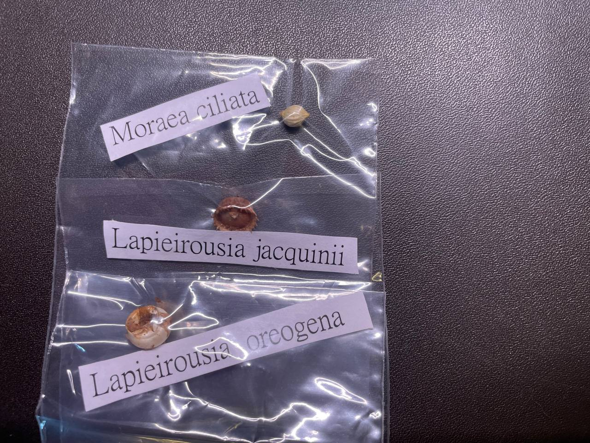

## 植物資料



中文名稱：拉培疏鳶尾、長管鳶尾  
學名：*Lapeirousia jacquinii*  
購入管道：FB 社團  
購入價格：250 NTD  

*Lapeirousia* 為鳶尾科下的一個屬，通常較小型，特徵是球莖為鐘型，底部平坦。  
冬型種，在春天開花，可自花授粉。  
花期結束後開始限水，等到葉子乾枯即可收球。  
播種需淺覆土，實生需兩到三年才能開花。  
這種拉培疏似乎特別好種。  

## 栽培紀錄

### 2024/04/11 入手

收到球後，怕球莖的水氣會導致發霉，拿出夾鏈袋置於陰涼處保存。  

## 參考資料

- [sanbi](https://pza.sanbi.org/lapeirousia-jacquinii)
