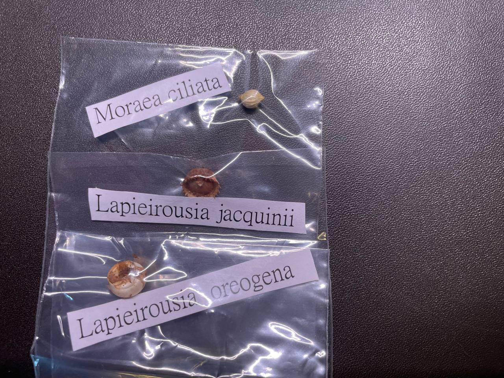

## 植物資料



中文名稱：肖鳶尾  
學名：*Moraea ciliata*  
購入管道：FB 社團  
購入價格：350 NTD  

冬型種，花具香味。  
花色藍色最常見，另外也有白色和黃色的。  

## 栽培紀錄

### 2024/04/11 入手

收到球後，怕球莖的水氣會導致發霉，拿出夾鏈袋置於陰涼處保存。  

## 參考資料

- [sanbi](https://pza.sanbi.org/moraea-ciliata)
