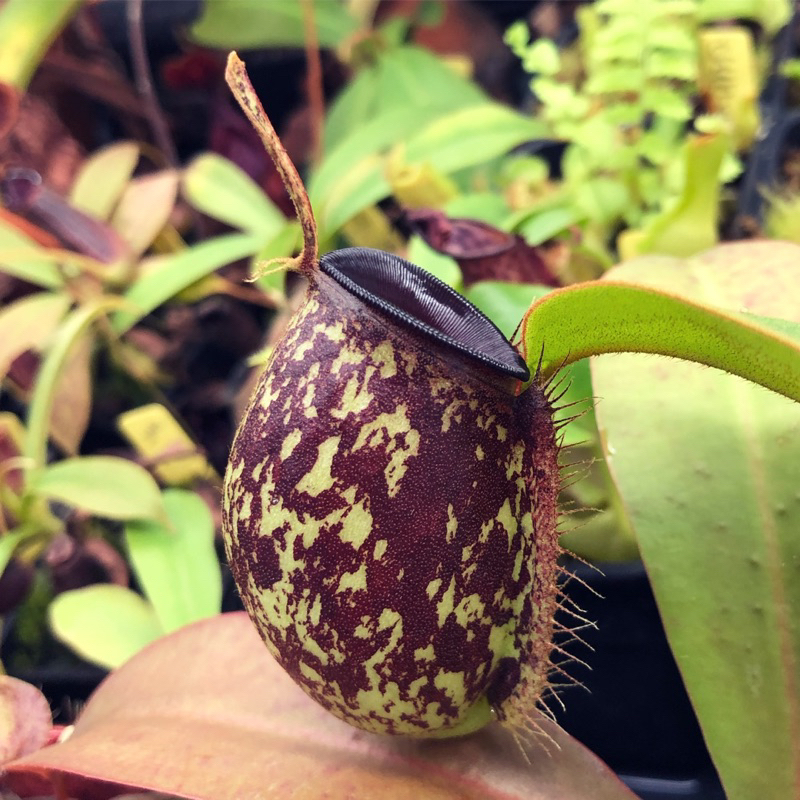
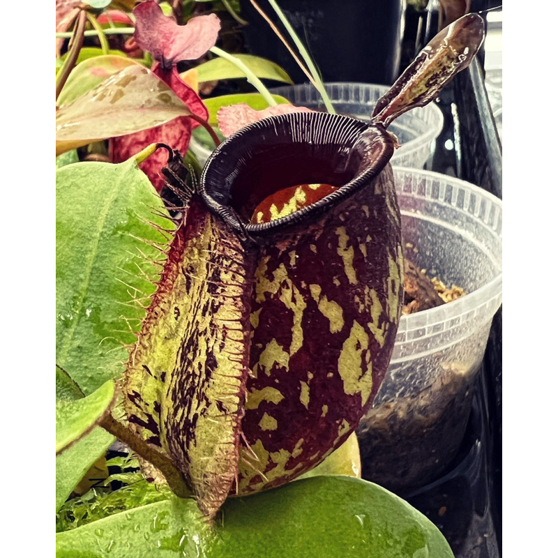
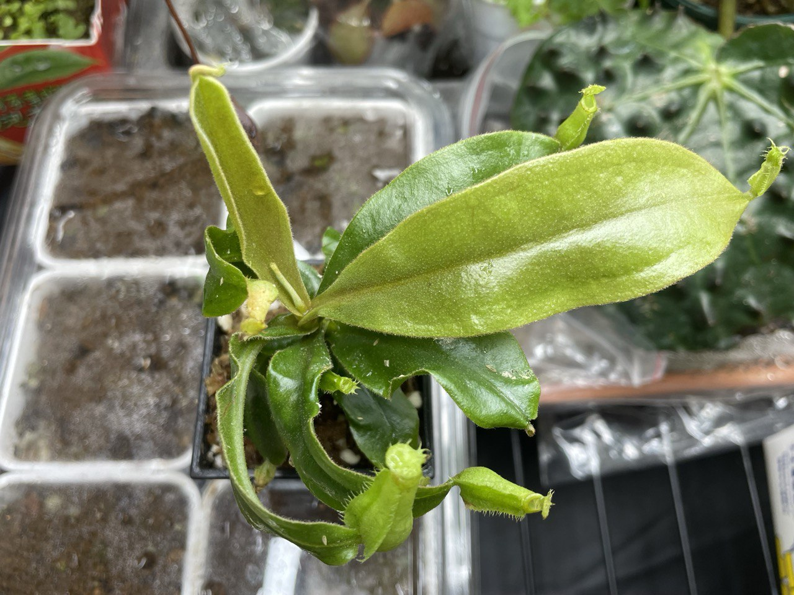

## 植物資料

賣家之親本照


  
  


中文名稱：黑唇斑瓶蘋果豬籠草  
學名：*Nepenthes ampullaria* Spot Black Lips  
購入管道：蝦皮，XD蝕驗室  
購入價格：800 NTD  

瓶身矮胖，蓋子細長後翻，很有特色的低地豬籠草。  
生長到一定階段後容易在地面出產生一大堆叢聚瓶。  

## 栽培紀錄

### 2024/01/21 入手

可看出底下的葉子深綠捲曲，且較肥厚，猜測應該是在組織培養瓶中所長出的葉子。  
最新的兩葉一心則是淺綠色，應是出瓶後長的葉子。  

目前種植環境約 20℃，套袋悶養中。  

