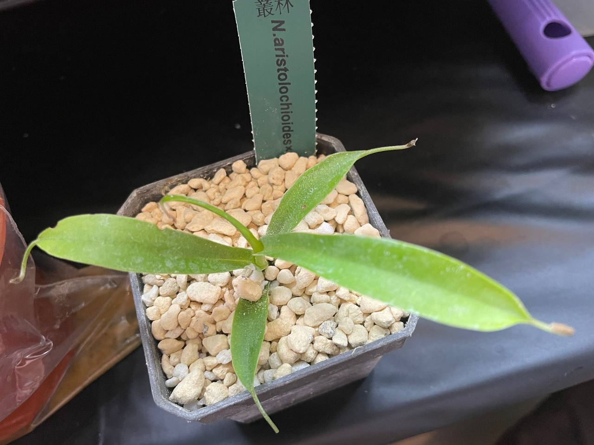

## 植物資料

中文名稱：馬兜鈴交葫蘆豬籠草  
學名及來源：*Nepenthes aristolochioides* x *ventricosa* BCP  
購入管道：小小叢林  
購入價格：500 NTD  

葫蘆的腰身被馬兜鈴抵銷，瓶子變得像是一條冬瓜，肉得可愛。  
交了耐候性不錯的葫蘆，賣家說在彰化露天可度夏。  

## 栽培紀錄

### 2024/06/23 入手

現砍無根枝條，以少許水苔做為底層，使介質較不容易完全乾透，中層則是鹿沼土、珍珠石、桐生砂混合。  
放置夾鏈袋中悶養，開口半開腰水種植。  

