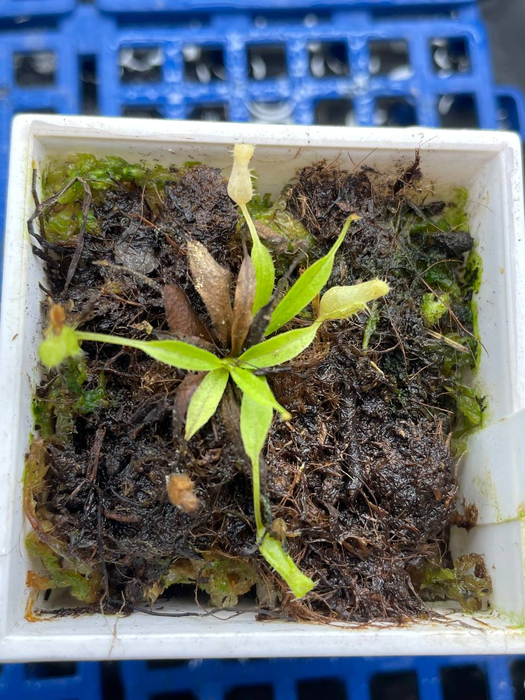

## 植物資料



中文名稱：艾登堡豬籠草  
學名：*Nepenthes attenboroughii*  
購入價格：455 NTD  

## 栽培紀錄

### 2024/04/29 入手

可能組培馴化沒多久，先用保水一點的介質悶養。  
放在小冰箱，溫度約 21-23℃。  

### 2024/06/05

冰箱內日夜溫約 24/21℃，弱光處加蓋悶養。  
長速偏慢，就算加蓋高濕度悶養還是枯了不少瓶子。  

