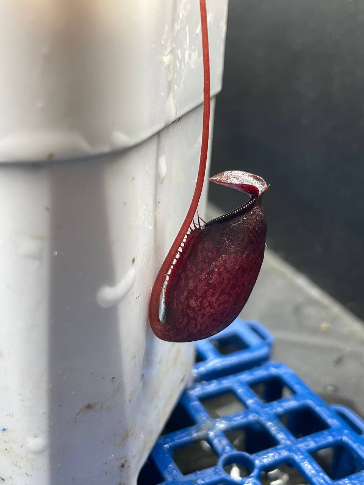
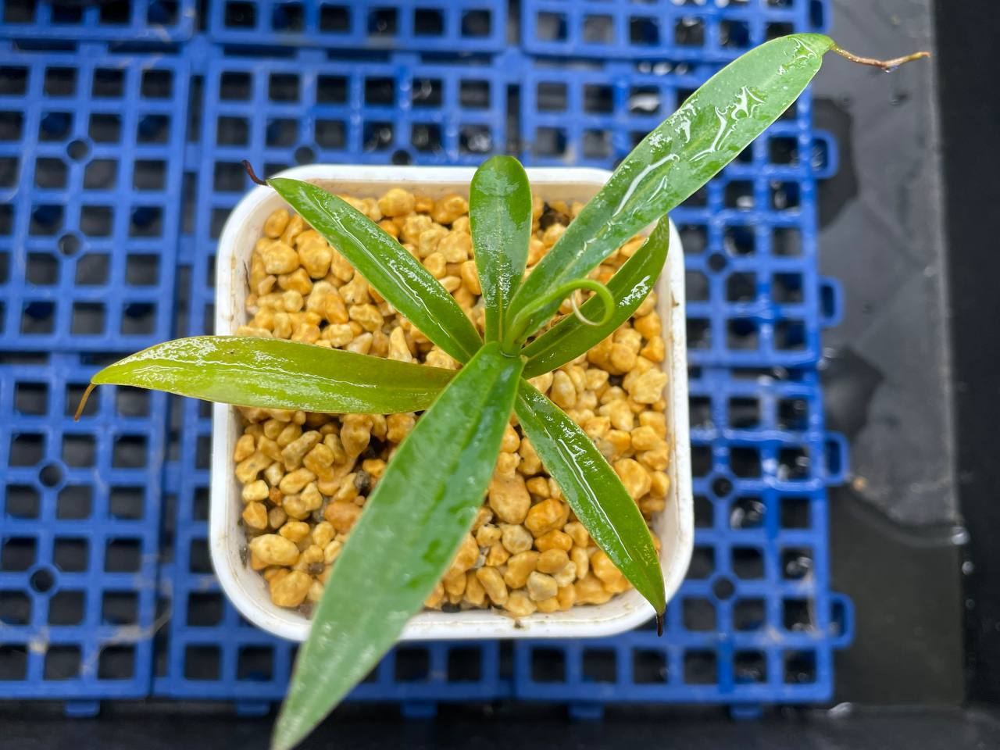

## 植物資料



中文名稱：貝里交馬兜鈴豬籠草  
學名：*Nepenthes bellii* x *aristolochioides*  
購入價格：600 NTD  

瓶子保留許多馬兜鈴的特色。  
交了貝里這個低地種後，可以預期比純種馬兜鈴更耐熱，種植起來應該能輕鬆不少。  

## 栽培紀錄

### 2024/05/28 入手

不確定原本種植環境，於是先將盆子套上夾鏈袋，開口半開的方式悶養。  
接下來打算逐漸打開夾鏈袋，等到腰水全乾後再移出袋子。  


  
  

