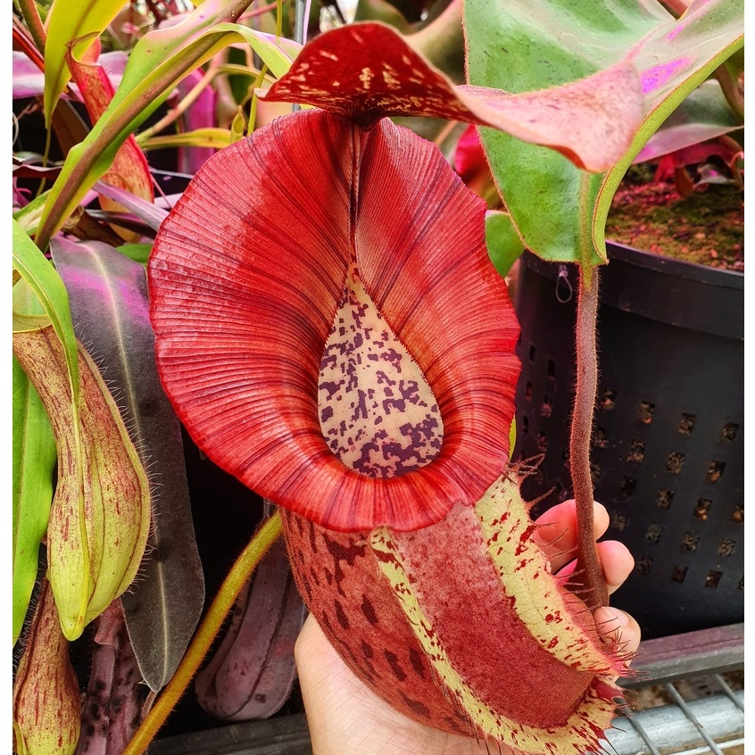
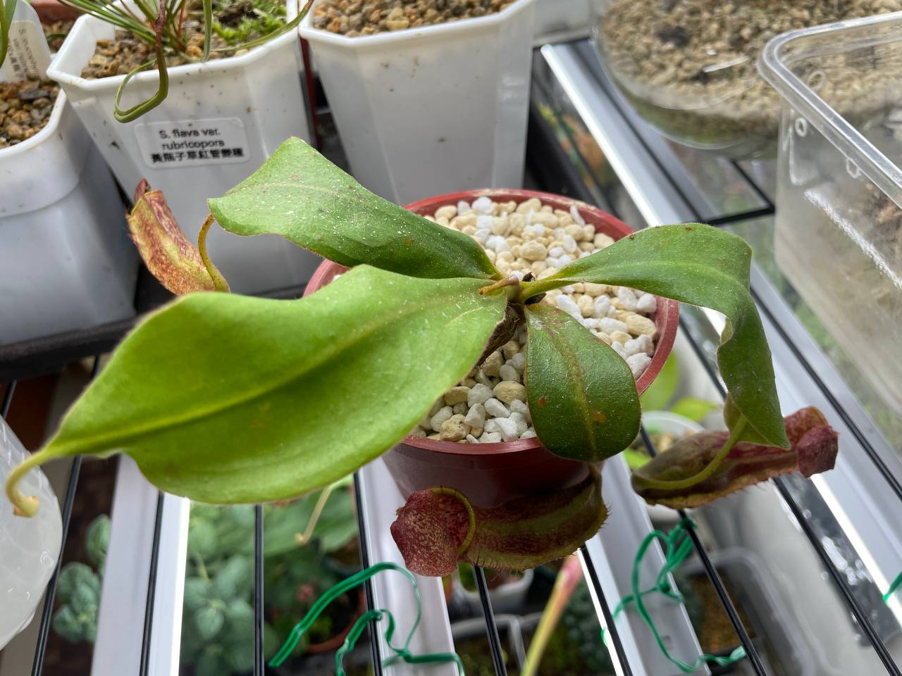
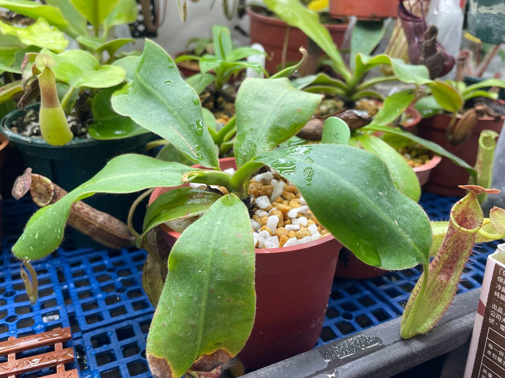
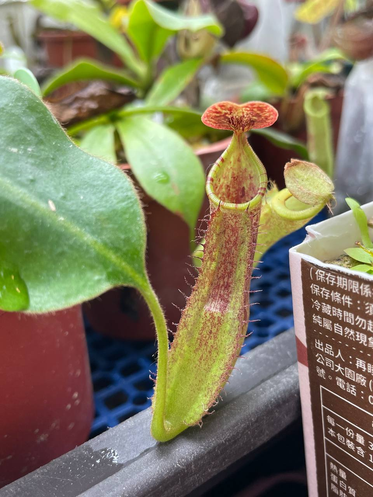
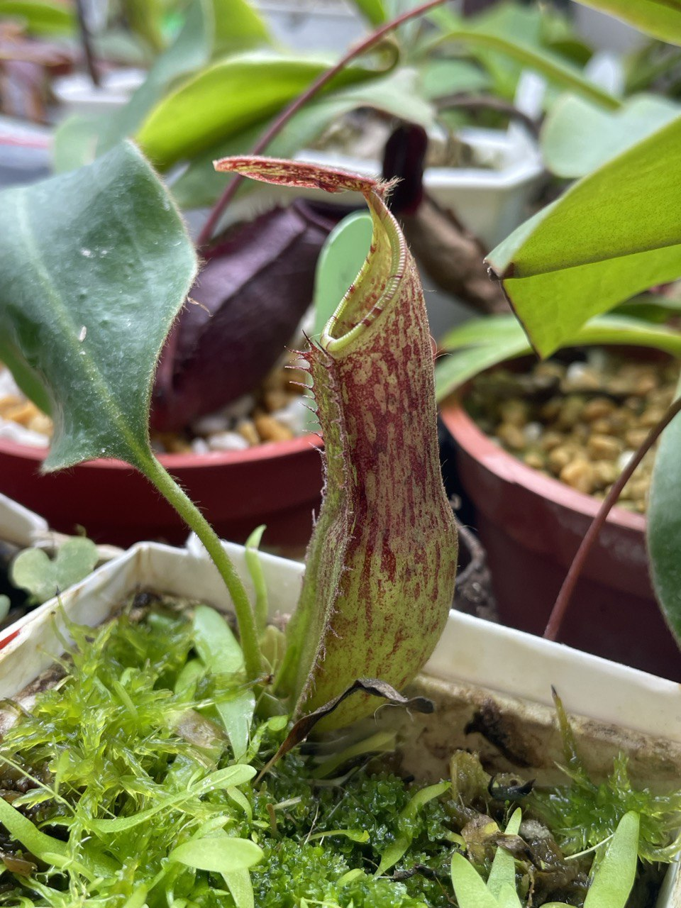

## 包希交維奇豬籠草

中文名稱：包希交維奇豬籠草  
學名及產地：*Nepenthes boschiana* x *veitchii* Bario  
購入管道：FB 食蟲社團  
購入價格：500 NTD  

*veitchii* Bario，後面的 Bario 指的是產地。不算在學名的格式中。  

### 2023/11/04 入手

其實我是看到異草堂的照片才買的。  
照片中的瓶子是全紅的，擁有巨大而厚實的瓶身以及寬大的唇。  
瓶身也有斑點，使得整體不會過於樸素。  

賣家說是實生苗，不過目前已經能觀察到花唇表現。  

### 2024/02/02

入手後第一瓶，生長速度還算快速。  


  
  
  

