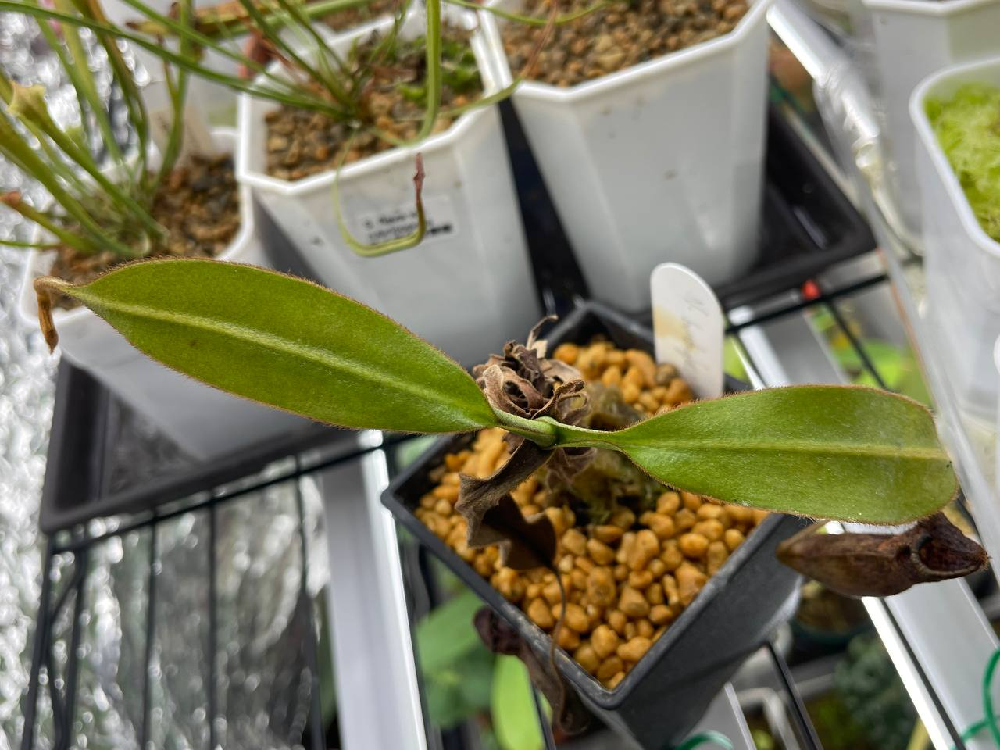
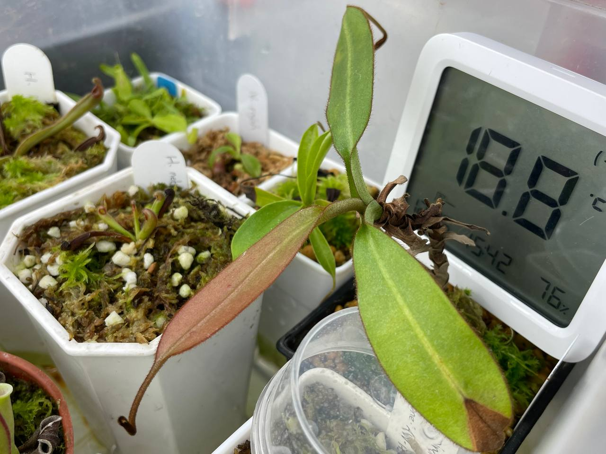
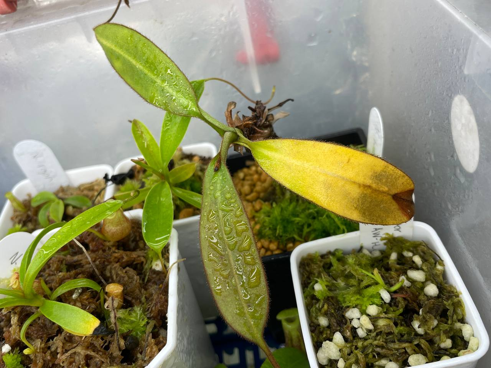
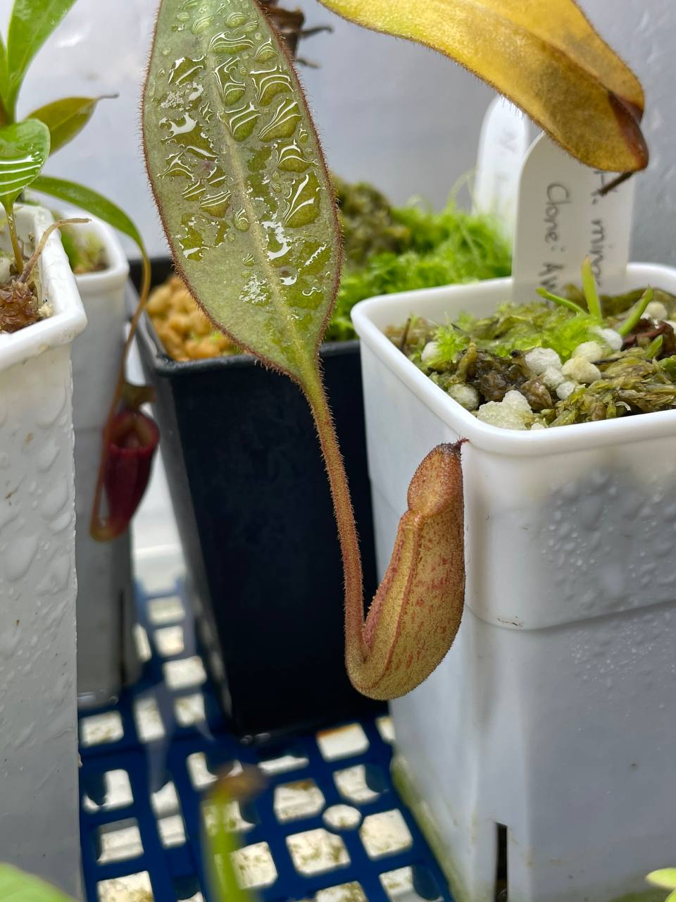
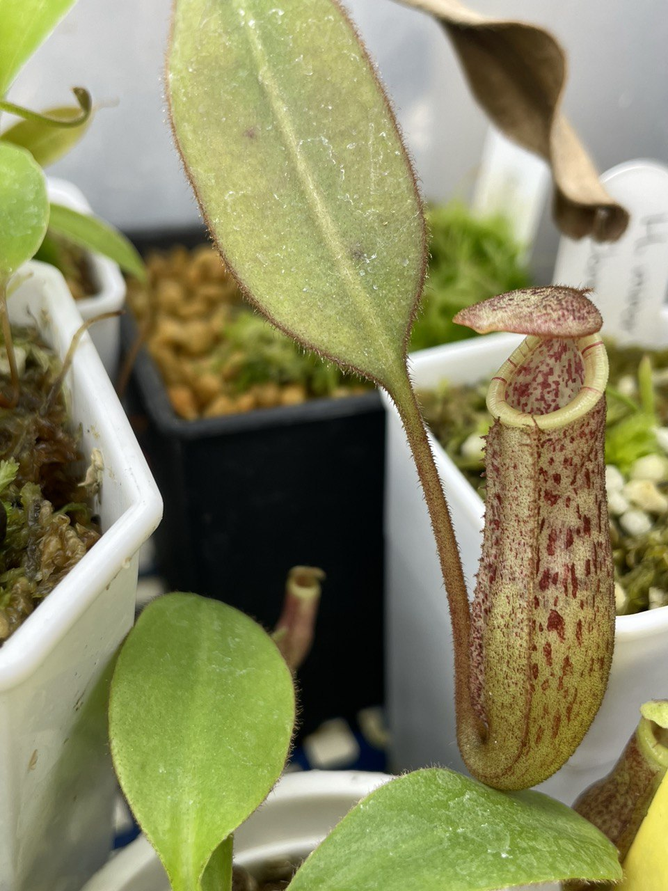
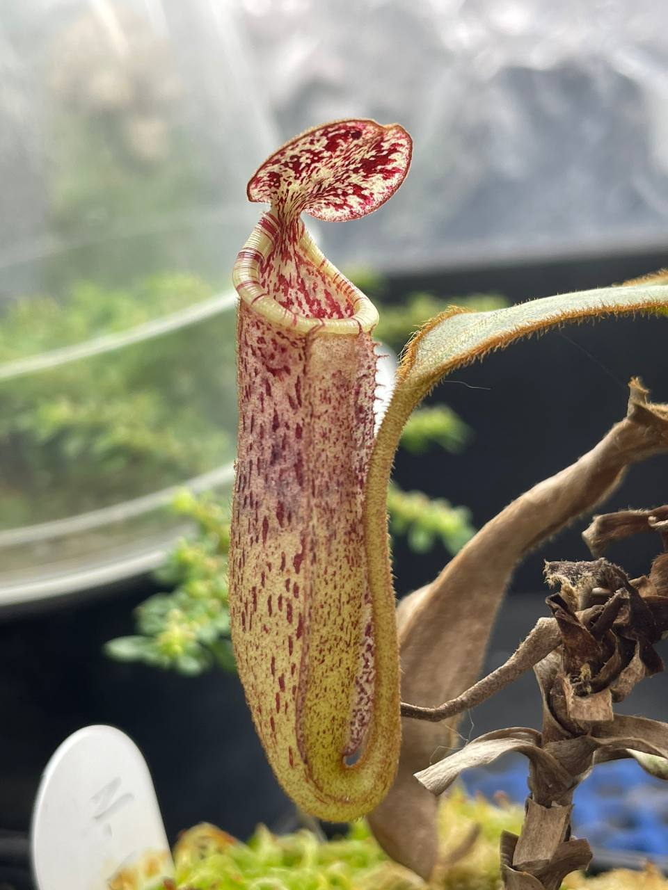
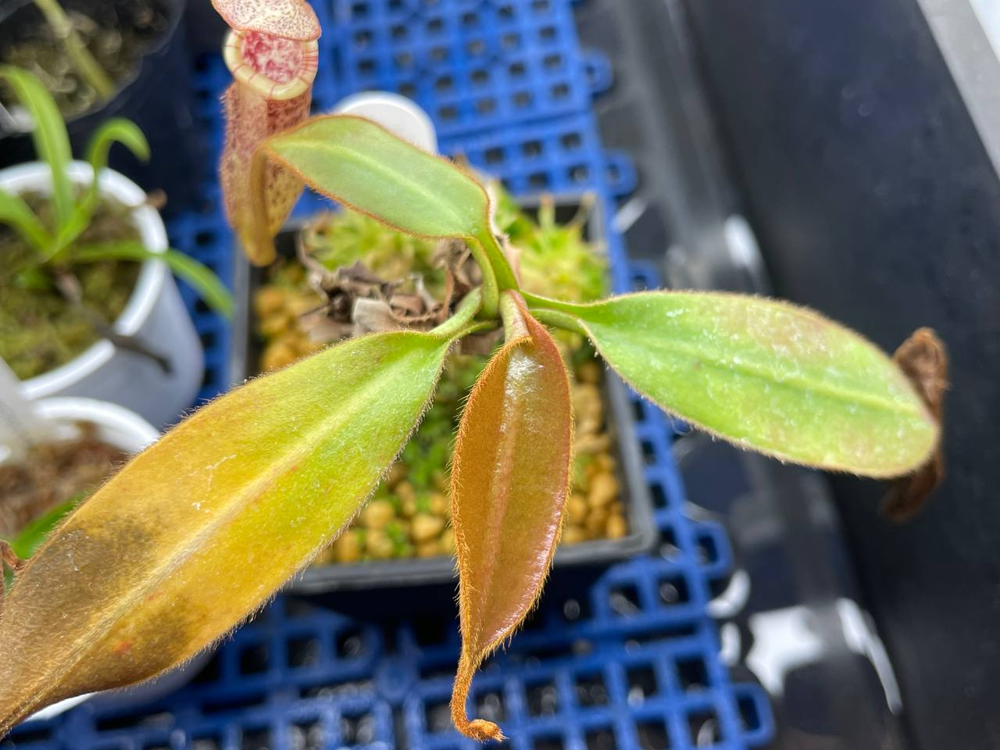

## 植物資料

中文名稱：豹班豬籠草  
學名：*Nepenthes burbidgeae*  
購入管道：FB 食蟲社團  
購入價格：1200 NTD  

## 栽培紀錄

### 2023/10/20 入手

分佈海拔約 1200-1800 m，算是高地入門款，感覺夏天有機會不用放在冰箱。  
入手時三片葉子。  

### 2023/11/07

放置於冰箱內無悶養，濕度變化真的太大，兩個瓶子都乾掉。  

### 2023/12/25

兩個月長一片葉子。  
和太陽瓶子草、皮托龐豬籠草、阿里豬籠草一起室內燈養。  
但只有豹斑新葉，因為光度太強花青素累積，呈現紅色。  
推斷豹斑光照需求比其他品種的豬籠草低。  
不過新葉生長完成後會慢慢退回綠色，所以這個光照還在忍受範圍內。  

### 2024/02/02

結瓶中，自 12 月以來無新葉，生長速度非常慢。  


  
  


### 2024/02/18 第一個瓶子

### 2024/06/05

冰箱日夜溫約 24/21℃，投射燈光直射處。  
生長速度非常慢，維持在三片葉子一個瓶子的狀態。  
葉縮可能是室內燈養時熱到。  
目前置於冰箱內繼續觀察植株狀態，繼續不好的話可能考慮先減少光照。  
新瓶子唇線較多，尺寸則和之前的瓶子差不多。  


  
  

