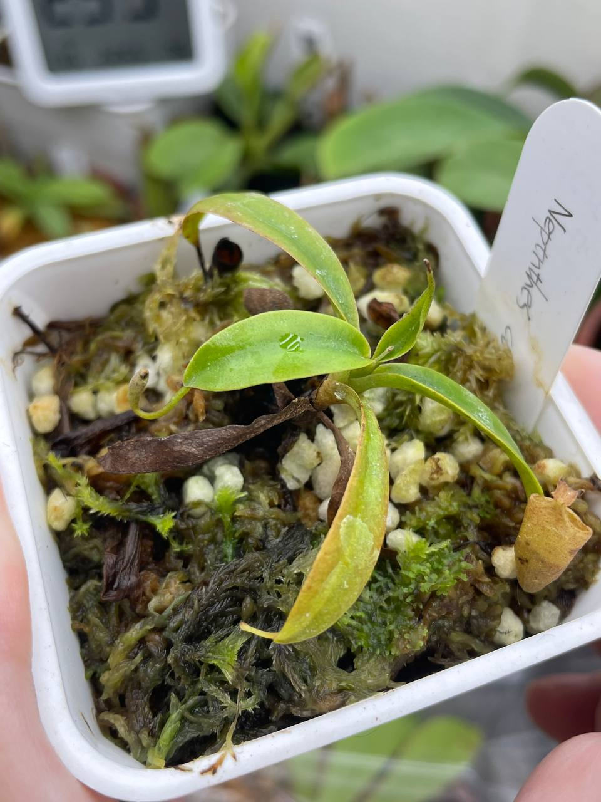

## 植物資料

中文名稱：風鈴豬籠草  
學名：*Nepenthes campanulata*  
購入管道：FB 食蟲社團  
購入價格：600 NTD  

## 栽培紀錄

### 2023/11/07

07/07 左右入手，收到後暫時種植在小冰箱。  
十月左右移出冰箱，濕度降低後葉子與瓶子快速黃化乾枯。  
目前套袋悶養中，目標是逐漸降低濕度以適應室內環境。  

### 2024/01 黑心死亡

套袋悶養時，因為中心長期積水而爛心死亡。  
