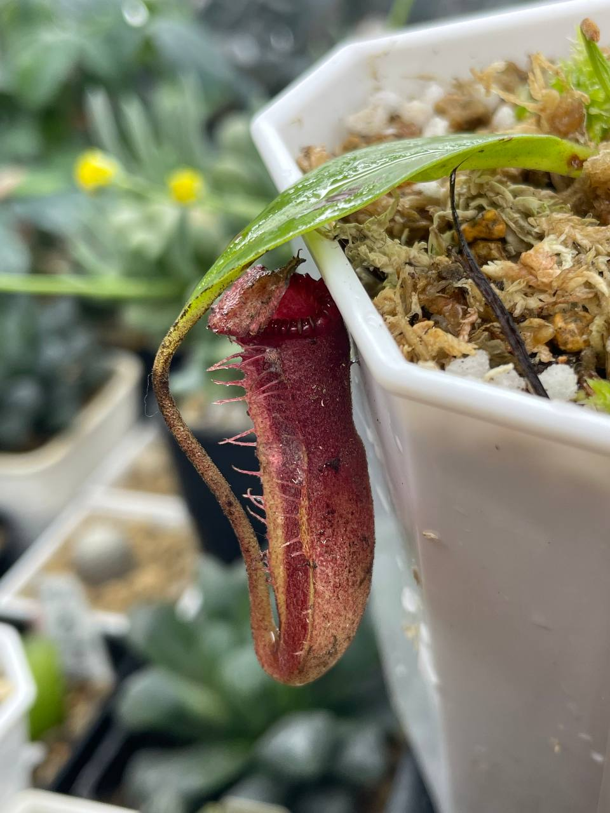
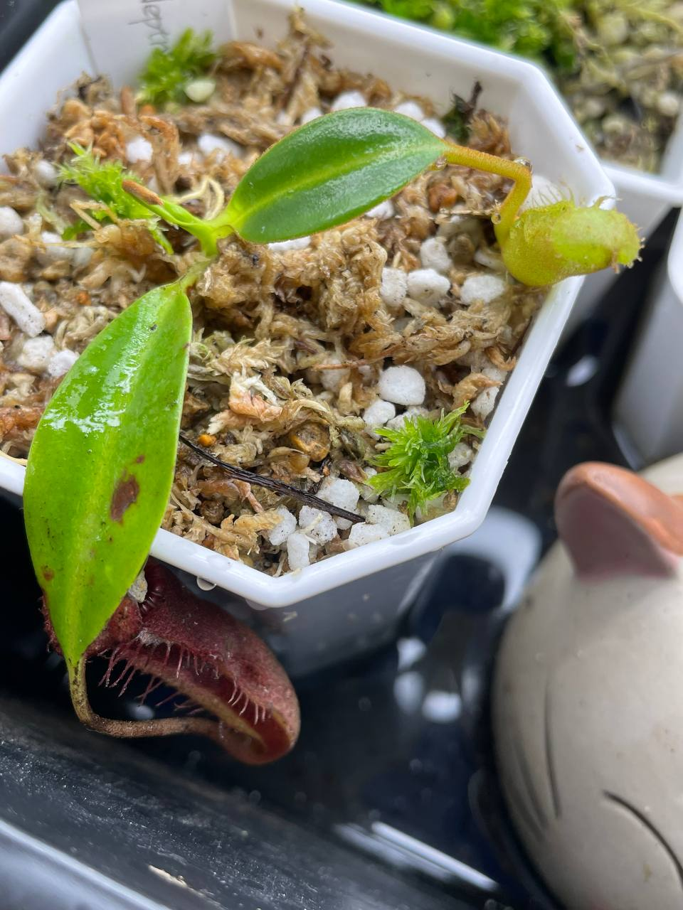
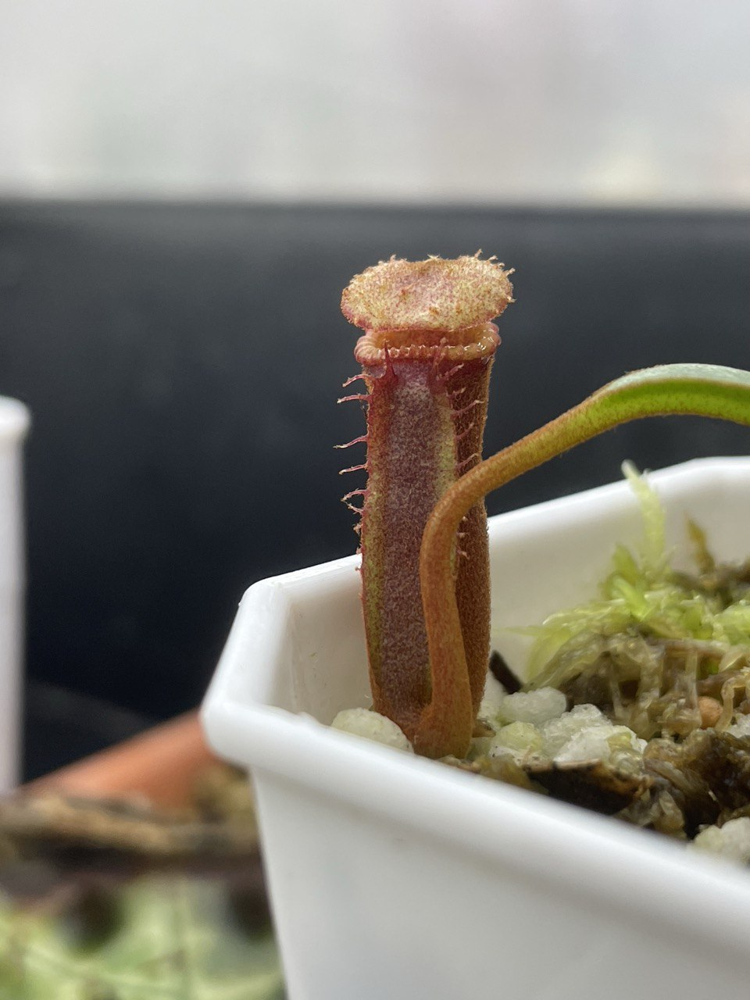
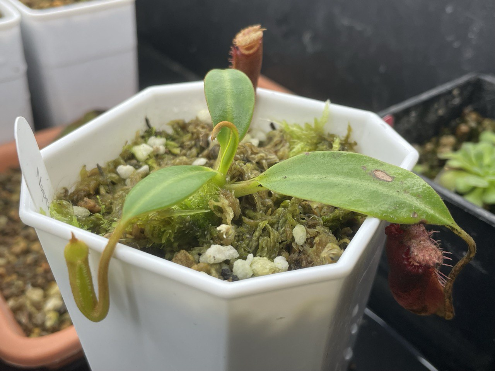

## 植物資料



中文名稱：愛德華豬籠草  
學名：*Nepenthes edwardsiana*  
購入管道：台灣 FB 食蟲植物社團  
購入價格：1100 NTD  

馬來西亞高山的利齒系豬籠草，特色是尖銳如刀片的唇肋與硬質的葉片。  
不過利齒系豬籠草無法承受太高的溫度，目前打算盡量以恆溫接近 22、23℃ 栽培，觀察看看是否能順利成長。  
原生地時常環繞著雲霧，可能無法承受太低的濕度，栽培上須注意保濕。  

## 栽培紀錄

### 2024/02/01 入手

亞成瓶已經具有利齒特徵，入手時帶有少量根系。  
目前套袋室內燈養中，日夜溫約 22/18℃ 左右。  


  
  


### 2024/03/24

夜溫開始變高，目前已移至冰箱種植。  
一直悶養中，穩定結瓶。  
居然連老瓶子都沒有枯萎。
其實有降溫就很好種。  


  
  

