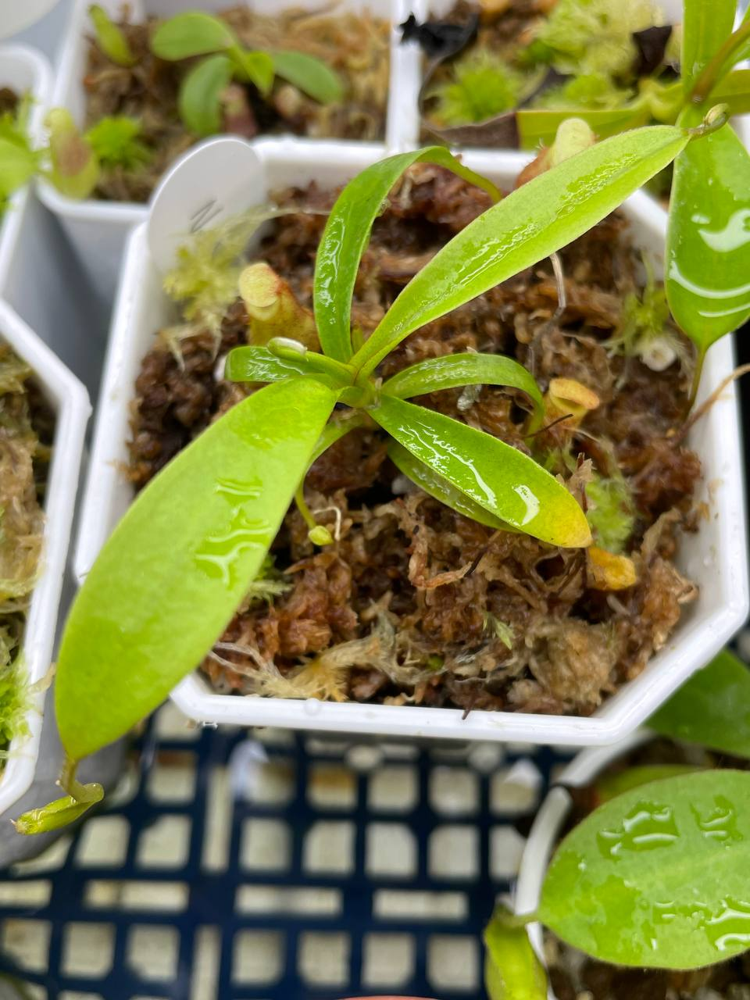
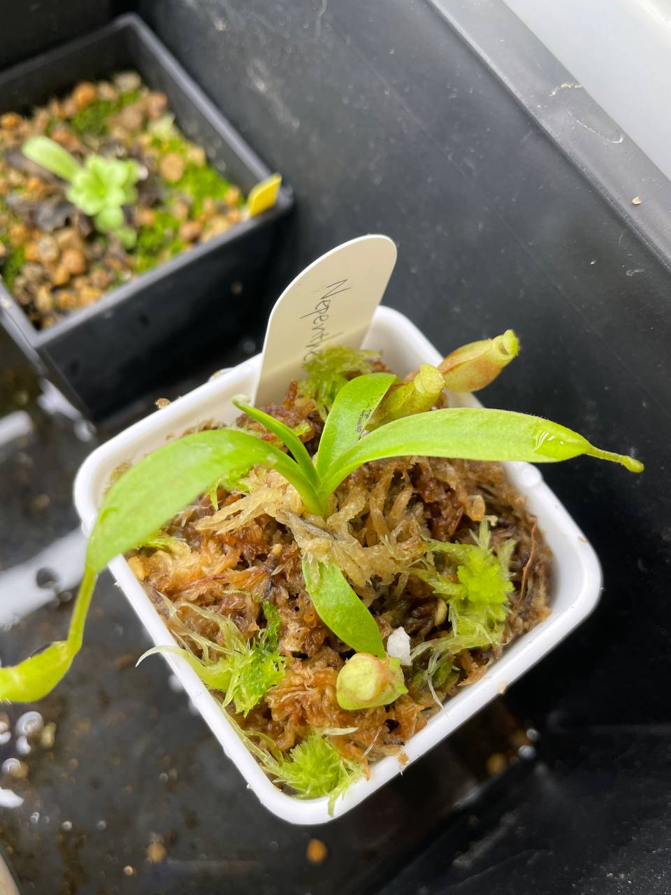
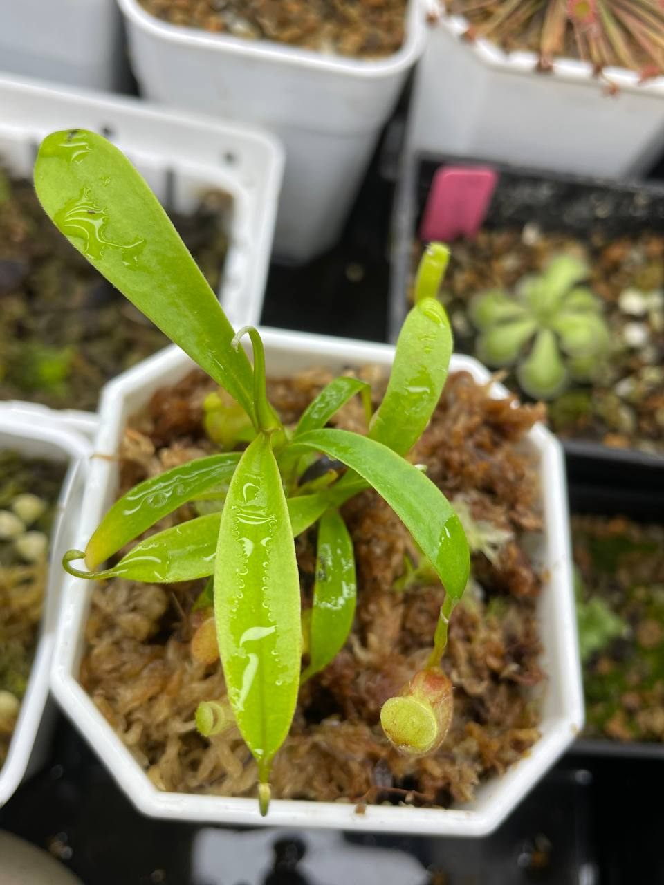
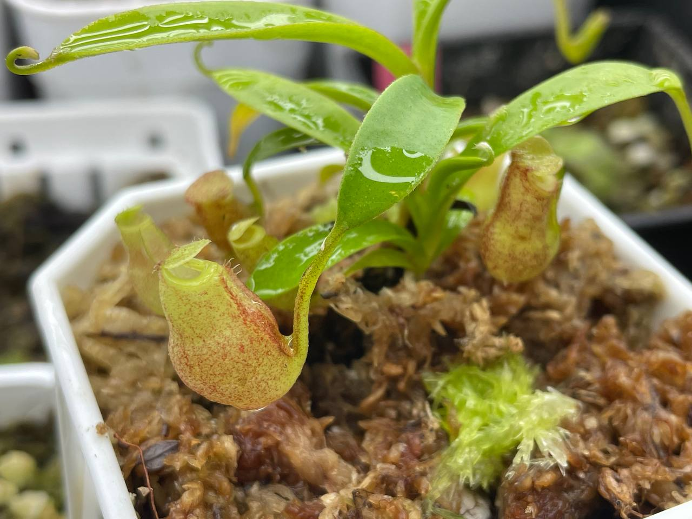
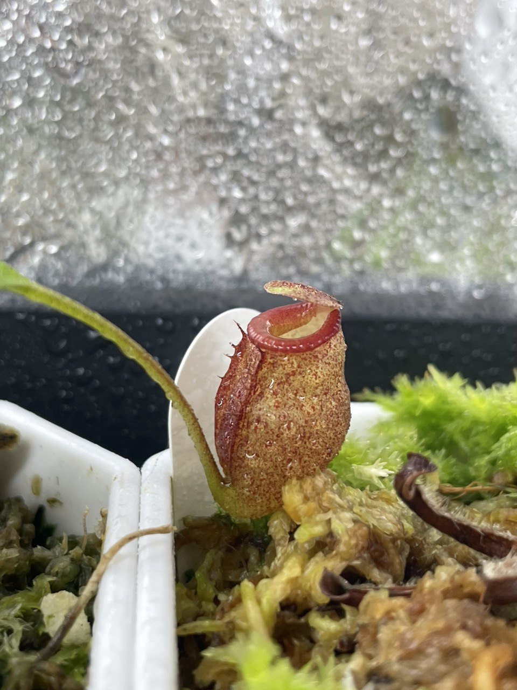
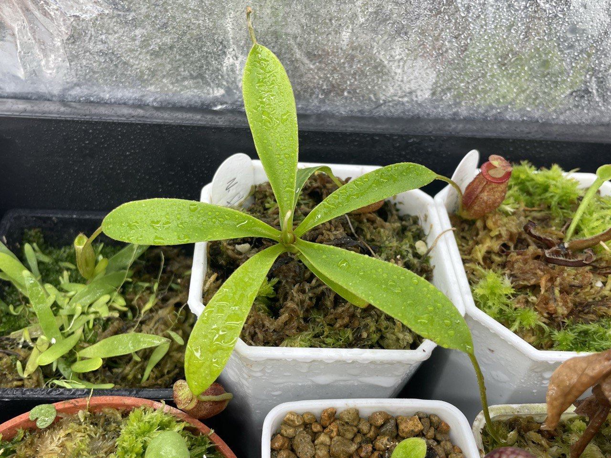

## 植物資料



中文名稱：杏黃豬籠草  
學名：*Nepenthes flava*  
購入管道：台灣 FB 食蟲植物社團  
購入價格：1500 NTD  

和馬桶豬籠草一樣，生長在蘇門答臘高山開闊地，具有黏稠的消化液。  
因為上位瓶顏色多為黃色而得名。  

## 栽培紀錄

### 2024/01/24 入手

帶有一棵直徑只比主芽小一點的側芽。  
側芽拆下來送朋友，自留主芽。  

方盆內的為分拆下來的側芽，八角盆則是自留的主芽。  

目前套袋室內燈養中，日夜溫約 22/18℃ 左右。  


  
  
  
  


### 2024/04/05

植株適應後放置於濕度變化較大的地方，還是能順利結瓶，看起對環境耐性挺好的。  


  
  

